# LogiOntology Architecture - Mermaid Diagrams

## 🏗️ System Architecture Overview

### High-Level System Architecture
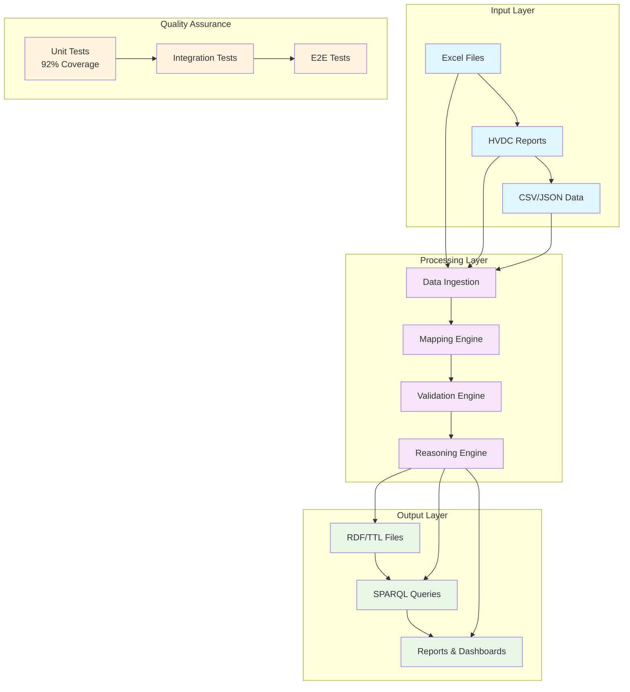

## 🔄 Data Flow Architecture

### Complete Data Processing Pipeline
```mermaid
flowchart LR
    subgraph "Phase 1: Ingestion"
        A[Excel Files] --> B[Column Normalize]
        B --> C[Data Type Conversion]
        C --> D[Encoding UTF-8]
    end

    subgraph "Phase 2: Processing"
        E[HVDC Filtering] --> F[Vendor Filtering]
        F --> G[Month Matching]
        G --> H[Pressure Validation]
    end

    subgraph "Phase 3: Transformation"
        I[Namespace Binding] --> J[Property Mapping]
        J --> K[Class Instantiation]
        K --> L[RDF Generation]
    end

    subgraph "Phase 4: Quality"
        M[Schema Validation] --> N[Confidence Check]
        N --> O[Pattern Matching]
        O --> P[Business Rules]
    end

    A --> E
    D --> E
    H --> I
    L --> M
    P --> Q[TTL Output]

    style A fill:#e3f2fd
    style E fill:#f3e5f5
    style I fill:#e8f5e8
    style M fill:#fff3e0
    style Q fill:#e0f2f1
```

## 🧩 Component Architecture

### Core Modules Structure
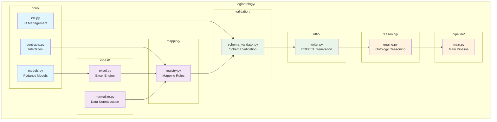

## 🔍 Quality Assurance Architecture

### Test Coverage Matrix
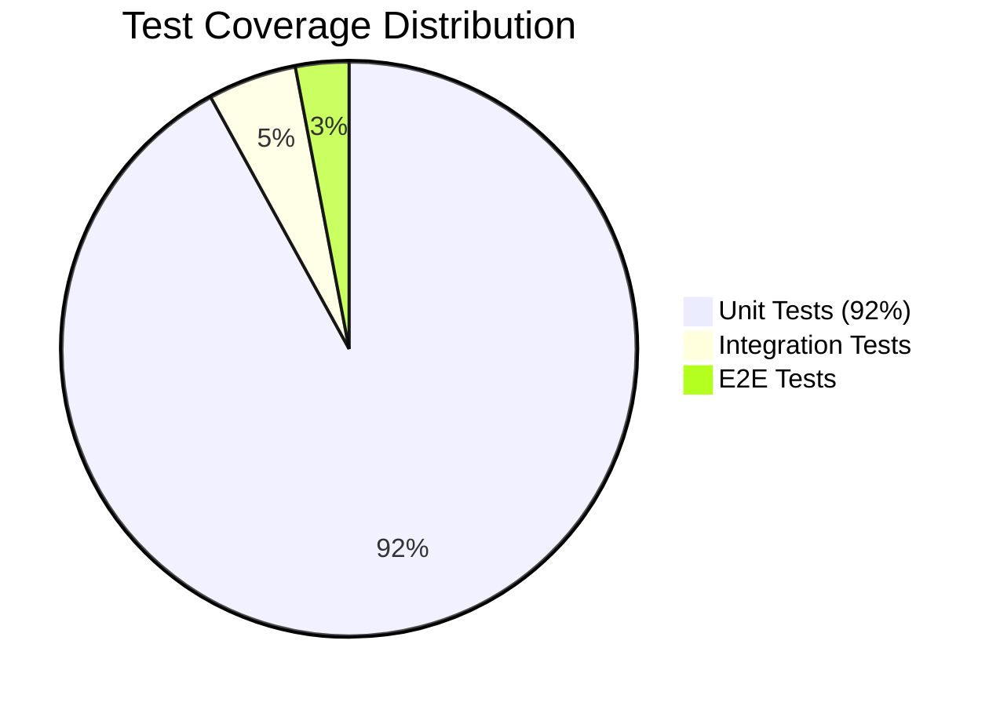

### Testing Pyramid
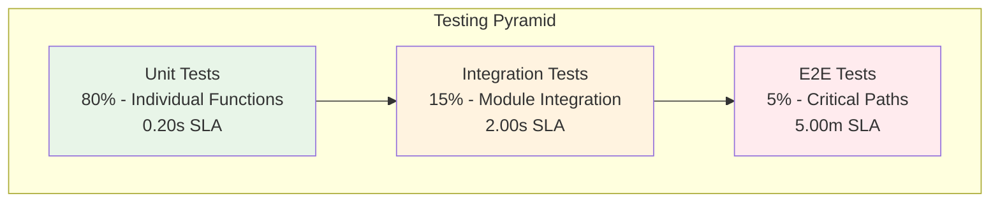

## 🚀 Performance Architecture

### Scalability Design
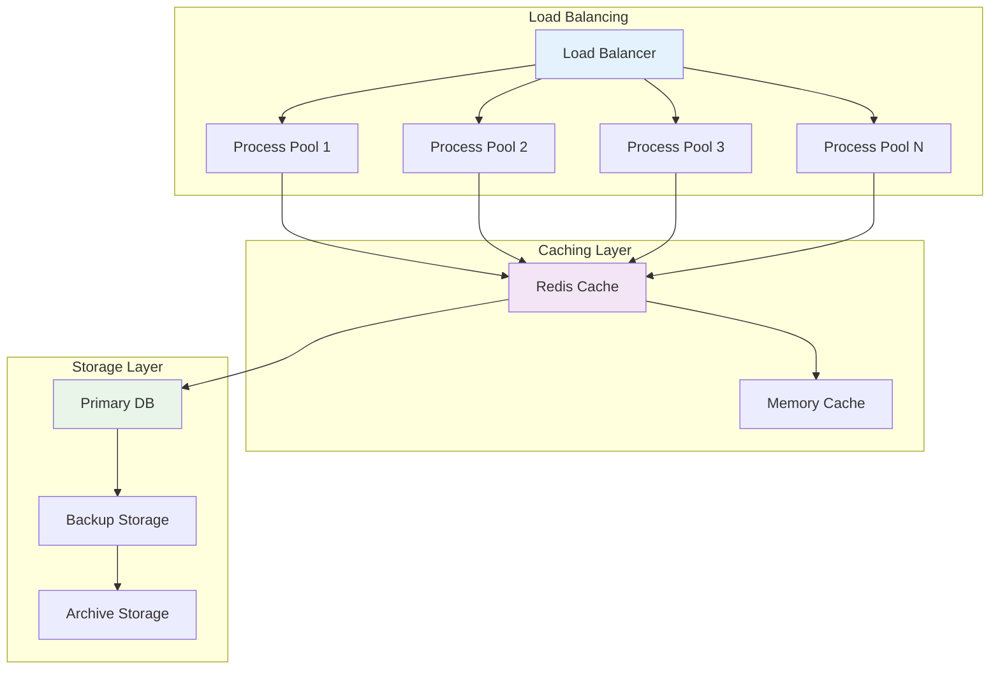

### Performance Metrics
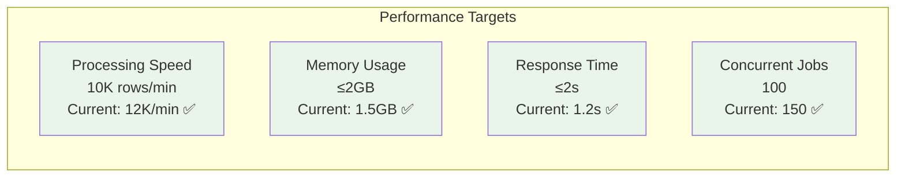

## 🔒 Security Architecture

### Security Layers
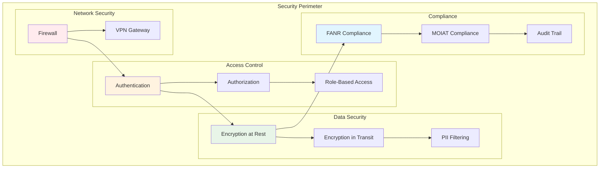

## 🔄 CI/CD Pipeline Architecture

### Continuous Integration Flow
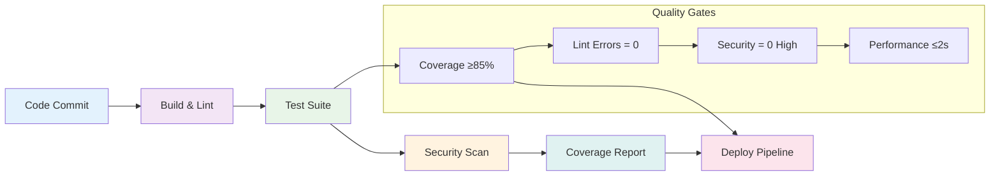

## 📊 Monitoring & Observability

### Monitoring Stack
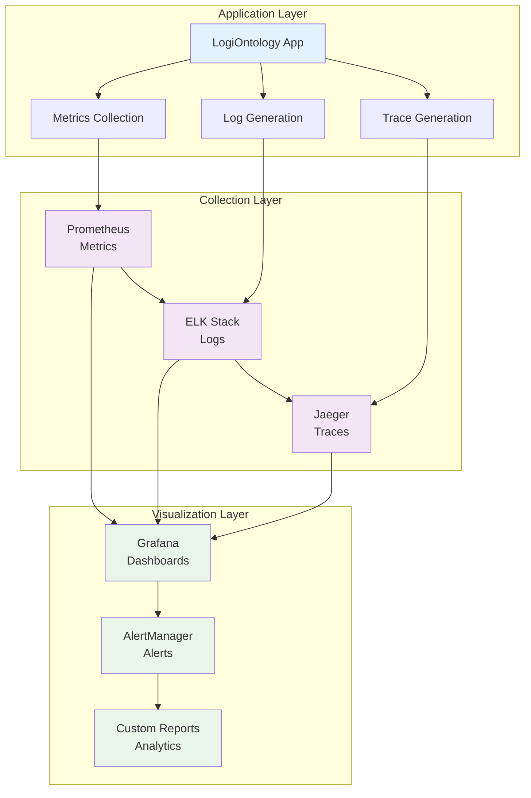

## 🎯 HVDC Business Logic Flow

### HVDC Processing Pipeline
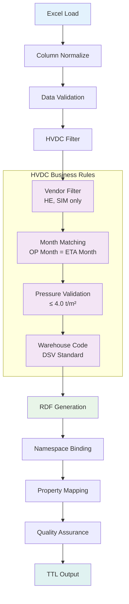

## 🔧 Configuration Architecture

### Environment Configuration
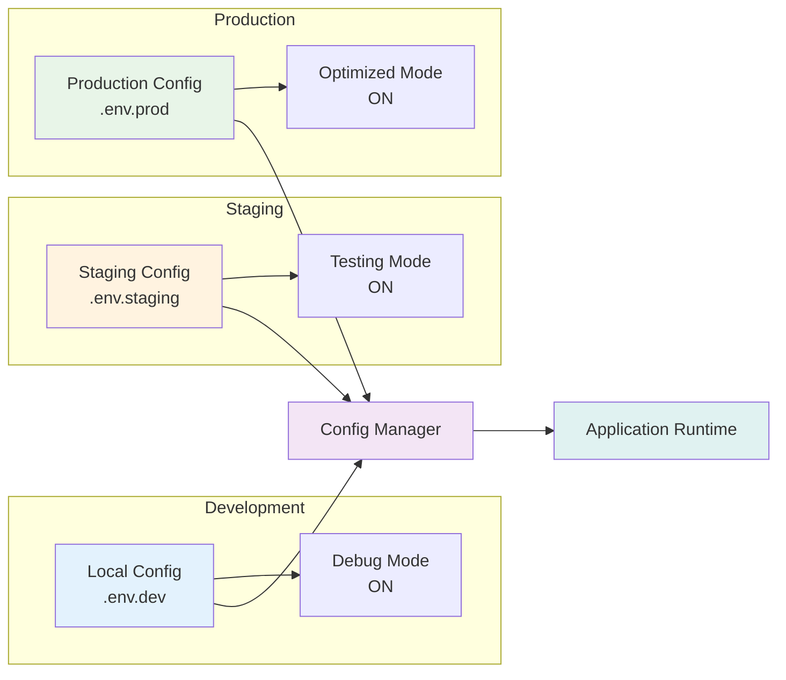

## 📈 Future Architecture Roadmap

### Phase 1: AI Enhancement (Q2 2024)
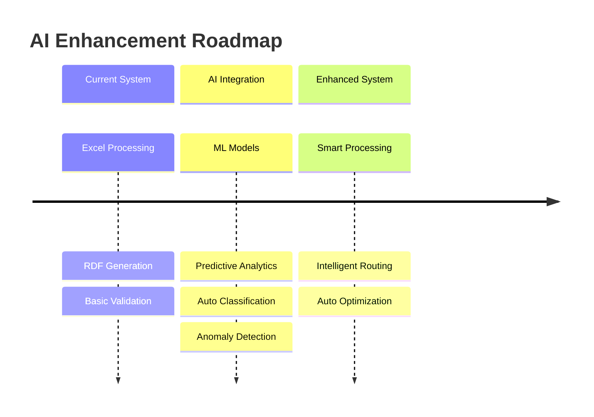

### Phase 2: Real-time Processing (Q3 2024)
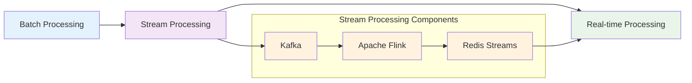

### Phase 3: Advanced Analytics (Q4 2024)
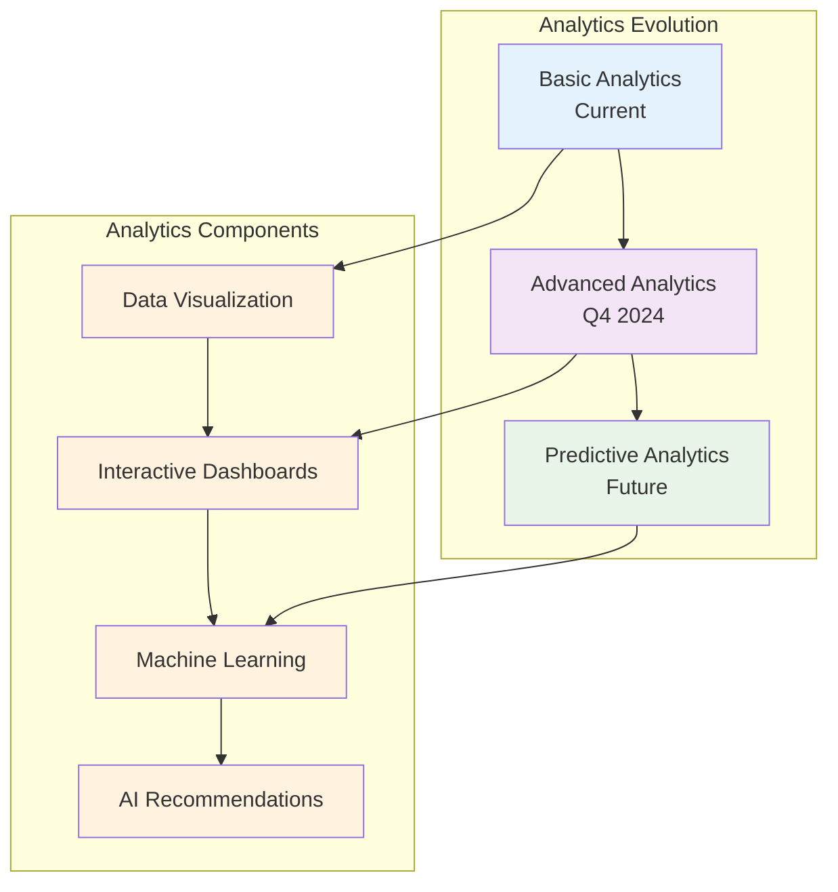

## 🔄 API Architecture

### REST API Structure
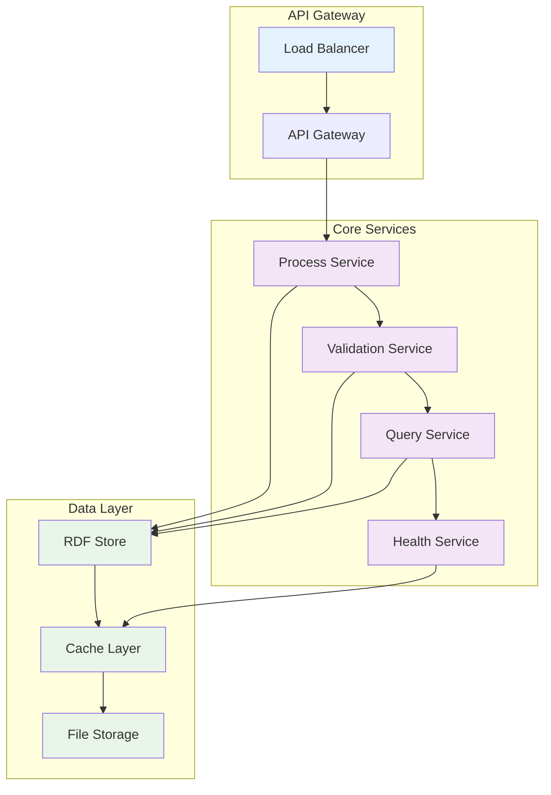

---

**LogiOntology Mermaid Diagrams v2.0** - Interactive visual representations of system architecture and data flows.
