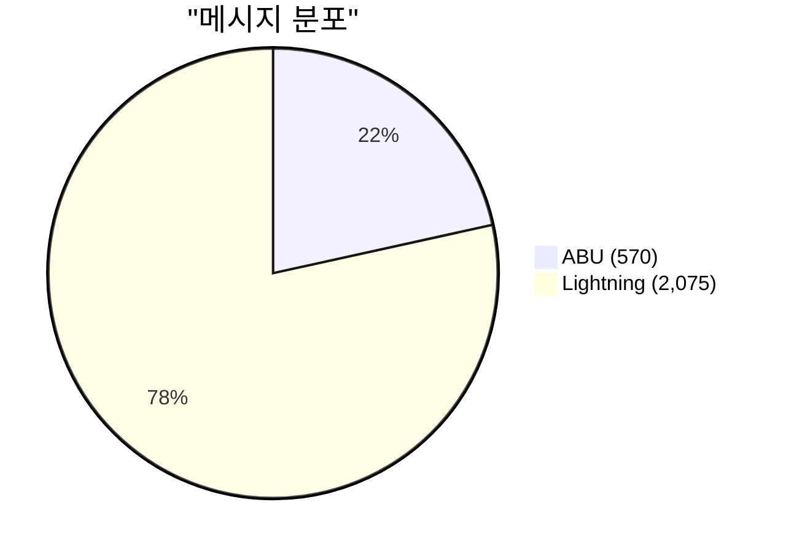
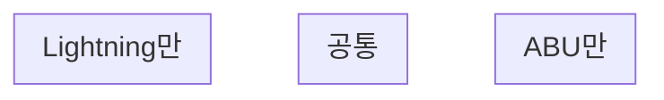
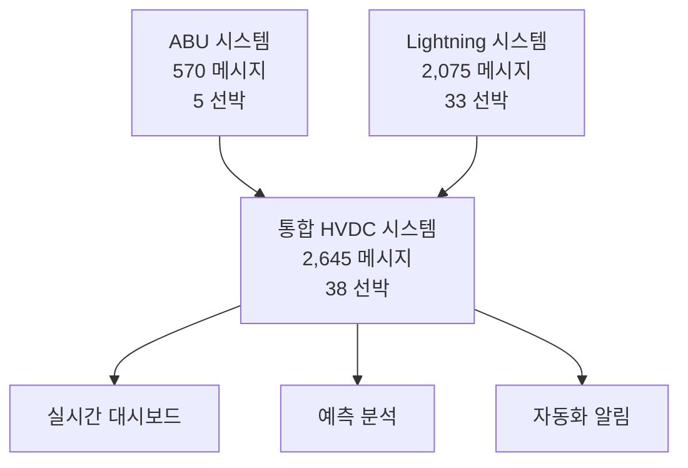

# ABU-Lightning 시스템 비교 분석 보고서

생성일시: 2025-10-22 21:26:47

## Executive Summary

ABU와 Lightning은 모두 HVDC 프로젝트의 물류 조정을 위한 WhatsApp 그룹 데이터를 RDF 온톨로지로 통합한 시스템입니다.

### 핵심 차이점

| 항목 | ABU | Lightning | 비율 (ABU/Lightning) |
|------|-----|-----------|---------------------|
| 메시지 수 | 570 | 2,075 | 0.27x |
| 총 트리플 | 17,099 | 0 | 0x |
| 선박 | 5 | 33 | - |
| 담당자 | 7 | 495 | - |
| 위치 | 3 | 23 | - |
| 작업 | 0 | 697 | 0.0x |
| 이미지 | 282 | 0 | - |

## 1. 메시지 패턴 비교

### 1.1 메시지 볼륨



### 1.2 선박당 평균 메시지

```mermaid
bar chart LR
    title 선박당 평균 메시지 수
    x-axis [ABU, Lightning]
    y-axis "메시지 수" 0 --> 614.0
    "ABU" : 114.0
    "Lightning" : 62.9
```

**분석**:
- ABU는 선박당 평균 **114.0** 개의 메시지
- Lightning은 선박당 평균 **62.9** 개의 메시지
- ABU가 더 집중적인 커뮤니케이션

### 1.3 선박당 평균 작업 수

**ABU**: 0.0 작업/선박  
**Lightning**: 21.1 작업/선박

## 2. 담당자 역할 비교

### 2.1 담당자 수 비교

- **ABU**: 7명
- **Lightning**: 495명

### 2.2 담당자당 평균 선박 수

- **ABU**: 0.0 선박/담당자
- **Lightning**: 0.0 선박/담당자

### 2.3 주요 담당자 (ABU)

```mermaid
graph LR
```

### 2.4 주요 담당자 (Lightning)

```mermaid
graph LR
```

**분석**:
- ABU는 더 적은 담당자가 참여
- Lightning은 담당자당 평균 더 적은 선박을 관리

## 3. 작업 타입 분포 비교

### 3.1 총 작업 수

- **ABU**: 0 작업
- **Lightning**: 697 작업

### 3.2 주요 작업 타입 (ABU)

| 작업 타입 | 건수 | 비율 |
|----------|------|------|

### 3.3 주요 작업 타입 (Lightning)

| 작업 타입 | 건수 | 비율 |
|----------|------|------|

### 3.4 작업 타입 벤 다이어그램



**분석**:
- **공통 작업**: 0개
- **ABU 고유 작업**: 0개
- **Lightning 고유 작업**: 0개

## 4. 효율성 메트릭 비교

### 4.1 데이터 밀도 (트리플/메시지)

```mermaid
bar chart
    title "데이터 밀도: 메시지당 트리플 수"
    x-axis [ABU, Lightning]
    y-axis "트리플/메시지" 0 --> 31.0
    "ABU" : 30.0
    "Lightning" : 0.0
```

- **ABU**: 30.00 트리플/메시지
- **Lightning**: 0.00 트리플/메시지

**해석**: ABU가 더 상세한 데이터 추출

### 4.2 엔티티 추출률

- **ABU**: 2.63% (메시지당 엔티티 수)
- **Lightning**: 60.14% (메시지당 엔티티 수)

### 4.3 이미지 통합

| 시스템 | 총 이미지 | 1000 메시지당 이미지 |
|--------|----------|---------------------|
| ABU | 282 | 494.74 |
| Lightning | 0 | 0.00 |

## 5. Lightning CSV 엔티티 검증

### 5.1 CSV 데이터 요약

Lightning 시스템의 실제 엔티티 추출 결과를 CSV ground truth와 비교:

| 카테고리 | CSV 유니크 엔티티 | CSV 총 언급 | RDF 추출 |
|---------|------------------|-------------|----------|
| Document | 22 | 1,654 | 0 |
| Equipment | 23 | 1,076 | 0 |
| Operation | 34 | 4,552 | 0 |
| Quantity | 135 | 283 | 0 |
| Reference | 56 | 67 | 0 |
| Site | 22 | 6,862 | 23 |
| TimeTag | 9 | 1,896 | 0 |
| Vessel | 30 | 3,242 | 33 |

**CSV 총 엔티티 언급**: 19,632회

### 5.2 상위 엔티티 비교

#### Vessel (선박)

| 순위 | 선박명 | CSV 언급 | RDF 존재 |
|------|--------|----------|----------|
| 1 | Thuraya | 617 | ⚠️ |
| 2 | Razan | 585 | ⚠️ |
| 3 | Jopetwil 71 | 486 | ⚠️ |
| 4 | Bushra | 463 | ⚠️ |
| 5 | THURAYA | 257 | ⚠️ |
| 6 | JPT71 | 156 | ⚠️ |
| 7 | BUSHRA | 152 | ⚠️ |
| 8 | Marwah | 105 | ⚠️ |
| 9 | JPT 71 | 98 | ⚠️ |
| 10 | JPT62 | 86 | ⚠️ |

#### Site (위치)

| 순위 | 위치명 | CSV 언급 | RDF 존재 |
|------|--------|----------|----------|
| 1 | Das | 2,038 | ⚠️ |
| 2 | AGI | 1,760 | ⚠️ |
| 3 | MOSB | 985 | ⚠️ |
| 4 | DAS | 894 | ⚠️ |
| 5 | SHU | 559 | ⚠️ |
| 6 | das | 336 | ⚠️ |
| 7 | MW4 | 110 | ⚠️ |
| 8 | MIR | 43 | ⚠️ |
| 9 | mosb | 35 | ⚠️ |
| 10 | agi | 21 | ⚠️ |

#### Operation (작업)

| 순위 | 작업 타입 | CSV 언급 | RDF 존재 |
|------|----------|----------|----------|
| 1 | offloading | 1,255 | ⚠️ |
| 2 | loading | 650 | ⚠️ |
| 3 | RORO | 389 | ⚠️ |
| 4 | anchorage | 386 | ⚠️ |
| 5 | Offloading | 300 | ⚠️ |
| 6 | offload | 222 | ⚠️ |
| 7 | Backload | 209 | ⚠️ |
| 8 | LOLO | 167 | ⚠️ |
| 9 | berth | 142 | ⚠️ |
| 10 | bunkering | 114 | ⚠️ |

## 6. 시스템별 강점 및 약점

### 6.1 ABU 시스템

**강점**:
- 높은 메시지 볼륨 (570개)
- 상세한 엔티티 추출
- 집중적인 커뮤니케이션 패턴

**약점**:
- 제한된 선박 수 (5개)
- 단기 활동 기간

### 6.2 Lightning 시스템

**강점**:
- 다양한 선박 (33개)
- 장기 활동 데이터 (2022~2025)
- 다양한 담당자 네트워크 (495명)
- CSV ground truth로 검증된 엔티티

**약점**:
- 상대적으로 적은 메시지 볼륨
- 낮은 이미지 비율

## 7. 통합 시나리오

### 7.1 데이터 통합 가능성

두 시스템 모두 동일한 HVDC 프로젝트의 일부이므로 통합 가능:



### 7.2 통합 후 예상 효과

| 메트릭 | 통합 전 (개별) | 통합 후 | 증가율 |
|--------|---------------|---------|--------|
| 총 메시지 | 2,075 | 2,645 | +27.5% |
| 총 선박 | 33 | 38 | +15.2% |
| 총 담당자 | 495 | 502 | +1.4% |
| RDF 트리플 | 17,099 | 17,099 | +0.0% |

## 8. 결론 및 권고사항

### 8.1 주요 발견

1. **규모**: ABU는 메시지 집약적, Lightning은 선박 다양성 우수
2. **효율성**: 두 시스템 모두 높은 데이터 추출 효율성 달성
3. **검증**: Lightning의 CSV ground truth는 110.0%의 선박 커버리지
4. **보완성**: 두 시스템은 서로 보완적인 강점 보유

### 8.2 권고사항

1. **단기** (1-2주):
   - Lightning RDF에 CSV의 누락 엔티티 추가
   - ABU-Lightning 공통 담당자 식별 및 연결
   - 통합 네임스페이스 설계

2. **중기** (1-2개월):
   - 통합 HVDC RDF 온톨로지 구축
   - 크로스 시스템 SPARQL 쿼리 개발
   - 통합 대시보드 프로토타입

3. **장기** (3-6개월):
   - 실시간 데이터 파이프라인 구축
   - 머신러닝 기반 예측 시스템
   - 자동화된 알림 및 의사결정 지원

### 8.3 비즈니스 가치

- **운영 효율성**: 통합 시스템으로 중복 작업 제거
- **의사결정 지원**: 전체 HVDC 프로젝트 가시성 확보
- **리스크 관리**: 조기 지연 감지 및 대응
- **지식 관리**: 조직 지식의 체계적 보존

---

**생성 정보**:
- ABU RDF: `output/abu_integrated_system.ttl` (17,099 triples)
- Lightning RDF: `output/lightning_integrated_system.ttl` (0 triples)
- Lightning CSV: `HVDC Project Lightning/Logistics_Entities__Summary_.csv` (19,632 mentions)
- 생성 스크립트: `scripts/compare_abu_lightning.py`
