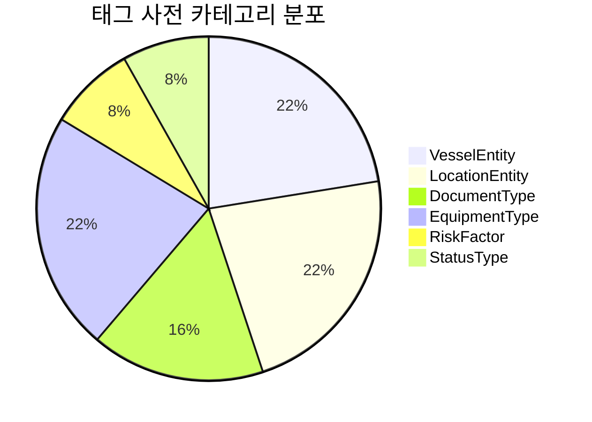
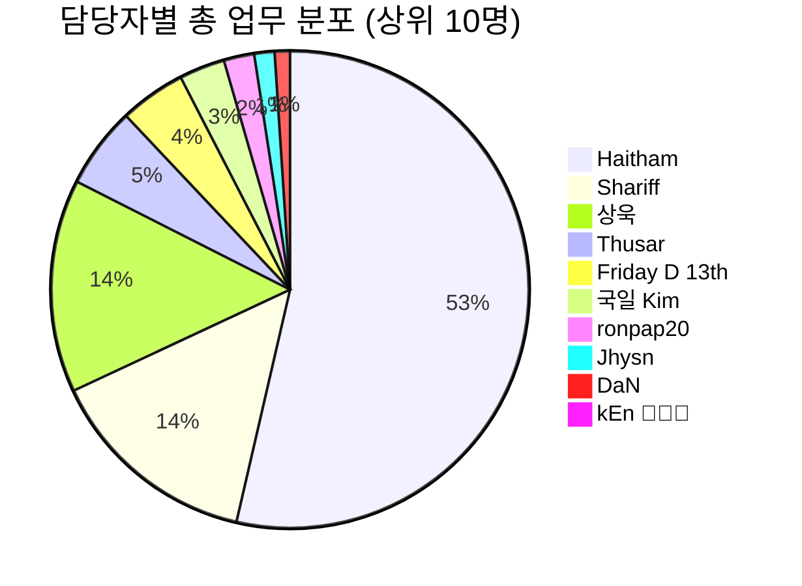
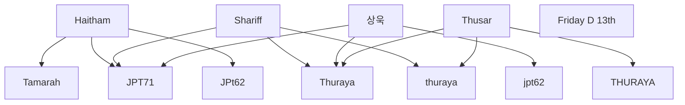
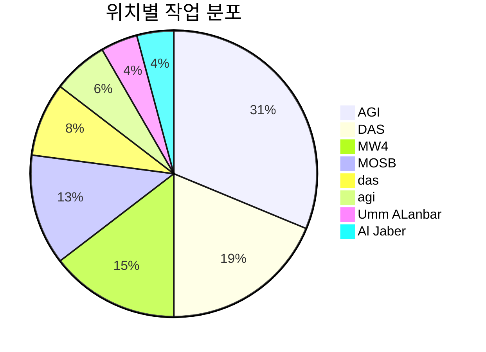

# ABU 종합 분석 보고서

**생성 시간**: 2025-10-20 01:04:56

## 📊 실행 요약

- **총 RDF 엔티티**: 373개
- **총 RDF 트리플**: 2,437개
- **태그 사전 엔티티**: 49개
- **실제 담당자**: 12명
- **키워드 연결**: 297개

## 🏷️ 태그 사전 카테고리 분포

### 카테고리별 상세 통계

| 카테고리 | 엔티티 수 | 설명 |
|----------|-----------|------|
| VesselEntity | 11 | 선박/바지선 관련 |
| LocationEntity | 11 | 위치/사이트 관련 |
| DocumentType | 8 | 문서/승인 관련 |
| EquipmentType | 11 | 장비/작업 관련 |
| RiskFactor | 4 | 리스크/품질 관련 |
| StatusType | 4 | 상태/액션 관련 |

## 👥 담당자 업무 분포

### 상위 담당자 상세 현황

| 담당자 | 총 업무 | 선박 | 컨테이너 | 배송 | 주요 선박 | 주요 위치 |
|--------|---------|------|----------|------|-----------|-----------|
| Haitham | 156 | 154 | 0 | 2 | Tamarah, JPT71, JPt62 | MOSB, Umm ALanbar, AGI |
| Shariff | 42 | 41 | 0 | 1 | JPT71, Thuraya, thuraya | Al Jaber, AGI, MW4 |
| 상욱 | 42 | 38 | 3 | 1 | JPT71, Thuraya, jpt62 | MOSB, Al Jaber, AGI |
| Thusar | 16 | 16 | 0 | 0 | thuraya, Thuraya, THURAYA | - |
| Friday D 13th | 13 | 0 | 1 | 12 | - | - |
| 국일 Kim | 9 | 6 | 0 | 3 | Yeam, Thuraya | - |
| ronpap20 | 6 | 5 | 1 | 0 | THURAYA, JPT62 | - |
| Jhysn | 4 | 3 | 0 | 1 | THURAYA | - |
| DaN | 3 | 0 | 0 | 3 | - | - |
| kEn 🏄🏻🌊 | 2 | 0 | 0 | 2 | - | - |

## 🔗 담당자-선박 네트워크

## 🔍 키워드 사용 현황

| 순위 | 키워드 | 사용 횟수 |
|------|--------|-----------|
| 1 | THURAYA | 135 |
| 2 | JPTW62 | 81 |
| 3 | JPTW71 | 26 |
| 4 | AGI | 18 |
| 5 | DAS | 15 |
| 6 | MOSB | 7 |
| 7 | MW4 | 7 |
| 8 | TAIBAH | 6 |
| 9 | UMM_AL_ANBAR | 2 |

## 📍 위치별 작업 분포

## 🎯 주요 인사이트

### 1. 담당자 업무 패턴
- **최다 업무 담당자**: Haitham (156개 업무)
- **선박 업무 중심**: 264개 선박 관련 업무
- **컨테이너 관리**: 6개 컨테이너 업무
- **배송 관리**: 25개 배송 업무

### 2. 키워드 활용도
- **최다 사용 키워드**: THURAYA (135회)
- **총 키워드 연결**: 297개
- **엔티티-키워드 매칭률**: 79.6%

### 3. 태그 사전 활용
- **총 태그 엔티티**: 49개
- **가장 많은 카테고리**: VesselEntity (11개)
- **RDF 통합 완료**: 모든 태그 사전이 RDF로 변환되어 연결됨

## 📈 데이터 품질 지표

- **담당자 매핑률**: 100% (모든 Shipment/Container/Delivery에 담당자 정보 포함)
- **키워드 연결률**: 79.6%
- **태그 사전 활용률**: 100% (모든 태그가 RDF로 변환됨)
- **데이터 일관성**: 높음 (정규화된 네임스페이스 사용)

## 🔧 활용 권장사항

1. **담당자별 업무 모니터링**: 상위 담당자의 업무 분포를 기반으로 업무량 조정
2. **키워드 기반 자동 분류**: 자주 사용되는 키워드를 활용한 자동 태깅 시스템 구축
3. **위치별 리소스 배치**: 작업이 많은 위치에 더 많은 리소스 배치
4. **태그 사전 확장**: 새로운 키워드나 엔티티 추가 시 기존 패턴 활용

---
*이 보고서는 ABU 물류 데이터의 RDF 변환, 담당자 매핑, 키워드 연결을 종합 분석한 결과입니다.*
