# ABU 통합 시스템 시각화 대시보드

**생성 시간**: 2025-10-20 01:28:29

## 📊 시스템 개요

### 통계 요약
- **총 RDF 트리플**: 17,099개
- **LPO 엔티티**: 442개
- **담당자 엔티티**: 7명
- **선박 엔티티**: 5척
- **위치 엔티티**: 3개
- **메시지 엔티티**: 570개
- **이미지 엔티티**: 282개

## 🔗 엔티티 관계도

다음 다이어그램은 주요 엔티티 간의 관계를 보여줍니다:

```mermaid
graph TD
    P_DaN["DaN"]
    P_kEn_🏄🏻🌊["kEn 🏄🏻🌊"]
    P_국일_Kim["국일 Kim"]
    V_Tamarah["Tamarah"]
    V_Thuraya["Thuraya"]
    V_Bushra["Bushra"]
    V_JPT71["JPT71"]
    V_JPT62["JPT62"]
    L_MOSB["MOSB"]
    L_DAS["DAS"]
    L_AGI["AGI"]
    LPO_LPO-2002["LPO-LPO-2002"]
    LPO_LPO-1347["LPO-LPO-1347"]
    LPO_LPO-2545["LPO-LPO-2545"]
    LPO_LPO-1187["LPO-LPO-1187"]
    LPO_LPO-1550["LPO-LPO-1550"]
    LPO_LPO-1230 --> P_DaN
    LPO_LPO-1230 --> P_kEn_🏄🏻🌊
    LPO_LPO-1550 --> P_DaN
    LPO_LPO-1550 --> P_kEn_🏄🏻🌊
    LPO_LPO-1595 --> P_DaN
    LPO_LPO-1595 --> P_kEn_🏄🏻🌊
    LPO_LPO-1599 --> P_DaN
    LPO_LPO-1599 --> P_kEn_🏄🏻🌊
    LPO_LPO-1103 --> P_국일_Kim
    LPO_LPO-1103 --> P_kEn_🏄🏻🌊
    V_Bushra --> L_DAS
    V_Tamarah --> L_DAS
    V_Thuraya --> L_DAS
    V_Thuraya --> L_AGI
    V_JPT62 --> L_AGI
    V_JPT62 --> L_MOSB
    V_JPT71 --> L_AGI
    V_JPT71 --> L_MOSB
```

## ⏰ 시간순 이벤트 타임라인

다음은 시간순으로 정렬된 주요 이벤트들입니다:

```mermaid
timeline
    title 2024-08-21T16:17:00
        Message : 메시지 Thuraya_24_8_21_16_17
    title 2024-08-21T17:07:00
        Message : 메시지 JPt62_24_8_21_17_07
    title 2024-08-22T07:23:00
        Message : 메시지 JPt62_24_8_22_07_23
    title 2024-08-22T07:32:00
        Message : 메시지 Averda_24_8_22_07_32
    title 2024-08-22T07:43:00
        Message : 메시지 JPt62_24_8_22_07_43
    title 2024-08-22T11:31:00
        Message : 메시지 thuraya_24_8_22_11_31
    title 2024-08-22T16:58:00
        Message : 메시지 thuraya_24_8_22_16_58
    title 2024-08-23T07:31:00
        Message : 메시지 JPt62_24_8_23_07_31
    title 2024-08-23T11:27:00
        Message : 메시지 Thuraya_24_8_23_11_27
    title 2024-08-25T07:24:00
        Message : 메시지 JPT62_24_8_25_07_24
    title 2024-08-25T16:44:00
        Message : 메시지 Thuraya_24_8_25_16_44
    title 2024-08-25T18:05:00
        Message : 메시지 JPT62_24_8_25_18_05
    title 2024-08-26
        LPO : LPO-LPO-1625 발주
        LPO : LPO-LPO-1628 발주
        LPO : LPO-LPO-1634 발주
        LPO : LPO-LPO-1645 발주
        LPO : LPO-LPO-1646 발주
        LPO : LPO-LPO-1653 발주
        LPO : LPO-LPO-278 발주
        LPO : LPO-LPO-279 발주
```



## 🕸️ 네트워크 다이어그램

다음은 엔티티 간의 연결 강도를 보여주는 네트워크 다이어그램입니다:

```mermaid
graph LR
    P_kEn_🏄🏻🌊["kEn 🏄🏻🌊<br/>(442)"]
    P_국일_Kim["국일 Kim<br/>(9)"]
    P_DaN["DaN<br/>(4)"]
    V_Thuraya["Thuraya<br/>(3)"]
    V_JPT62["JPT62<br/>(2)"]
    V_JPT71["JPT71<br/>(2)"]
    V_Bushra["Bushra<br/>(1)"]
    V_Tamarah["Tamarah<br/>(1)"]
    L_MOSB["MOSB<br/>(368)"]
    L_DAS["DAS<br/>(63)"]
    L_AGI["AGI<br/>(26)"]
    P_kEn_🏄🏻🌊 -.-> V_Thuraya
    P_kEn_🏄🏻🌊 -.-> V_JPT62
    P_국일_Kim -.-> V_Thuraya
    P_국일_Kim -.-> V_JPT62
    P_DaN -.-> V_Thuraya
    P_DaN -.-> V_JPT62
    V_Thuraya -.-> L_MOSB
    V_Thuraya -.-> L_DAS
    V_JPT62 -.-> L_MOSB
    V_JPT62 -.-> L_DAS
    V_JPT71 -.-> L_MOSB
    V_JPT71 -.-> L_DAS
```

## 👥 담당자별 업무 흐름

다음은 주요 담당자들의 LPO 처리 흐름을 보여줍니다:

```mermaid
flowchart TD
    Start([시작])
    kEn_🏄🏻🌊["kEn 🏄🏻🌊<br/>(442개 LPO)"]
    Start --> kEn_🏄🏻🌊
    kEn_🏄🏻🌊_LPO_0["LPO-LPO-1000"]
    kEn_🏄🏻🌊 --> kEn_🏄🏻🌊_LPO_0
    kEn_🏄🏻🌊_LPO_1["LPO-LPO-1007"]
    kEn_🏄🏻🌊 --> kEn_🏄🏻🌊_LPO_1
    kEn_🏄🏻🌊_LPO_2["LPO-LPO-1022"]
    kEn_🏄🏻🌊 --> kEn_🏄🏻🌊_LPO_2
    국일_Kim["국일 Kim<br/>(9개 LPO)"]
    Start --> 국일_Kim
    국일_Kim_LPO_0["LPO-LPO-1103"]
    국일_Kim --> 국일_Kim_LPO_0
    국일_Kim_LPO_1["LPO-LPO-1196"]
    국일_Kim --> 국일_Kim_LPO_1
    국일_Kim_LPO_2["LPO-LPO-1357"]
    국일_Kim --> 국일_Kim_LPO_2
    DaN["DaN<br/>(4개 LPO)"]
    Start --> DaN
    DaN_LPO_0["LPO-LPO-1230"]
    DaN --> DaN_LPO_0
    DaN_LPO_1["LPO-LPO-1595"]
    DaN --> DaN_LPO_1
    DaN_LPO_2["LPO-LPO-1599"]
    DaN --> DaN_LPO_2
    End([완료])
    kEn_🏄🏻🌊_LPO_0 --> End
    kEn_🏄🏻🌊_LPO_1 --> End
    kEn_🏄🏻🌊_LPO_2 --> End
    국일_Kim_LPO_0 --> End
    국일_Kim_LPO_1 --> End
    국일_Kim_LPO_2 --> End
    DaN_LPO_0 --> End
    DaN_LPO_1 --> End
    DaN_LPO_2 --> End
```

## 📈 핵심 인사이트

### 1. 데이터 통합 성과
- **완전한 물류 이력 추적**: LPO 발주부터 배송까지 전 과정이 RDF로 구조화됨
- **담당자 업무 가시성**: 각 담당자의 LPO 처리 현황이 명확히 추적됨
- **이미지-컨텍스트 연결**: 282개의 WhatsApp 이미지가 메시지와 연결됨

### 2. 관계 네트워크 분석
- **LPO-담당자 연결**: 442개의 LPO가 담당자와 연결됨
- **선박-위치 연결**: 5개의 선박이 위치와 연결됨
- **메시지-LPO 연결**: 442개의 메시지가 LPO와 연결됨

### 3. 운영 효율성
- **자동화된 추적**: 모든 물류 활동이 RDF 그래프로 자동 추적됨
- **SPARQL 쿼리 가능**: 복잡한 물류 질문에 즉시 답변 가능
- **실시간 모니터링**: 담당자별, 선박별, 위치별 실시간 현황 파악 가능

## 🚀 다음 단계

1. **SPARQL 쿼리 최적화**: 자주 사용되는 쿼리 패턴에 대한 인덱스 구축
2. **실시간 업데이트**: 새로운 LPO나 메시지가 추가될 때 자동 RDF 업데이트
3. **고급 분석**: 머신러닝을 활용한 물류 패턴 분석 및 예측
4. **대시보드 구축**: 웹 기반 실시간 모니터링 대시보드 개발

## 📁 관련 파일

- **통합 RDF**: `output/abu_integrated_system.ttl`
- **크로스 레퍼런스 보고서**: `reports/abu_cross_references_report.md`
- **이미지 통합 보고서**: `reports/whatsapp_images_integration_report.md`

---
*이 보고서는 ABU WhatsApp 방의 모든 데이터를 통합하여 생성되었습니다.*
