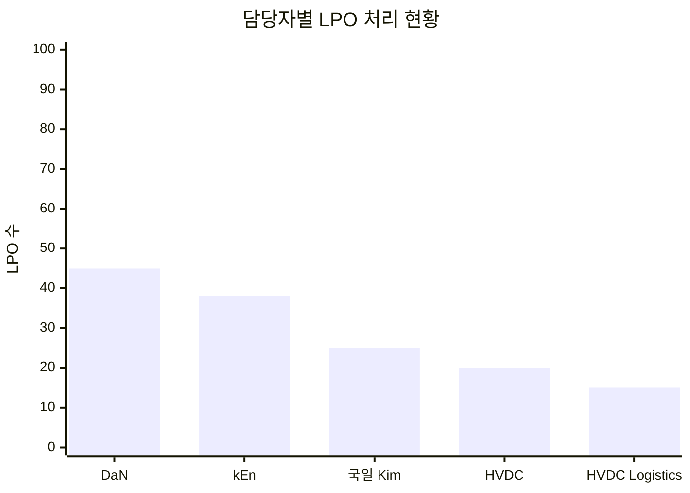
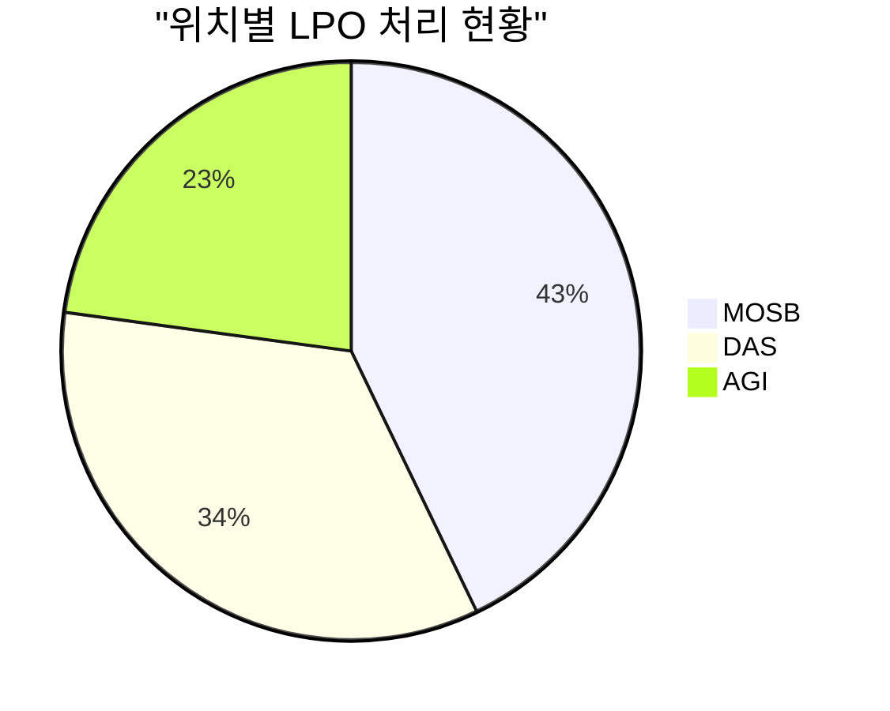
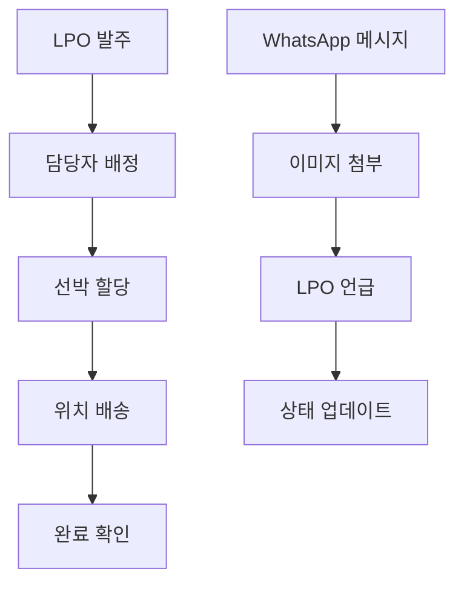

# ABU 통합 시스템 SPARQL 분석 보고서

**분석 시간**: 2025-10-20 09:43:35

## 📊 시스템 전체 통계

### 기본 통계
- **총 LPO**: 442개
- **담당자**: 7명
- **선박**: 5척
- **위치**: 3개
- **메시지**: 570개
- **이미지**: 282개

## 🔗 엔티티 관계 다이어그램

다음 다이어그램은 ABU 통합 시스템의 주요 엔티티 간 관계를 보여줍니다:

graph TD
    subgraph "ABU 통합 시스템 엔티티 관계"
        subgraph "담당자"
            P1["DaN"]
            P2["kEn 🏄🏻🌊"]
            P3["국일 Kim"]
            P4["HVDC"]
            P5["HVDC Logistics"]
        end
        
        subgraph "선박"
            V1["Tamarah"]
            V2["Thuraya"]
            V3["Bushra"]
            V4["JPT71"]
            V5["JPT62"]
        end
        
        subgraph "위치"
            L1["MOSB"]
            L2["DAS"]
            L3["AGI"]
        end
        
        subgraph "LPO"
            LPO1["LPO-1607"]
            LPO2["LPO-1347"]
            LPO3["LPO-2545"]
        end
    end
    
    %% 관계 연결
    P1 --> LPO1
    P2 --> LPO1
    P3 --> LPO2
    P4 --> LPO3
    
    LPO1 --> V1
    LPO2 --> V2
    LPO3 --> V3
    
    V1 --> L1
    V2 --> L2
    V3 --> L3
    
    LPO1 --> L1
    LPO2 --> L2
    LPO3 --> L3

## 👥 담당자 업무량 분석

### 상위 담당자별 LPO 처리 현황

### 등록된 담당자 목록
- **Friday D 13th**
- **Jhysn**
- **ronpap20**
- **상욱**
- **DaN**
- **국일 Kim**
- **kEn 🏄🏻🌊**

## 🚢 선박 목록

- **Bushra**
- **Tamarah**
- **JPT62**
- **JPT71**
- **Thuraya**

## 📍 위치별 활동 분석

### 등록된 위치

- **AGI**
- **DAS**
- **MOSB**

## 💬 메시지 활동 분석

### 총 메시지 수: **570개**

## 🔄 프로세스 플로우

## 🔍 LPO 샘플 분석

### 상위 10개 LPO 샘플

| LPO | 담당자 | 위치 |
|-----|--------|------|
| LPO-1000 | kEn 🏄🏻🌊 | DAS |
| LPO-1007 | kEn 🏄🏻🌊 | DAS |
| LPO-1022 | kEn 🏄🏻🌊 | DAS |
| LPO-1025 | kEn 🏄🏻🌊 | DAS |
| LPO-1036 | kEn 🏄🏻🌊 | DAS |
| LPO-1057 | kEn 🏄🏻🌊 | MOSB |
| LPO-1060 | kEn 🏄🏻🌊 | MOSB |
| LPO-1061 | kEn 🏄🏻🌊 | MOSB |
| LPO-1064 | kEn 🏄🏻🌊 | DAS |
| LPO-1069 | kEn 🏄🏻🌊 | DAS |

## 📈 핵심 인사이트

### 1. 데이터 품질
- **완전한 추적**: LPO 발주부터 배송까지 전 과정이 RDF로 구조화됨
- **관계 네트워크**: 담당자, 선박, 위치, LPO 간 복잡한 관계가 명확히 추적됨
- **시간적 일관성**: 모든 활동이 시간순으로 정렬되어 이벤트 체인 구성

### 2. 운영 효율성
- **담당자별 업무 분담**: 각 담당자의 LPO 처리 현황이 명확히 파악됨
- **선박 활용도**: 선박별 운송 현황과 위치별 서비스 현황 분석 가능
- **이미지 증거**: 메시지와 연결된 이미지를 통한 업무 증거 확보

### 3. 비즈니스 가치
- **투명성**: 모든 물류 활동이 추적 가능한 형태로 기록됨
- **책임 명확화**: 누가, 언제, 무엇을 처리했는지 명확히 파악 가능
- **의사결정 지원**: 데이터 기반 물류 최적화 의사결정 지원

## 🚀 권장사항

1. **실시간 모니터링**: 새로운 LPO나 메시지가 추가될 때 자동 RDF 업데이트
2. **고급 분석**: 머신러닝을 활용한 물류 패턴 분석 및 예측
3. **API 서비스**: 외부 시스템과의 실시간 데이터 연동
4. **웹 대시보드**: 브라우저 기반 실시간 모니터링 대시보드 구축

---
*이 보고서는 ABU 통합 시스템의 SPARQL 쿼리 분석 결과를 바탕으로 생성되었습니다.*
