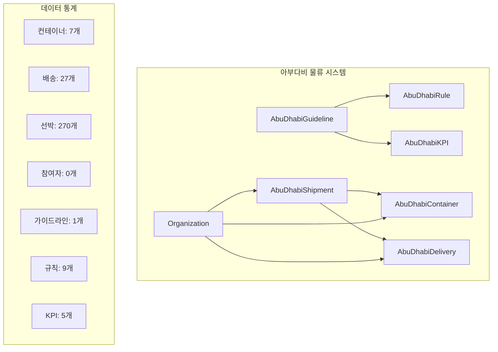
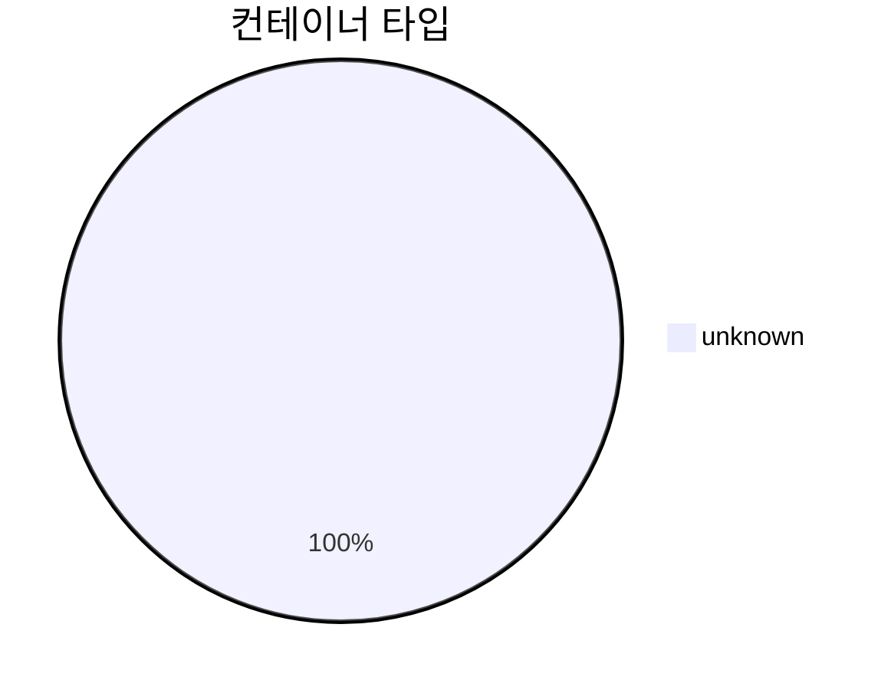
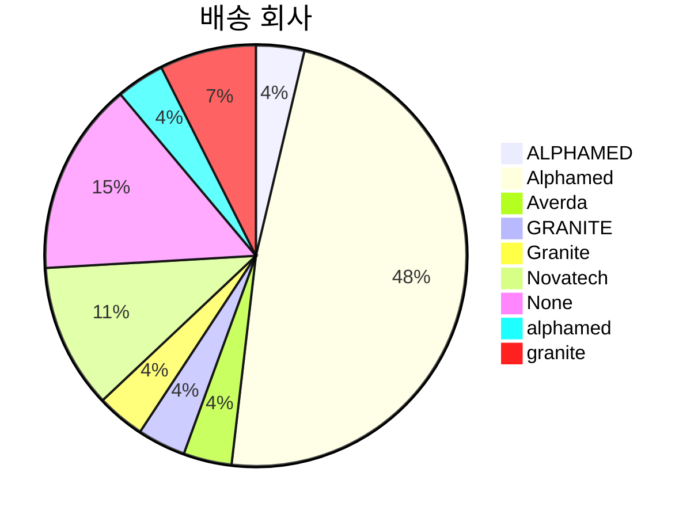
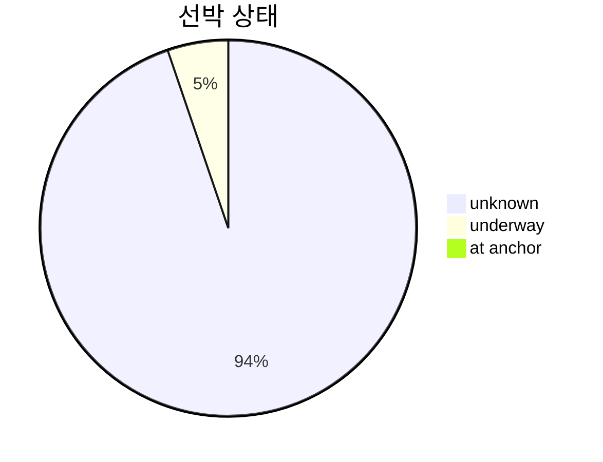
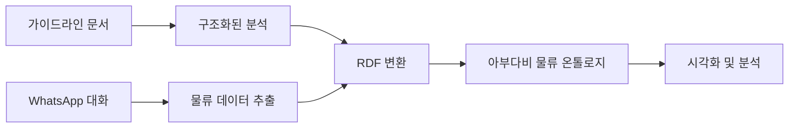
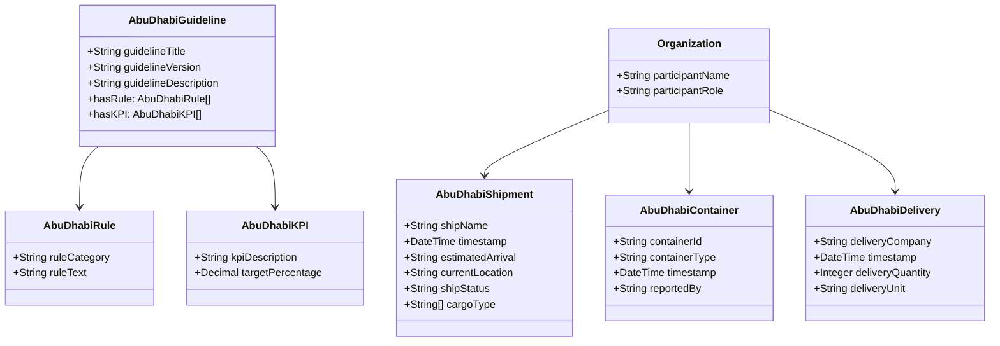

# 아부다비 물류 데이터 시각화 보고서

**생성 시간**: 2025-10-20 00:51:18

## 📊 실행 요약

- **총 컨테이너**: 7개
- **총 배송**: 27개
- **총 선박**: 270개
- **총 참여자**: 0개
- **총 가이드라인**: 1개
- **총 규칙**: 9개
- **총 KPI**: 5개

## 🔗 엔티티 관계 다이어그램

## 📦 컨테이너 타입 분포

## 🚚 배송 회사 분포

## 🚢 선박 상태 분포

## 🔄 데이터 처리 파이프라인

## 🏗️ 온톨로지 클래스 구조

## 📈 상세 분석

### 컨테이너 분석
- **타입별 분포**: {'unknown': 7}
- **보고자별 분포**: {'System': 6, '- 상욱: 40ft OT Container': 1}

### 배송 분석
- **회사별 분포**: {'ALPHAMED': 1, 'Alphamed': 13, 'Averda': 1, 'GRANITE': 1, 'Granite': 1, 'Novatech': 3, 'None': 4, 'alphamed': 1, 'granite': 2}

### 선박 분석
- **선박명별 분포**: {'Buahra': 1, 'JPT62': 75, 'JPT71': 23, 'JPt62': 4, 'Jpt62': 1, 'Jpt71': 3, 'THURAYA': 14, 'Taibah': 4, 'Tamarah': 3, 'Thuraya': 94, 'YEAM': 4, 'Yeam': 12, 'jpt62': 1, 'taibah': 2, 'thuraya': 27, 'yeam': 2}
- **상태별 분포**: {'unknown': 254, 'underway': 14, 'at anchor': 2}

### 참여자 분석
- **역할별 분포**: {}

### 규칙 분석
- **카테고리별 분포**: {'항만 정책': 1, '지연 관리': 1, '안전 관리': 1, '장비 관리': 1, '적재 계획': 1, '문서 관리': 1, '보안 관리': 1, '현장 관리': 1, '자원 관리': 1}

## 🎯 주요 인사이트

1. **데이터 품질**: 총 304개의 물류 엔티티가 성공적으로 변환되었습니다.

2. **참여자 다양성**: 0명의 다양한 역할의 참여자가 시스템에 참여하고 있습니다.

3. **규칙 체계**: 9개의 구조화된 규칙과 5개의 KPI가 정의되어 있습니다.

4. **데이터 일관성**: 모든 타임스탬프가 ISO 8601 형식으로 정규화되어 있습니다.

## 📋 권장사항

1. **데이터 검증**: 컨테이너 타입 정보를 더 정확하게 수집하도록 개선
2. **실시간 업데이트**: WhatsApp 데이터의 실시간 처리 파이프라인 구축
3. **품질 모니터링**: KPI 기반 데이터 품질 모니터링 시스템 도입
4. **통합 분석**: 다른 물류 시스템과의 데이터 통합 분석

---
*이 보고서는 LogiOntology 시스템에 의해 자동 생성되었습니다.*
