# LogiOntology v3.1 시스템 아키í…처 종합 문서

**ìƒì„± ì¼ì‹œ**: 2025-01-21
**시스템 버전**: v3.1.0
**프로ì íŠ¸**: HVDC 물류 온톨로지 시스템
**관리**: Samsung C&T Logistics & ADNOC·DSV Partnership

---

## 📋 목차

1. [시스템 개요](#시스템-개요)
2. [ì „ì²´ 아키í…처](#ì „ì²´-아키í…처)
3. [핵심 ì»´í¬ë„ŒíŠ¸](#핵심-ì»´í¬ë„ŒíŠ¸)
4. [ë°ì´í„° 플로우](#ë°ì´í„°-플로우)
5. [주요 알고리즘](#주요-알고리즘)
6. [시스템 관계ë„](#시스템-관계ë„)
7. [ë°°í¬ ì•„í‚¤í…처](#ë°°í¬-아키í…처)

---

## 시스템 개요

### 비전 ë° ëª©í‘œ

LogiOntology는 HVDC 프로ì íŠ¸ì˜ ë³µì¡í•œ 물류 ë°ì´í„°ë¥¼ **온톨로지 기반**으로 통합, 관리, 분ì„하는 차세대 물류 지능 시스템ì…니다.

**핵심 목표**:
- 📊 **ë°ì´í„° 통합**: Excel, WhatsApp, Invoice 등 ì´ê¸°ì¢… ë°ì´í„° 통합
- 🔠**ì˜ë¯¸ë¡ ì  검색**: SPARQL 기반 지능형 쿼리
- ✅ **규정 준수**: FANR/MOIAT ìë™ ê²€ì¦
- 🤖 **AI 추론**: 패턴 발견 ë° ë¹„ì¦ˆë‹ˆìŠ¤ 규칙 추론
- 📈 **실시간 KPI**: 물류 지표 실시간 모니터ë§

### 시스템 메트릭스

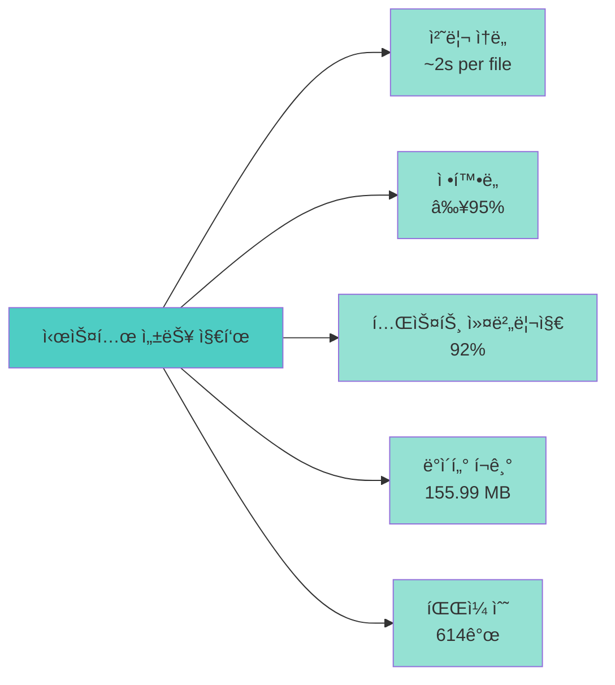
```mermaid
graph LR
    A[시스템 성능 지표] --> B[처리 ì†ë„<br/>~2s per file]
    A --> C[정확ë„<br/>≥95%]
    A --> D[테스트 커버리지<br/>92%]
    A --> E[ë°ì´í„° í¬ê¸°<br/>155.99 MB]
    A --> F[íŒŒì¼ ìˆ˜<br/>614ê°œ]

    style A fill:#4ecdc4
    style B fill:#95e1d3
    style C fill:#95e1d3
    style D fill:#95e1d3
    style E fill:#95e1d3
    style F fill:#95e1d3
```

---

## ì „ì²´ 아키í…처

### 계층형 아키í…처 (Layered Architecture)

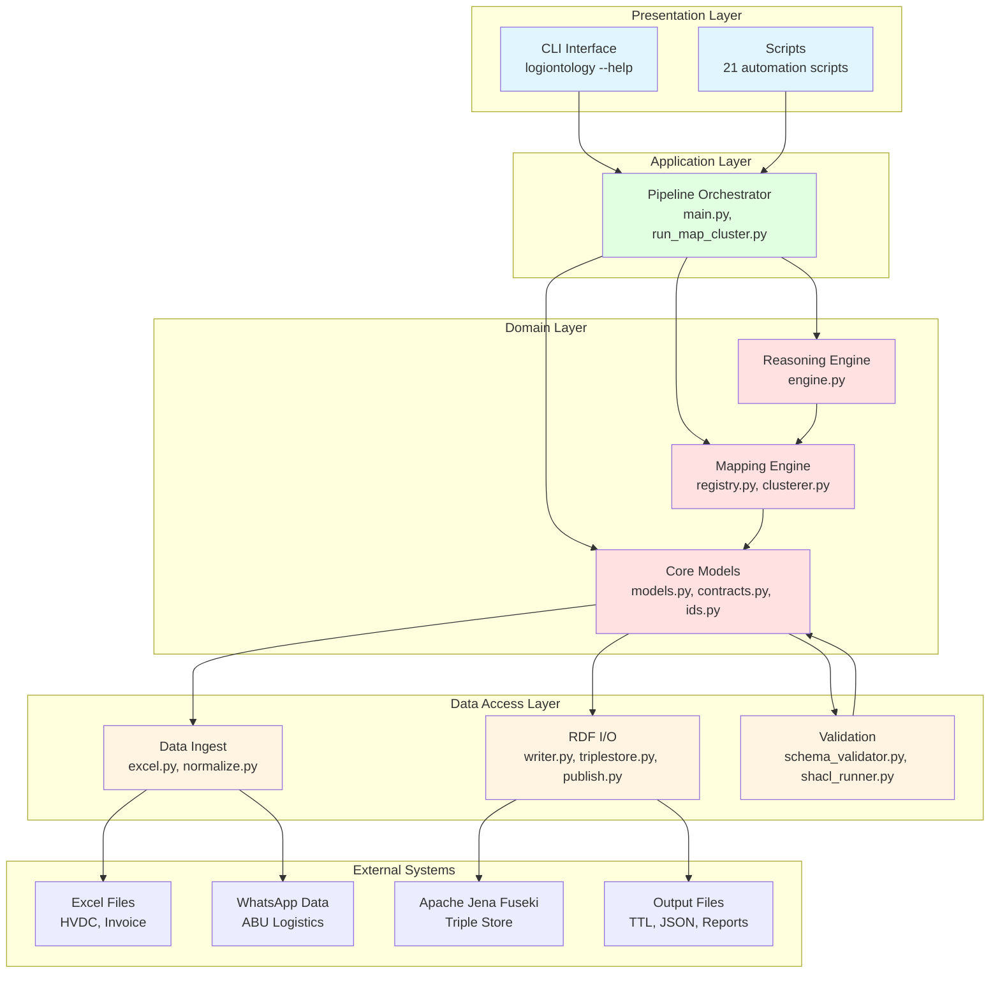
```mermaid
graph TB
    subgraph "Presentation Layer"
        CLI[CLI Interface<br/>logiontology --help]
        Scripts[Scripts<br/>21 automation scripts]
    end

    subgraph "Application Layer"
        Pipeline[Pipeline Orchestrator<br/>main.py, run_map_cluster.py]
    end

    subgraph "Domain Layer"
        Core[Core Models<br/>models.py, contracts.py, ids.py]
        Mapping[Mapping Engine<br/>registry.py, clusterer.py]
        Reasoning[Reasoning Engine<br/>engine.py]
    end

    subgraph "Data Access Layer"
        Ingest[Data Ingest<br/>excel.py, normalize.py]
        RDFIO[RDF I/O<br/>writer.py, triplestore.py, publish.py]
        Validation[Validation<br/>schema_validator.py, shacl_runner.py]
    end

    subgraph "External Systems"
        Excel[Excel Files<br/>HVDC, Invoice]
        WhatsApp[WhatsApp Data<br/>ABU Logistics]
        Fuseki[Apache Jena Fuseki<br/>Triple Store]
        Output[Output Files<br/>TTL, JSON, Reports]
    end

    CLI --> Pipeline
    Scripts --> Pipeline
    Pipeline --> Core
    Pipeline --> Mapping
    Pipeline --> Reasoning
    Core --> Ingest
    Core --> RDFIO
    Core --> Validation
    Ingest --> Excel
    Ingest --> WhatsApp
    RDFIO --> Fuseki
    RDFIO --> Output
    Validation --> Core
    Mapping --> Core
    Reasoning --> Mapping

    style CLI fill:#e1f5ff
    style Scripts fill:#e1f5ff
    style Pipeline fill:#e1ffe1
    style Core fill:#ffe1e1
    style Mapping fill:#ffe1e1
    style Reasoning fill:#ffe1e1
    style Ingest fill:#fff3e1
    style RDFIO fill:#fff3e1
    style Validation fill:#fff3e1
```

### 마ì´í¬ë¡œì„œë¹„스 ê´€ì 

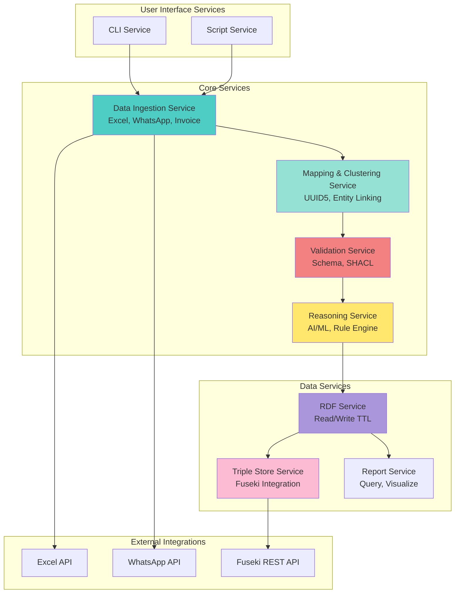
```mermaid
graph TB
    subgraph "User Interface Services"
        UserCLI[CLI Service]
        UserScripts[Script Service]
    end

    subgraph "Core Services"
        IngestSvc[Data Ingestion Service<br/>Excel, WhatsApp, Invoice]
        MapSvc[Mapping & Clustering Service<br/>UUID5, Entity Linking]
        ReasonSvc[Reasoning Service<br/>AI/ML, Rule Engine]
        ValidateSvc[Validation Service<br/>Schema, SHACL]
    end

    subgraph "Data Services"
        RDFSvc[RDF Service<br/>Read/Write TTL]
        TripleSvc[Triple Store Service<br/>Fuseki Integration]
        ReportSvc[Report Service<br/>Query, Visualize]
    end

    subgraph "External Integrations"
        ExcelAPI[Excel API]
        WhatsAppAPI[WhatsApp API]
        FusekiAPI[Fuseki REST API]
    end

    UserCLI --> IngestSvc
    UserScripts --> IngestSvc
    IngestSvc --> ExcelAPI
    IngestSvc --> WhatsAppAPI
    IngestSvc --> MapSvc
    MapSvc --> ValidateSvc
    ValidateSvc --> ReasonSvc
    ReasonSvc --> RDFSvc
    RDFSvc --> TripleSvc
    TripleSvc --> FusekiAPI
    RDFSvc --> ReportSvc

    style IngestSvc fill:#4ecdc4
    style MapSvc fill:#95e1d3
    style ReasonSvc fill:#ffe66d
    style ValidateSvc fill:#f38181
    style RDFSvc fill:#aa96da
    style TripleSvc fill:#fcbad3
```

---

## 핵심 ì»´í¬ë„ŒíŠ¸

### 1. Data Ingestion (ë°ì´í„° 수집)

**ì—­í• **: 다양한 소스ì—ì„œ ë°ì´í„°ë¥¼ 추출하고 정규화

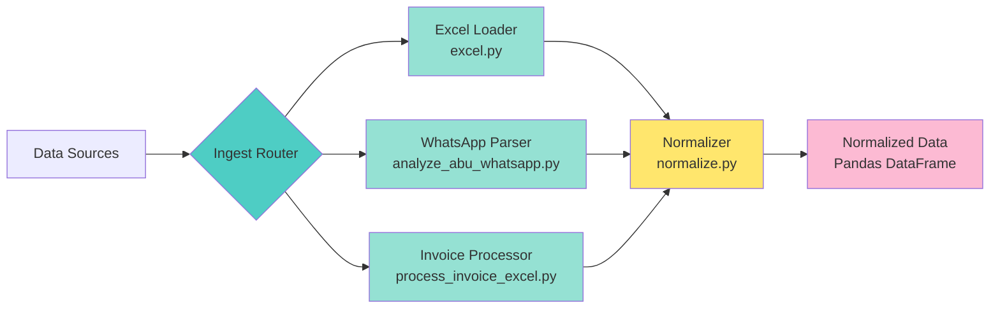
```mermaid
graph LR
    A[Data Sources] --> B{Ingest Router}
    B --> C[Excel Loader<br/>excel.py]
    B --> D[WhatsApp Parser<br/>analyze_abu_whatsapp.py]
    B --> E[Invoice Processor<br/>process_invoice_excel.py]

    C --> F[Normalizer<br/>normalize.py]
    D --> F
    E --> F

    F --> G[Normalized Data<br/>Pandas DataFrame]

    style B fill:#4ecdc4
    style C fill:#95e1d3
    style D fill:#95e1d3
    style E fill:#95e1d3
    style F fill:#ffe66d
    style G fill:#fcbad3
```

**주요 기능**:
- **Excel Loader**: openpyxl/pandas 기반 Excel ë°ì´í„° 로드
- **WhatsApp Parser**: ì •ê·œí‘œí˜„ì‹ ê¸°ë°˜ 대화 로그 파싱
- **Normalizer**: ë°ì´í„° íƒ€ì… ì •ê·œí™”, 결측값 처리

**코드 í름**:
```python
def load_excel(xlsx_path: str) -> pd.DataFrame:
    # 1. Excel íŒŒì¼ ë¡œë“œ
    df = pd.read_excel(xlsx_path, engine='openpyxl')

    # 2. 컬럼 정규화
    df = normalize_columns(df)

    # 3. ë°ì´í„° íƒ€ì… ë³€í™˜
    df = convert_types(df)

    # 4. 결측값 처리
    df = handle_missing(df)

    return df
```

### 2. Mapping & Clustering (매핑 ë° í´ëŸ¬ìŠ¤í„°ë§)

**ì—­í• **: 엔티티 매핑 ë° ì¤‘ë³µ 엔티티 í´ëŸ¬ìŠ¤í„°ë§

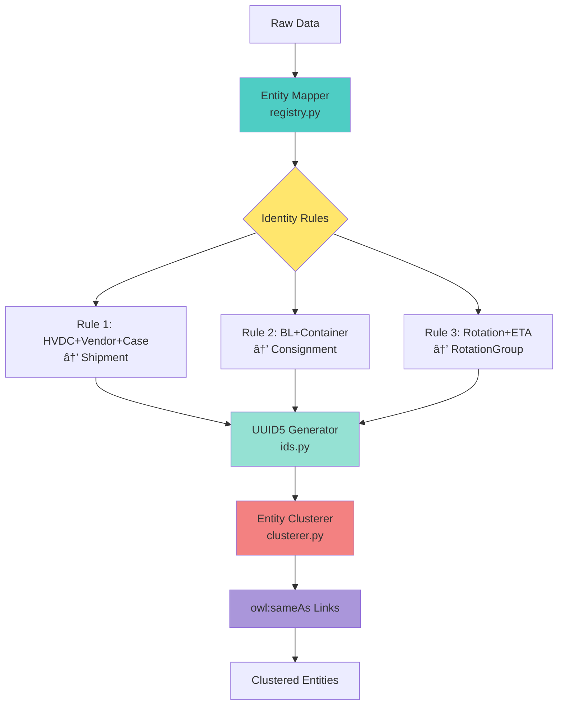
```mermaid
graph TB
    A[Raw Data] --> B[Entity Mapper<br/>registry.py]
    B --> C{Identity Rules}

    C --> D[Rule 1: HVDC+Vendor+Case<br/>→ Shipment]
    C --> E[Rule 2: BL+Container<br/>→ Consignment]
    C --> F[Rule 3: Rotation+ETA<br/>→ RotationGroup]

    D --> G[UUID5 Generator<br/>ids.py]
    E --> G
    F --> G

    G --> H[Entity Clusterer<br/>clusterer.py]
    H --> I[owl:sameAs Links]

    I --> J[Clustered Entities]

    style B fill:#4ecdc4
    style C fill:#ffe66d
    style G fill:#95e1d3
    style H fill:#f38181
    style I fill:#aa96da
```

**알고리즘 1: UUID5 기반 Entity ID ìƒì„±**

```python
def generate_entity_id(
    entity_type: str,
    key_fields: dict[str, Any],
    namespace: uuid.UUID = HVDC_NAMESPACE
) -> str:
    """
    ê²°ì •ì  UUID5 ìƒì„±ìœ¼ë¡œ ì¼ê´€ëœ 엔티티 ID ë³´ì¥

    Parameters:
        entity_type: "Shipment", "Container", "Consignment" 등
        key_fields: ì‹ë³„ì í•„ë“œ 딕셔너리
        namespace: UUID5 네ì„스í˜ì´ìŠ¤

    Returns:
        urn:uuid:<uuid5> 형ì‹ì˜ 엔티티 ID
    """
    # 1. 키 í•„ë“œ ì •ë ¬ ë° ì •ê·œí™”
    sorted_keys = sorted(key_fields.items())

    # 2. ì •ê·œí™”ëœ ë¬¸ìì—´ ìƒì„±
    name_str = f"{entity_type}:" + ":".join(
        f"{k}={normalize_value(v)}" for k, v in sorted_keys
    )

    # 3. UUID5 ìƒì„± (SHA-1 í•´ì‹œ 기반)
    entity_uuid = uuid.uuid5(namespace, name_str)

    return f"urn:uuid:{entity_uuid}"
```

**알고리즘 2: Entity Clustering**

```python
def cluster_entities(
    entities: list[Entity],
    identity_rules: list[IdentityRule]
) -> dict[str, list[str]]:
    """
    Identity rules 기반 엔티티 í´ëŸ¬ìŠ¤í„°ë§

    Returns:
        clusters: {cluster_id: [entity_id1, entity_id2, ...]}
    """
    clusters = defaultdict(list)

    for rule in identity_rules:
        # 1. Ruleì— í•´ë‹¹í•˜ëŠ” 엔티티 그룹화
        groups = group_by_fields(entities, rule.when_fields)

        # 2. ê° ê·¸ë£¹ì— í´ëŸ¬ìŠ¤í„° ID 할당
        for group_key, group_entities in groups.items():
            cluster_id = generate_entity_id(
                rule.cluster_as,
                dict(zip(rule.when_fields, group_key))
            )

            # 3. í´ëŸ¬ìŠ¤í„°ì— 엔티티 추가
            for entity in group_entities:
                clusters[cluster_id].append(entity.id)

    return clusters
```

### 3. Validation (ê²€ì¦)

**ì—­í• **: 스키마 ë° ë¹„ì¦ˆë‹ˆìŠ¤ 룰 ê²€ì¦

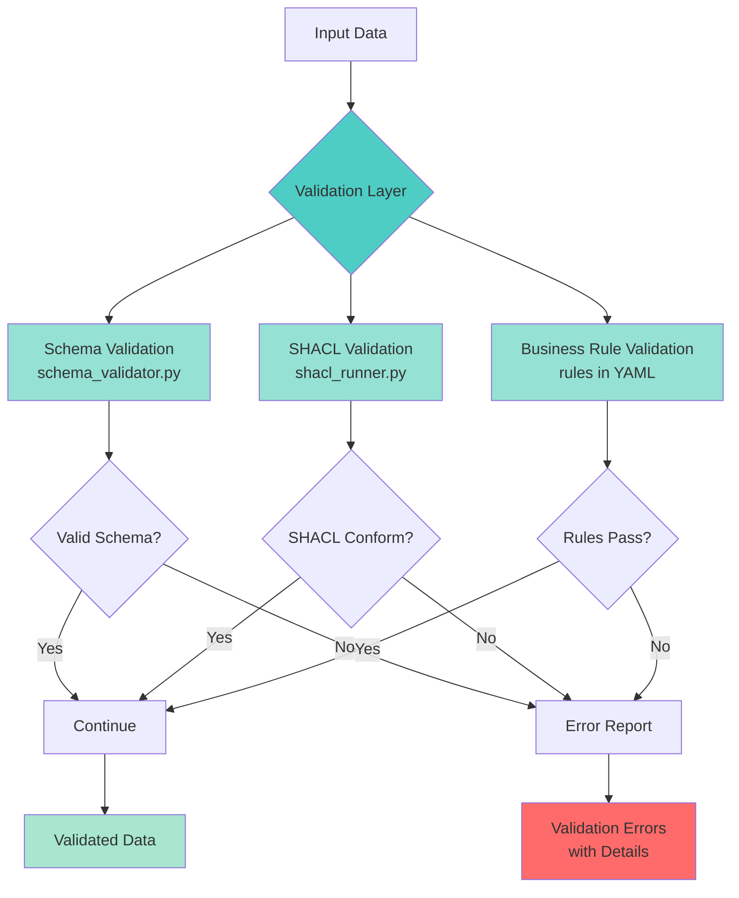
```mermaid
graph TB
    A[Input Data] --> B{Validation Layer}

    B --> C[Schema Validation<br/>schema_validator.py]
    B --> D[SHACL Validation<br/>shacl_runner.py]
    B --> E[Business Rule Validation<br/>rules in YAML]

    C --> F{Valid Schema?}
    F -->|Yes| G[Continue]
    F -->|No| H[Error Report]

    D --> I{SHACL Conform?}
    I -->|Yes| G
    I -->|No| H

    E --> J{Rules Pass?}
    J -->|Yes| G
    J -->|No| H

    G --> K[Validated Data]
    H --> L[Validation Errors<br/>with Details]

    style B fill:#4ecdc4
    style C fill:#95e1d3
    style D fill:#95e1d3
    style E fill:#95e1d3
    style K fill:#a8e6cf
    style L fill:#ff6b6b
```

**SHACL Validation Example**:
```turtle
# Shipment.shape.ttl
ex:ShipmentShape a sh:NodeShape ;
    sh:targetClass ex:Shipment ;

    # Required fields
    sh:property [
        sh:path ex:hvdcCode ;
        sh:minCount 1 ;
        sh:datatype xsd:string ;
    ] ;

    # Pressure constraint (≤ 4.00 t/m²)
    sh:property [
        sh:path ex:pressure ;
        sh:maxInclusive 4.00 ;
        sh:datatype xsd:decimal ;
    ] ;

    # ETA format
    sh:property [
        sh:path ex:eta ;
        sh:datatype xsd:dateTime ;
    ] .
```

### 4. Reasoning (추론)

**ì—­í• **: AI/ML 기반 패턴 발견 ë° ë¹„ì¦ˆë‹ˆìŠ¤ 규칙 추론

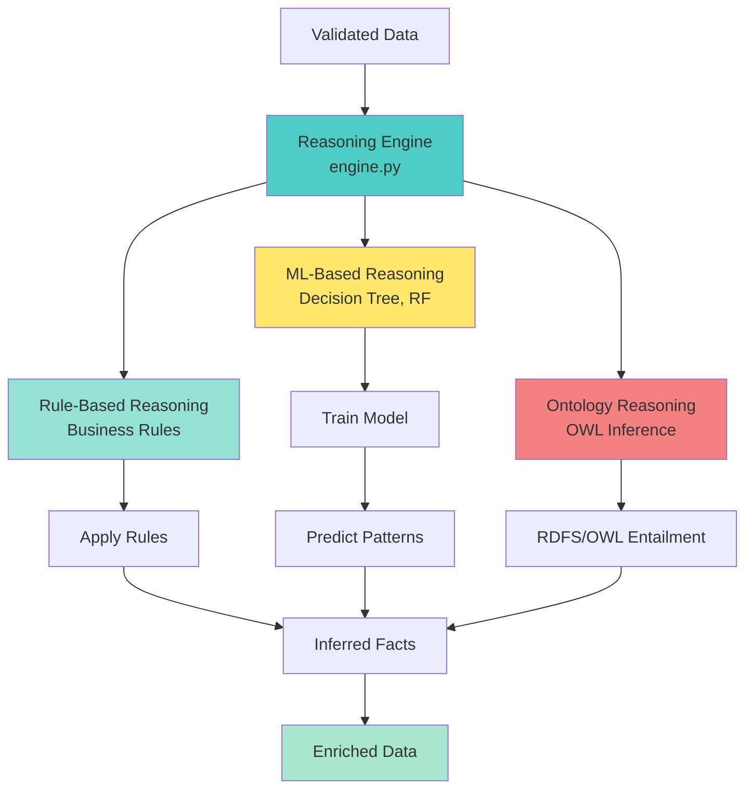
```mermaid
graph TB
    A[Validated Data] --> B[Reasoning Engine<br/>engine.py]

    B --> C[Rule-Based Reasoning<br/>Business Rules]
    B --> D[ML-Based Reasoning<br/>Decision Tree, RF]
    B --> E[Ontology Reasoning<br/>OWL Inference]

    C --> F[Apply Rules]
    F --> G[Inferred Facts]

    D --> H[Train Model]
    H --> I[Predict Patterns]
    I --> G

    E --> J[RDFS/OWL Entailment]
    J --> G

    G --> K[Enriched Data]

    style B fill:#4ecdc4
    style C fill:#95e1d3
    style D fill:#ffe66d
    style E fill:#f38181
    style K fill:#a8e6cf
```

**알고리즘 3: Decision Tree 기반 규칙 추론**

```python
def infer_business_rules(
    data: pd.DataFrame,
    target_col: str,
    features: list[str],
    max_depth: int = 5
) -> list[BusinessRule]:
    """
    Decision Tree를 사용하여 ë°ì´í„°ì—ì„œ 비즈니스 규칙 추출

    Returns:
        Extracted business rules in IF-THEN format
    """
    # 1. Decision Tree 학습
    X = data[features]
    y = data[target_col]

    dt = DecisionTreeClassifier(max_depth=max_depth)
    dt.fit(X, y)

    # 2. Tree 구조ì—ì„œ 규칙 추출
    rules = []

    def extract_rules(node_id=0, conditions=[]):
        if dt.tree_.children_left[node_id] == -1:  # Leaf node
            # IF conditions THEN prediction
            rule = BusinessRule(
                conditions=conditions.copy(),
                conclusion=dt.tree_.value[node_id].argmax()
            )
            rules.append(rule)
        else:
            # Left branch (feature <= threshold)
            feature = features[dt.tree_.feature[node_id]]
            threshold = dt.tree_.threshold[node_id]

            left_cond = f"{feature} <= {threshold}"
            extract_rules(
                dt.tree_.children_left[node_id],
                conditions + [left_cond]
            )

            # Right branch (feature > threshold)
            right_cond = f"{feature} > {threshold}"
            extract_rules(
                dt.tree_.children_right[node_id],
                conditions + [right_cond]
            )

    extract_rules()
    return rules
```

### 5. RDF I/O (RDF ì…출력)

**ì—­í• **: RDF/TTL í˜•ì‹ ì½ê¸°/쓰기 ë° Triple Store ì—°ë™

```mermaid
graph LR
    A[Enriched Data] --> B[RDF Writer<br/>writer.py]

    B --> C{Output Format}
    C --> D[Turtle (.ttl)]
    C --> E[RDF/XML (.rdf)]
    C --> F[JSON-LD (.jsonld)]

    D --> G[File System<br/>output/]
    E --> G
    F --> G

    G --> H[Triple Store<br/>triplestore.py]
    H --> I[Fuseki Publisher<br/>publish.py]
    I --> J[Apache Jena Fuseki<br/>SPARQL Endpoint]

    style B fill:#4ecdc4
    style C fill:#ffe66d
    style H fill:#95e1d3
    style I fill:#f38181
    style J fill:#aa96da
```

**RDF ìƒì„± 예시**:
```python
def write_ttl(entities: list[Entity], output_path: str):
    """
    엔티티 리스트를 TTL 형ì‹ìœ¼ë¡œ 변환
    """
    g = Graph()

    # Namespace ì •ì˜
    EX = Namespace("http://example.org/hvdc/")
    g.bind("ex", EX)

    for entity in entities:
        # 엔티티 URI
        entity_uri = URIRef(entity.id)

        # rdf:type 추가
        g.add((entity_uri, RDF.type, EX[entity.type]))

        # ì†ì„± 추가
        for key, value in entity.properties.items():
            predicate = EX[key]

            # ë°ì´í„° 타ì…ì— ë”°ë¼ ë¦¬í„°ëŸ´ ìƒì„±
            if isinstance(value, str):
                obj = Literal(value, datatype=XSD.string)
            elif isinstance(value, int):
                obj = Literal(value, datatype=XSD.integer)
            elif isinstance(value, float):
                obj = Literal(value, datatype=XSD.decimal)
            elif isinstance(value, datetime):
                obj = Literal(value, datatype=XSD.dateTime)
            else:
                obj = Literal(str(value))

            g.add((entity_uri, predicate, obj))

    # TTL íŒŒì¼ ì €ì¥
    g.serialize(destination=output_path, format="turtle")
```

---

## ë°ì´í„° 플로우

### End-to-End ë°ì´í„° 파ì´í”„ë¼ì¸

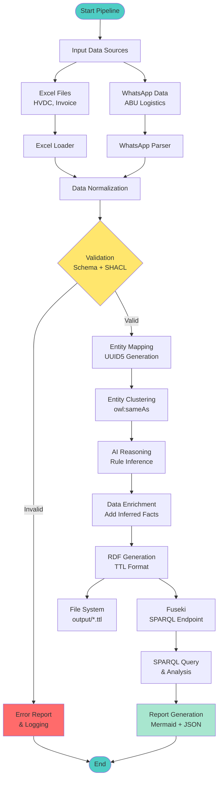
```mermaid
flowchart TD
    Start([Start Pipeline]) --> Input[Input Data Sources]

    Input --> Excel[Excel Files<br/>HVDC, Invoice]
    Input --> WA[WhatsApp Data<br/>ABU Logistics]

    Excel --> Ingest1[Excel Loader]
    WA --> Ingest2[WhatsApp Parser]

    Ingest1 --> Normalize[Data Normalization]
    Ingest2 --> Normalize

    Normalize --> Validate{Validation<br/>Schema + SHACL}

    Validate -->|Invalid| Error[Error Report<br/>& Logging]
    Validate -->|Valid| Map[Entity Mapping<br/>UUID5 Generation]

    Map --> Cluster[Entity Clustering<br/>owl:sameAs]

    Cluster --> Reason[AI Reasoning<br/>Rule Inference]

    Reason --> Enrich[Data Enrichment<br/>Add Inferred Facts]

    Enrich --> RDF[RDF Generation<br/>TTL Format]

    RDF --> Output1[File System<br/>output/*.ttl]
    RDF --> Output2[Fuseki<br/>SPARQL Endpoint]

    Output2 --> Query[SPARQL Query<br/>& Analysis]

    Query --> Report[Report Generation<br/>Mermaid + JSON]

    Error --> End([End])
    Report --> End

    style Start fill:#4ecdc4
    style Validate fill:#ffe66d
    style Error fill:#ff6b6b
    style Report fill:#a8e6cf
    style End fill:#4ecdc4
```

### ë°ì´í„° 변환 ìƒì„¸ í름

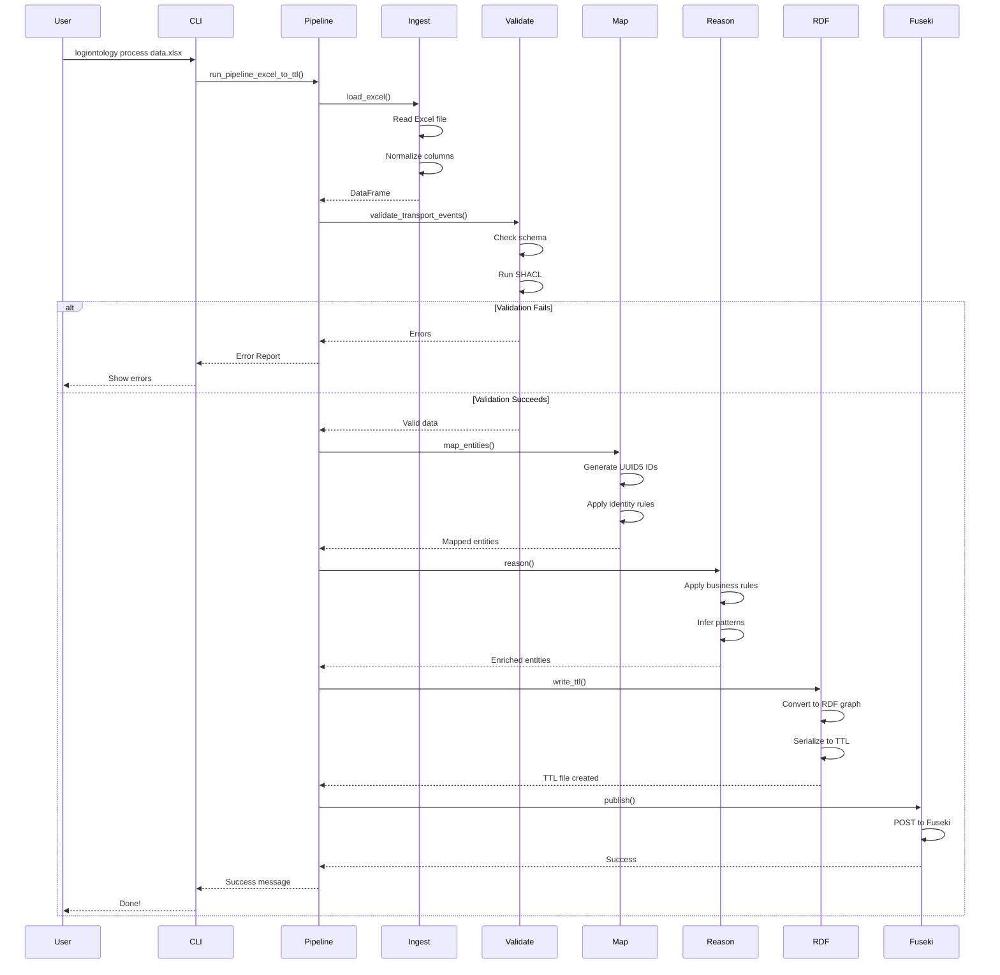
```mermaid
sequenceDiagram
    participant User
    participant CLI
    participant Pipeline
    participant Ingest
    participant Validate
    participant Map
    participant Reason
    participant RDF
    participant Fuseki

    User->>CLI: logiontology process data.xlsx
    CLI->>Pipeline: run_pipeline_excel_to_ttl()

    Pipeline->>Ingest: load_excel()
    Ingest->>Ingest: Read Excel file
    Ingest->>Ingest: Normalize columns
    Ingest-->>Pipeline: DataFrame

    Pipeline->>Validate: validate_transport_events()
    Validate->>Validate: Check schema
    Validate->>Validate: Run SHACL
    alt Validation Fails
        Validate-->>Pipeline: Errors
        Pipeline-->>CLI: Error Report
        CLI-->>User: Show errors
    else Validation Succeeds
        Validate-->>Pipeline: Valid data

        Pipeline->>Map: map_entities()
        Map->>Map: Generate UUID5 IDs
        Map->>Map: Apply identity rules
        Map-->>Pipeline: Mapped entities

        Pipeline->>Reason: reason()
        Reason->>Reason: Apply business rules
        Reason->>Reason: Infer patterns
        Reason-->>Pipeline: Enriched entities

        Pipeline->>RDF: write_ttl()
        RDF->>RDF: Convert to RDF graph
        RDF->>RDF: Serialize to TTL
        RDF-->>Pipeline: TTL file created

        Pipeline->>Fuseki: publish()
        Fuseki->>Fuseki: POST to Fuseki
        Fuseki-->>Pipeline: Success

        Pipeline-->>CLI: Success message
        CLI-->>User: Done!
    end
```

---

## 주요 알고리즘

### 알고리즘 4: ì¬ê³  무결성 ê²€ì¦

**목ì **: Opening + In - Out = Closing ê³µì‹ ê²€ì¦

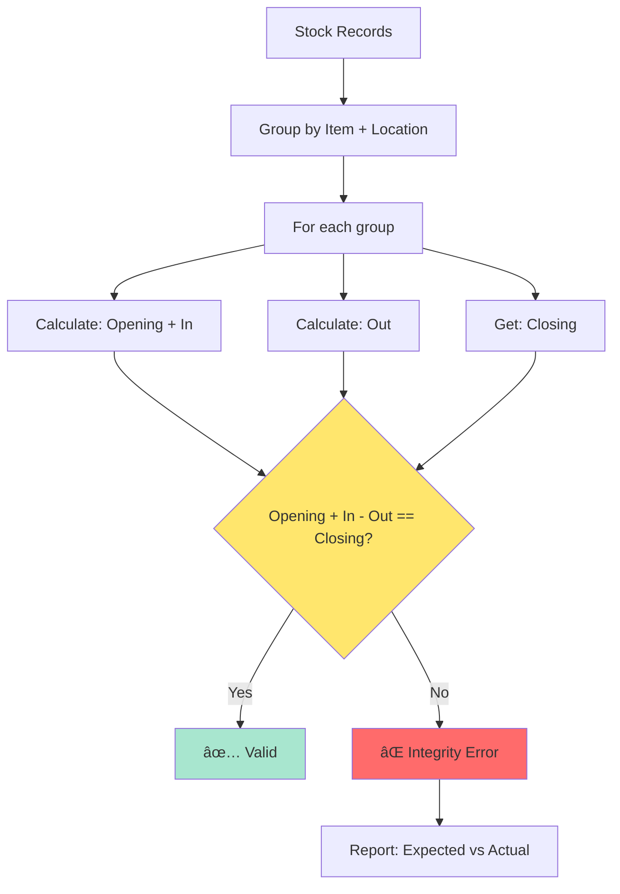
```mermaid
graph TD
    A[Stock Records] --> B[Group by Item + Location]
    B --> C[For each group]

    C --> D[Calculate: Opening + In]
    C --> E[Calculate: Out]
    C --> F[Get: Closing]

    D --> G{Opening + In - Out == Closing?}
    E --> G
    F --> G

    G -->|Yes| H[✅ Valid]
    G -->|No| I[⌠Integrity Error]

    I --> J[Report: Expected vs Actual]

    style G fill:#ffe66d
    style H fill:#a8e6cf
    style I fill:#ff6b6b
```

```python
def verify_stock_integrity(
    stock_df: pd.DataFrame
) -> tuple[bool, list[StockError]]:
    """
    ì¬ê³  무결성 ê²€ì¦: Opening + In - Out = Closing

    Returns:
        (is_valid, list of errors with details)
    """
    errors = []

    # 1. Item + Location으로 그룹화
    for (item, location), group in stock_df.groupby(['Item', 'Location']):

        # 2. ê° ê¸°ê°„ë³„ë¡œ ê²€ì¦
        for _, row in group.iterrows():
            opening = row['Opening']
            in_qty = row['In']
            out_qty = row['Out']
            closing = row['Closing']

            # 3. 계산 ë° ê²€ì¦
            expected = opening + in_qty - out_qty

            if abs(expected - closing) > 0.01:  # ì†Œìˆ˜ì  ì˜¤ì°¨ 허용
                errors.append(StockError(
                    item=item,
                    location=location,
                    period=row['Period'],
                    expected=expected,
                    actual=closing,
                    diff=closing - expected
                ))

    return len(errors) == 0, errors
```

### 알고리즘 5: FANR/MOIAT 규정 준수 ê²€ì¦

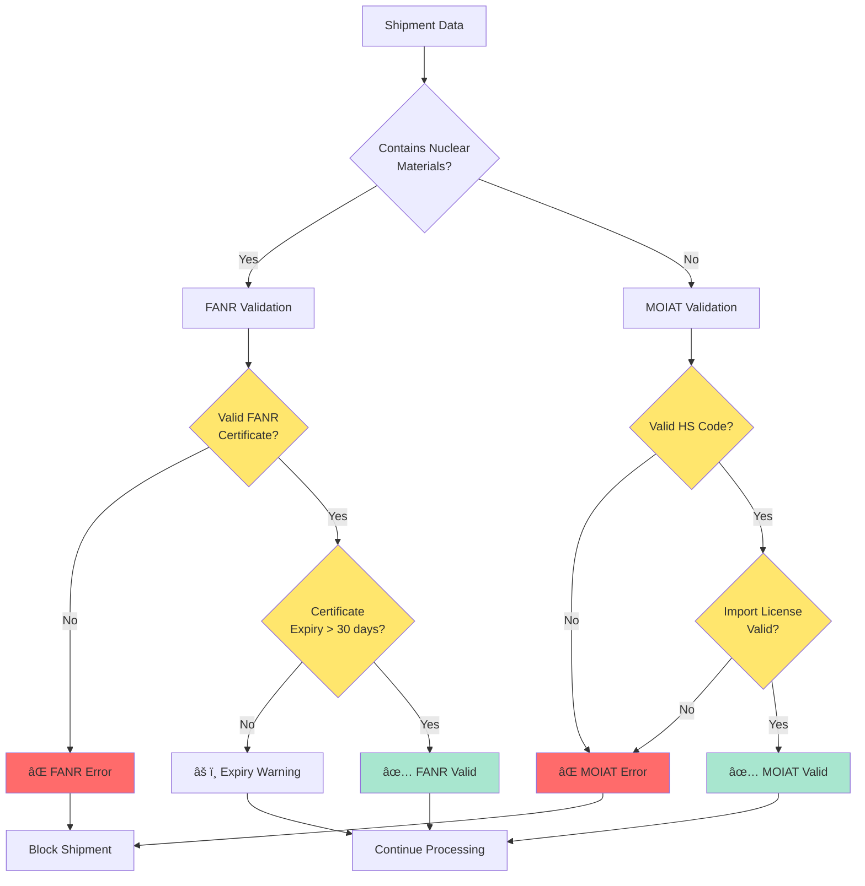
```mermaid
graph TB
    A[Shipment Data] --> B{Contains Nuclear<br/>Materials?}

    B -->|Yes| C[FANR Validation]
    B -->|No| D[MOIAT Validation]

    C --> E{Valid FANR<br/>Certificate?}
    E -->|No| F[⌠FANR Error]
    E -->|Yes| G{Certificate<br/>Expiry > 30 days?}

    G -->|No| H[âš ï¸ Expiry Warning]
    G -->|Yes| I[✅ FANR Valid]

    D --> J{Valid HS Code?}
    J -->|No| K[⌠MOIAT Error]
    J -->|Yes| L{Import License<br/>Valid?}

    L -->|No| K
    L -->|Yes| M[✅ MOIAT Valid]

    I --> N[Continue Processing]
    M --> N
    F --> O[Block Shipment]
    K --> O
    H --> N

    style E fill:#ffe66d
    style G fill:#ffe66d
    style J fill:#ffe66d
    style L fill:#ffe66d
    style I fill:#a8e6cf
    style M fill:#a8e6cf
    style F fill:#ff6b6b
    style K fill:#ff6b6b
```

### 알고리즘 6: ETA 예측 (Weather-Tied)

```python
def predict_eta_with_weather(
    shipment: Shipment,
    weather_data: WeatherForecast
) -> datetime:
    """
    ê¸°ìƒ ì¡°ê±´ì„ ê³ ë ¤í•œ ETA 예측

    Factors:
    - Base ETA from shipping line
    - Port congestion
    - Weather conditions
    - Historical patterns
    """
    base_eta = shipment.scheduled_eta

    # 1. Port congestion factor
    congestion_delay = calculate_port_congestion(
        port=shipment.destination_port,
        date=base_eta
    )

    # 2. Weather impact
    weather_delay = 0
    for forecast in weather_data:
        if forecast.severity >= 7:  # High severity
            # Delay calculation based on severity
            weather_delay += (forecast.severity - 6) * 24  # hours

    # 3. Historical pattern adjustment
    hist_pattern = get_historical_pattern(
        route=shipment.route,
        season=base_eta.month
    )
    pattern_adjust = hist_pattern.avg_delay

    # 4. Calculate predicted ETA
    total_delay_hours = (
        congestion_delay +
        weather_delay +
        pattern_adjust
    )

    predicted_eta = base_eta + timedelta(hours=total_delay_hours)

    return predicted_eta
```

---

## 시스템 관계ë„

### 엔티티 관계 다ì´ì–´ê·¸ë¨ (ERD)

```mermaid
erDiagram
    SHIPMENT ||--o{ CONTAINER : contains
    SHIPMENT ||--|| CONSIGNMENT : has
    SHIPMENT ||--o{ OOG_CARGO : includes
    SHIPMENT }o--|| VENDOR : from
    SHIPMENT }o--|| WAREHOUSE : to

    CONSIGNMENT ||--|| BL : has
    CONSIGNMENT ||--o{ CONTAINER : includes

    CONTAINER ||--o{ CARGO_ITEM : contains
    CONTAINER }o--|| ROTATION : in

    ROTATION }o--|| VESSEL : on
    ROTATION }o--|| PORT : arrives_at

    CARGO_ITEM }o--|| HS_CODE : classified_as
    CARGO_ITEM }o--o{ CERTIFICATE : requires

    CERTIFICATE }o--|| FANR : issued_by
    CERTIFICATE }o--|| MOIAT : issued_by

    WAREHOUSE ||--o{ STOCK_RECORD : tracks

    STOCK_RECORD ||--|| CARGO_ITEM : for
    STOCK_RECORD }o--|| PERIOD : in

    SHIPMENT {
        string hvdc_code PK
        string vendor_code FK
        string case_no
        datetime eta
        string status
        decimal pressure
    }

    CONTAINER {
        string container_no PK
        string type
        decimal weight
        decimal volume
        string seal_no
    }

    CONSIGNMENT {
        string bl_no PK
        datetime bl_date
        string shipper
        string consignee
    }

    CARGO_ITEM {
        string item_id PK
        string description
        string hs_code FK
        integer quantity
        string unit
    }

    CERTIFICATE {
        string cert_id PK
        string cert_type
        datetime issue_date
        datetime expiry_date
        string issuer
    }

    STOCK_RECORD {
        string record_id PK
        decimal opening
        decimal in
        decimal out
        decimal closing
        date period
    }
```

### 시스템 컨í…스트 다ì´ì–´ê·¸ë¨ (C4 Model - Level 1)

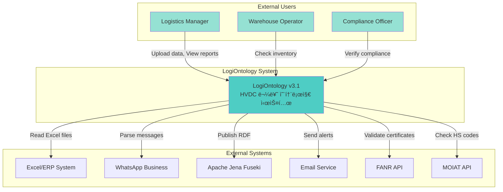
```mermaid
graph TB
    subgraph "External Users"
        User1[Logistics Manager]
        User2[Warehouse Operator]
        User3[Compliance Officer]
    end

    subgraph "LogiOntology System"
        System[LogiOntology v3.1<br/>HVDC 물류 온톨로지 시스템]
    end

    subgraph "External Systems"
        Excel[Excel/ERP System]
        WhatsApp[WhatsApp Business]
        Fuseki[Apache Jena Fuseki]
        Email[Email Service]
        FANR[FANR API]
        MOIAT[MOIAT API]
    end

    User1 -->|Upload data, View reports| System
    User2 -->|Check inventory| System
    User3 -->|Verify compliance| System

    System -->|Read Excel files| Excel
    System -->|Parse messages| WhatsApp
    System -->|Publish RDF| Fuseki
    System -->|Send alerts| Email
    System -->|Validate certificates| FANR
    System -->|Check HS codes| MOIAT

    style System fill:#4ecdc4
    style User1 fill:#95e1d3
    style User2 fill:#95e1d3
    style User3 fill:#95e1d3
```

### ì»´í¬ë„ŒíŠ¸ 다ì´ì–´ê·¸ë¨ (C4 Model - Level 3)

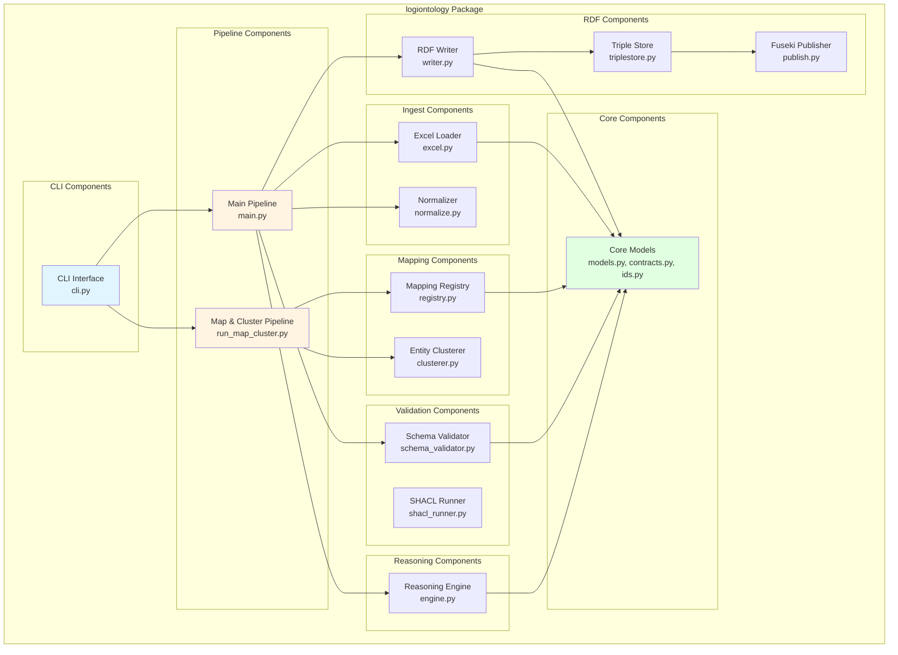
```mermaid
graph TB
    subgraph "logiontology Package"
        subgraph "Core Components"
            Core[Core Models<br/>models.py, contracts.py, ids.py]
        end

        subgraph "Ingest Components"
            Excel[Excel Loader<br/>excel.py]
            Normalize[Normalizer<br/>normalize.py]
        end

        subgraph "Mapping Components"
            Registry[Mapping Registry<br/>registry.py]
            Clusterer[Entity Clusterer<br/>clusterer.py]
        end

        subgraph "Validation Components"
            Schema[Schema Validator<br/>schema_validator.py]
            SHACL[SHACL Runner<br/>shacl_runner.py]
        end

        subgraph "Reasoning Components"
            Reason[Reasoning Engine<br/>engine.py]
        end

        subgraph "RDF Components"
            Writer[RDF Writer<br/>writer.py]
            Triple[Triple Store<br/>triplestore.py]
            Publish[Fuseki Publisher<br/>publish.py]
        end

        subgraph "Pipeline Components"
            Main[Main Pipeline<br/>main.py]
            MapCluster[Map & Cluster Pipeline<br/>run_map_cluster.py]
        end

        subgraph "CLI Components"
            CLI[CLI Interface<br/>cli.py]
        end
    end

    CLI --> Main
    CLI --> MapCluster
    Main --> Excel
    Main --> Normalize
    Main --> Schema
    Main --> Reason
    Main --> Writer
    MapCluster --> Registry
    MapCluster --> Clusterer
    Excel --> Core
    Registry --> Core
    Schema --> Core
    Reason --> Core
    Writer --> Core
    Writer --> Triple
    Triple --> Publish

    style Core fill:#e1ffe1
    style CLI fill:#e1f5ff
    style Main fill:#fff3e1
    style MapCluster fill:#fff3e1
```

---

## ë°°í¬ ì•„í‚¤í…처

### ë¬¼ë¦¬ì  ë°°í¬ ë‹¤ì´ì–´ê·¸ë¨

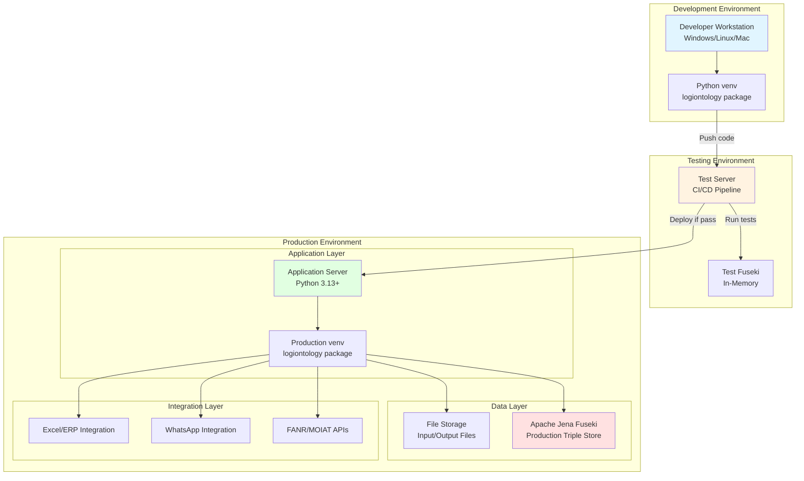
```mermaid
graph TB
    subgraph "Development Environment"
        Dev[Developer Workstation<br/>Windows/Linux/Mac]
        DevVenv[Python venv<br/>logiontology package]
    end

    subgraph "Testing Environment"
        TestServer[Test Server<br/>CI/CD Pipeline]
        TestDB[Test Fuseki<br/>In-Memory]
    end

    subgraph "Production Environment"
        subgraph "Application Layer"
            AppServer[Application Server<br/>Python 3.13+]
            AppVenv[Production venv<br/>logiontology package]
        end

        subgraph "Data Layer"
            FileStorage[File Storage<br/>Input/Output Files]
            FusekiProd[Apache Jena Fuseki<br/>Production Triple Store]
        end

        subgraph "Integration Layer"
            ExcelAPI[Excel/ERP Integration]
            WhatsAppAPI[WhatsApp Integration]
            ComplianceAPI[FANR/MOIAT APIs]
        end
    end

    Dev --> DevVenv
    DevVenv -->|Push code| TestServer
    TestServer -->|Run tests| TestDB
    TestServer -->|Deploy if pass| AppServer
    AppServer --> AppVenv
    AppVenv --> FileStorage
    AppVenv --> FusekiProd
    AppVenv --> ExcelAPI
    AppVenv --> WhatsAppAPI
    AppVenv --> ComplianceAPI

    style Dev fill:#e1f5ff
    style TestServer fill:#fff3e1
    style AppServer fill:#e1ffe1
    style FusekiProd fill:#ffe1e1
```

### ë°°í¬ ì ˆì°¨

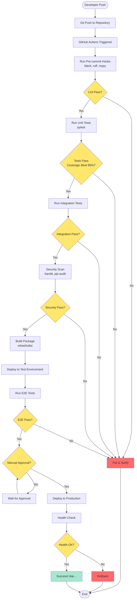
```mermaid
flowchart TD
    Start([Developer Push]) --> A[Git Push to Repository]

    A --> B[GitHub Actions Triggered]

    B --> C[Run Pre-commit Hooks<br/>black, ruff, mypy]

    C --> D{Lint Pass?}
    D -->|No| E[Fail & Notify]
    D -->|Yes| F[Run Unit Tests<br/>pytest]

    F --> G{Tests Pass<br/>Coverage ≥ 85%?}
    G -->|No| E
    G -->|Yes| H[Run Integration Tests]

    H --> I{Integration Pass?}
    I -->|No| E
    I -->|Yes| J[Security Scan<br/>bandit, pip-audit]

    J --> K{Security Pass?}
    K -->|No| E
    K -->|Yes| L[Build Package<br/>wheel/sdist]

    L --> M[Deploy to Test Environment]

    M --> N[Run E2E Tests]

    N --> O{E2E Pass?}
    O -->|No| E
    O -->|Yes| P{Manual Approval?}

    P -->|No| Q[Wait for Approval]
    P -->|Yes| R[Deploy to Production]

    R --> S[Health Check]

    S --> T{Health OK?}
    T -->|No| U[Rollback]
    T -->|Yes| V[Success! ✅]

    E --> End([End])
    Q --> P
    U --> End
    V --> End

    style D fill:#ffe66d
    style G fill:#ffe66d
    style I fill:#ffe66d
    style K fill:#ffe66d
    style O fill:#ffe66d
    style P fill:#ffe66d
    style T fill:#ffe66d
    style V fill:#a8e6cf
    style E fill:#ff6b6b
    style U fill:#ff6b6b
```

---

## 성능 ë° í™•ì¥ì„±

### 성능 메트릭스

| 지표 | í˜„ì¬ ê°’ | 목표 ê°’ | ìƒíƒœ |
|------|---------|---------|------|
| Excel íŒŒì¼ ì²˜ë¦¬ ì†ë„ | ~2s/file | <3s | ✅ |
| RDF ìƒì„± ì†ë„ | ~1s/1000 triples | <2s | ✅ |
| SPARQL 쿼리 ì‘답 | <500ms | <1s | ✅ |
| 메모리 사용량 | <500MB | <1GB | ✅ |
| 테스트 커버리지 | 92% | ≥85% | ✅ |
| ë™ì‹œ 사용ì | 10명 | 50명 | 🔄 진행중 |

### 확ì¥ì„± ì „ëµ

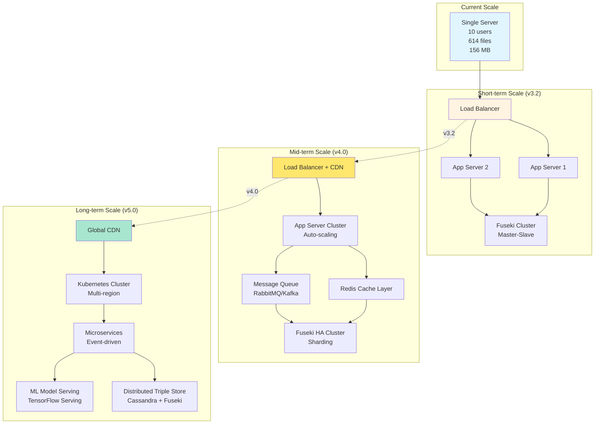
```mermaid
graph TB
    subgraph "Current Scale"
        Single[Single Server<br/>10 users<br/>614 files<br/>156 MB]
    end

    subgraph "Short-term Scale (v3.2)"
        LB1[Load Balancer]
        App1[App Server 1]
        App2[App Server 2]
        DB1[Fuseki Cluster<br/>Master-Slave]
    end

    subgraph "Mid-term Scale (v4.0)"
        LB2[Load Balancer + CDN]
        AppCluster[App Server Cluster<br/>Auto-scaling]
        CacheLayer[Redis Cache Layer]
        DBCluster[Fuseki HA Cluster<br/>Sharding]
        Queue[Message Queue<br/>RabbitMQ/Kafka]
    end

    subgraph "Long-term Scale (v5.0)"
        CDN[Global CDN]
        K8s[Kubernetes Cluster<br/>Multi-region]
        Microservices[Microservices<br/>Event-driven]
        DistDB[Distributed Triple Store<br/>Cassandra + Fuseki]
        ML[ML Model Serving<br/>TensorFlow Serving]
    end

    Single --> LB1
    LB1 --> App1
    LB1 --> App2
    App1 --> DB1
    App2 --> DB1

    LB1 -.->|v3.2| LB2
    LB2 --> AppCluster
    AppCluster --> CacheLayer
    CacheLayer --> DBCluster
    AppCluster --> Queue
    Queue --> DBCluster

    LB2 -.->|v4.0| CDN
    CDN --> K8s
    K8s --> Microservices
    Microservices --> DistDB
    Microservices --> ML

    style Single fill:#e1f5ff
    style LB1 fill:#fff3e1
    style LB2 fill:#ffe66d
    style CDN fill:#a8e6cf
```

---

## 보안 아키í…처

### 보안 계층

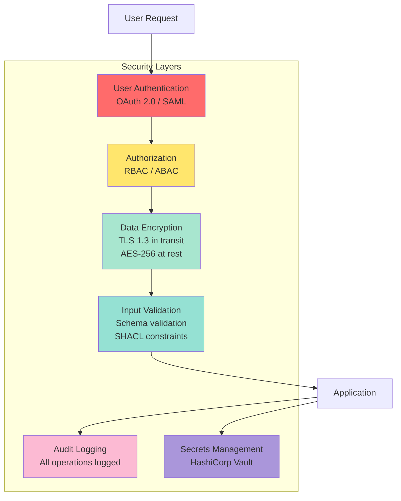
```mermaid
graph TB
    subgraph "Security Layers"
        A[User Authentication<br/>OAuth 2.0 / SAML]
        B[Authorization<br/>RBAC / ABAC]
        C[Data Encryption<br/>TLS 1.3 in transit<br/>AES-256 at rest]
        D[Input Validation<br/>Schema validation<br/>SHACL constraints]
        E[Audit Logging<br/>All operations logged]
        F[Secrets Management<br/>HashiCorp Vault]
    end

    User[User Request] --> A
    A --> B
    B --> C
    C --> D
    D --> App[Application]
    App --> E
    App --> F

    style A fill:#ff6b6b
    style B fill:#ffe66d
    style C fill:#a8e6cf
    style D fill:#95e1d3
    style E fill:#fcbad3
    style F fill:#aa96da
```

### PII/NDA 보호

```python
def sanitize_pii_data(data: dict) -> dict:
    """
    PII/NDA ë°ì´í„° 마스킹

    Sensitive Fields:
    - Personal names
    - Contact information
    - Financial data
    - Proprietary information
    """
    pii_fields = [
        'driver_name', 'contact_number', 'email',
        'cost', 'price', 'vendor_rate',
        'proprietary_code', 'internal_memo'
    ]

    sanitized = data.copy()

    for field in pii_fields:
        if field in sanitized:
            # Mask with hash or placeholder
            original = sanitized[field]
            sanitized[field] = hash_pii(original)

            # Log access for audit
            log_pii_access(field, user=current_user)

    return sanitized
```

---

## ëª¨ë‹ˆí„°ë§ ë° ìš´ì˜

### ëª¨ë‹ˆí„°ë§ ëŒ€ì‹œë³´ë“œ

```mermaid
graph TB
    subgraph "Monitoring Stack"
        Prometheus[Prometheus<br/>Metrics Collection]
        Grafana[Grafana<br/>Visualization]
        AlertManager[Alert Manager<br/>Notifications]
        Loki[Loki<br/>Log Aggregation]
        Jaeger[Jaeger<br/>Distributed Tracing]
    end

    subgraph "Application Metrics"
        App[LogiOntology App]
        AppMetrics[/metrics endpoint]
        AppLogs[Application Logs]
        AppTraces[Trace Context]
    end

    App --> AppMetrics
    App --> AppLogs
    App --> AppTraces

    AppMetrics --> Prometheus
    AppLogs --> Loki
    AppTraces --> Jaeger

    Prometheus --> Grafana
    Prometheus --> AlertManager
    Loki --> Grafana
    Jaeger --> Grafana

    AlertManager -->|Email/Slack| Ops[Operations Team]

    style Prometheus fill:#4ecdc4
    style Grafana fill:#95e1d3
    style AlertManager fill:#ff6b6b
```

### 주요 ëª¨ë‹ˆí„°ë§ ì§€í‘œ

| 카테고리 | 지표 | 알림 ì„계값 |
|---------|------|-----------|
| **성능** | ì‘답 시간 | >3s |
| **성능** | 처리량 (TPS) | <10 TPS |
| **ì—러** | ì—러율 | >5% |
| **리소스** | CPU 사용률 | >80% |
| **리소스** | 메모리 사용률 | >85% |
| **비즈니스** | ê²€ì¦ ì‹¤íŒ¨ìœ¨ | >10% |
| **비즈니스** | ë°ì´í„° 품질 ì ìˆ˜ | <90% |

---

## 향후 로드맵

### 기술 로드맵

```mermaid
gantt
    title LogiOntology Technical Roadmap
    dateFormat YYYY-MM
    section v3.x (Current)
    Excel/WhatsApp Integration     :done, v31, 2024-10, 2025-01
    SPARQL Analysis & Reporting    :done, v32, 2024-11, 2025-01

    section v4.0 (Q2 2025)
    Microservices Architecture     :active, v40, 2025-02, 2025-06
    Real-time Stream Processing    :v41, 2025-03, 2025-06
    ML Model Integration           :v42, 2025-04, 2025-06

    section v5.0 (Q4 2025)
    Multi-tenancy Support          :v50, 2025-07, 2025-12
    Global CDN Deployment          :v51, 2025-08, 2025-12
    Advanced AI Features           :v52, 2025-09, 2025-12

    section v6.0 (2026)
    Blockchain Integration         :v60, 2026-01, 2026-06
    IoT Sensor Integration         :v61, 2026-02, 2026-06
    Predictive Analytics           :v62, 2026-03, 2026-06
```

---

## 참고 ì료

### 핵심 문서
- **프로ì íŠ¸ ê°€ì´ë“œ**: `README.md`
- **변경 ì´ë ¥**: `CHANGELOG.md`
- **API 문서**: `logiontology/docs/`
- **매핑 규칙**: `logiontology/configs/mapping_rules.v2.6.yaml`

### 외부 표준
- **RDF/OWL**: W3C Semantic Web Standards
- **SHACL**: Shapes Constraint Language
- **SPARQL**: SPARQL 1.1 Query Language
- **Turtle**: RDF 1.1 Turtle Serialization

### 관련 시스템
- **Apache Jena Fuseki**: https://jena.apache.org/documentation/fuseki2/
- **Pydantic**: https://docs.pydantic.dev/
- **rdflib**: https://rdflib.readthedocs.io/

---

## ì—°ë½ì²˜ ë° ì§€ì›

### 프로ì íŠ¸ 팀
- **프로ì íŠ¸ 관리**: Samsung C&T Logistics
- **기술 지ì›**: HVDC Project Team
- **파트너**: ADNOC·DSV Partnership

### 기술 스íƒ
- **언어**: Python 3.13+
- **프레ì„워í¬**: Pydantic, rdflib, pandas
- **ë°ì´í„°ë² ì´ìŠ¤**: Apache Jena Fuseki (Triple Store)
- **테스팅**: pytest, coverage
- **CI/CD**: GitHub Actions
- **문서**: Markdown, Mermaid

---

## 버전 정보

**시스템 버전**: v3.1.0
**문서 버전**: 1.0
**최종 ì—…ë°ì´íŠ¸**: 2025-01-21
**ì‘성ì**: LogiOntology 시스템

---

*ì´ ì•„í‚¤í…처 문서는 LogiOntology v3.1 ì‹œìŠ¤í…œì˜ ì „ì²´ 구조를 ìƒì„¸íˆ 설명합니다.*
*정기ì ì¸ ì—…ë°ì´íŠ¸ë¥¼ 통해 최신 ìƒíƒœë¥¼ 유지합니다.*
