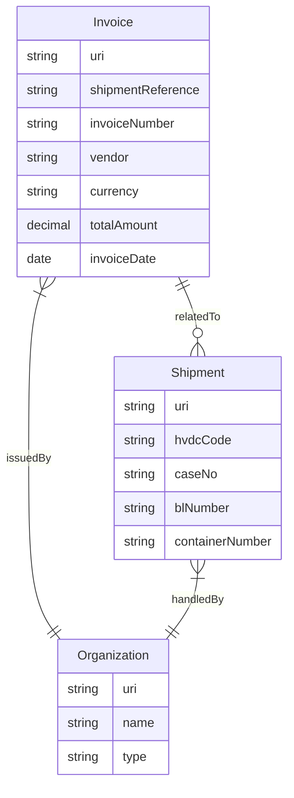
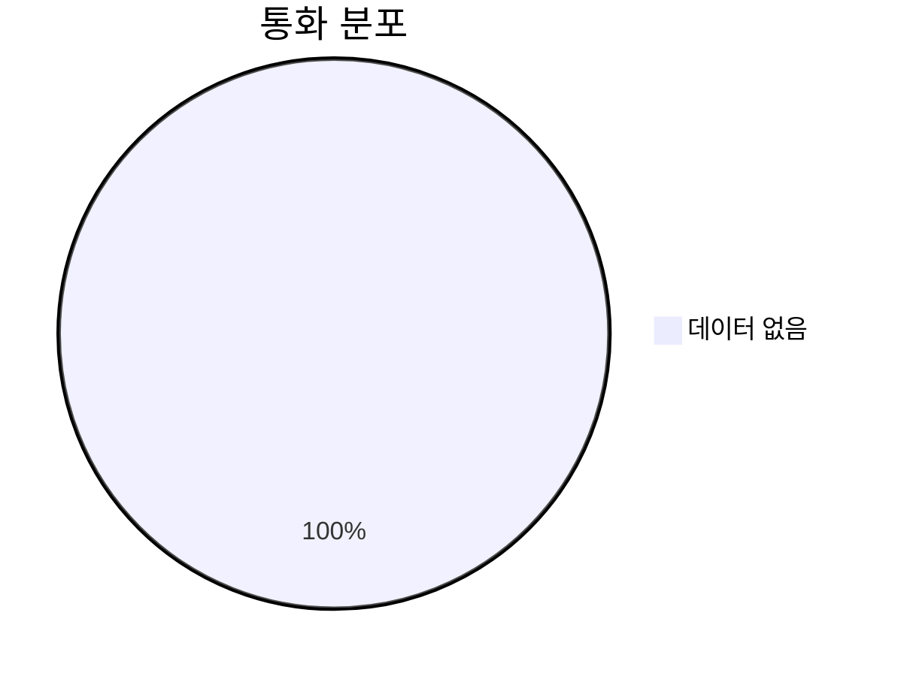
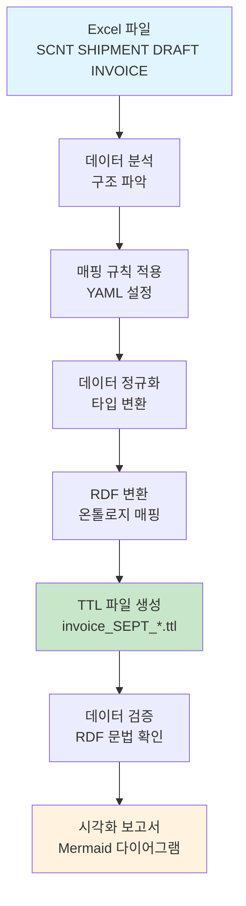

# Invoice 데이터 시각화 및 요약

**생성 시간**: 2025-10-20 00:28:25

## Executive Summary

- **총 Invoice 수**: 29개
- **총 금액**: 1,171.00
- **평균 금액**: 46.84
- **처리 완료율**: 87.9%

## Mermaid 다이어그램

### 1. Entity Relationship



### 2. 통화 분포



### 3. Vendor 분포

```mermaid
xychart-beta
    title Vendor 분포
    x-axis ['BOE Issued Date']
    y-axis "Invoice 수" 0 --> 2
    bar [1]
```

### 4. 데이터 처리 파이프라인



### 5. RDF 온톨로지 구조

```mermaid
classDiagram
    class Invoice {
        +String hasShipmentReference
        +String hasJobNumber
        +String hasBLNumber
        +String hasContainerNumber
        +String hasVendor
        +Date invoiceDate
        +Date dueDate
        +String paymentTerms
        +String currency
        +Decimal exchangeRate
        +Decimal totalAmount
        +Decimal unitPrice
        +String unit
        +String description
        +String title
        +Decimal amount
        +String currencyCode
        +String invoiceNumber
        +String invoiceType
        +String status
        +String notes
        +String metadata
        +Shipment relatedShipment
    }

    class Shipment {
        +String hvdcCode
        +String caseNo
        +String blNumber
        +String containerNumber
        +Organization vendor
    }

    class Organization {
        +String name
        +String type
    }

    Invoice ||--o{ Shipment : relatedTo
    Invoice }|--|| Organization : issuedBy
    Shipment }|--|| Organization : handledBy

```

## 데이터 비교 분석

### RDF vs Excel

- **RDF Invoice 수**: 29개
- **Excel 행 수**: 33개
- **변환율**: 87.9%

### 데이터 품질 지표

- **RDF 완성도**: 0.0%
- **Excel 완성도**: 61.5%

## 상세 통계

### 통화 분포

### Vendor 분포
- **BOE Issued Date**: 1개 (3.4%)

## 권장 사항

1. **데이터 품질 개선**: RDF 완성도 0.0%를 95% 이상으로 향상
2. **매핑 규칙 최적화**: 변환율 87.9% 개선
3. **검증 강화**: 필수 필드 누락 방지를 위한 사전 검증 로직 추가
4. **모니터링**: 정기적인 데이터 품질 검사 및 보고서 자동 생성

---
*이 보고서는 LogiOntology v3.1 시스템에 의해 자동 생성되었습니다.*
