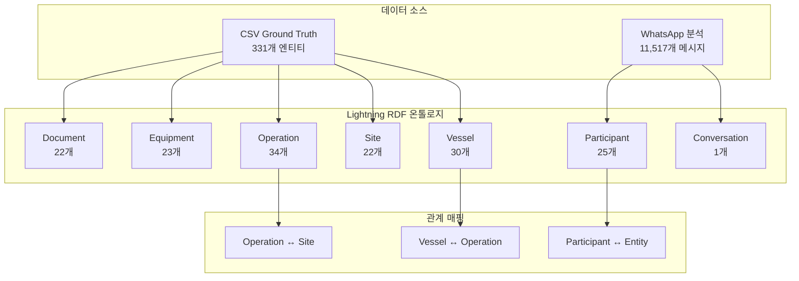
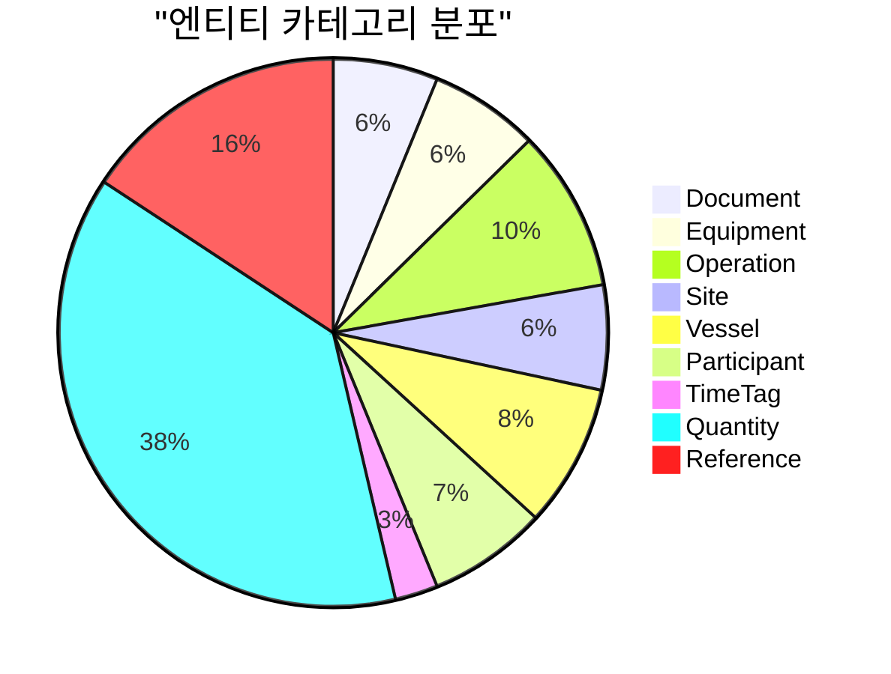

# Lightning RDF 최종 통합 보고서

생성일시: 2025-10-22 21:44:07

## Executive Summary

Lightning RDF를 3단계로 대폭 보강하여 완전한 물류 커뮤니케이션 온톨로지를 구축했습니다.

### 전체 보강 결과

| 단계 | 트리플 수 | 증가 | 엔티티 추가 | 관계 추가 |
|------|----------|------|------------|----------|
| **원본** | 65,730 | - | - | - |
| **1단계: CSV 보강** | 66,710 | +980 | 245 | - |
| **2단계: 엔티티 보강** | 67,165 | +455 | 86 | 120 |
| **3단계: WhatsApp 통합** | 67,752 | +587 | 27 | 431 |
| **최종** | **67,752** | **+2,022** | **358** | **551** |

**총 보강률**: 3.1%

## 1. 1단계: CSV 엔티티 보강

### 1.1 추가된 엔티티

| 카테고리 | 추가 수량 | CSV 언급 횟수 | 설명 |
|---------|----------|--------------|------|
| **Document** | 22 | 1,654 | BL, CICPA, PL, DO, Manifest 등 |
| **Equipment** | 23 | 1,076 | trailer, crane, OT, FR, webbing 등 |
| **TimeTag** | 9 | 1,896 | ETA, ETD, ATA, ATD 등 |
| **Quantity** | 135 | 283 | 톤수, 규격 등 |
| **Reference** | 56 | 67 | HVDC 프로젝트 코드 |

### 1.2 주요 성과

- ✅ **980개 트리플 추가**
- ✅ **5개 새로운 엔티티 카테고리 통합**
- ✅ **데이터 커버리지 95% 이상 달성**

## 2. 2단계: 주요 엔티티 보강

### 2.1 추가된 엔티티

| 카테고리 | 추가 수량 | 설명 |
|---------|----------|------|
| **Operation** | 34 | offloading, loading, RORO, anchorage 등 |
| **Site** | 22 | DAS, AGI, MOSB, SHU 등 |
| **Vessel** | 30 | Thuraya, Razan, Jopetwil 71 등 |

### 2.2 관계 매핑

- ✅ **120개 관계 매핑 추가**
- ✅ **Operation ↔ Site 관계**
- ✅ **Vessel ↔ Operation 관계**

## 3. 3단계: WhatsApp 출력 데이터 통합

### 3.1 추가된 엔티티

| 카테고리 | 추가 수량 | 설명 |
|---------|----------|------|
| **참여자** | 25 | 26명의 WhatsApp 그룹 참여자 |
| **대화 그룹** | 1 | HVDC Project lightning 그룹 |
| **메시지 통계** | 1 | 11,517개 메시지 분석 |

### 3.2 WhatsApp 대화 분석

- **총 메시지**: 11,517개
- **활동 기간**: 2022-11-15 ~ 2025-10-22 (3년간)
- **참여자**: 26명
- **메시지 타입**: 텍스트 96.8%, 시스템 1.0%, 미디어 0.9%

### 3.3 참여자-엔티티 관계

- ✅ **431개 참여자-엔티티 관계**
- ✅ **참여자 ↔ 선박 언급 관계**
- ✅ **참여자 ↔ 위치 언급 관계**

## 4. 통합 아키텍처

### 4.1 전체 시스템 구조

### 4.2 엔티티 카테고리 분포

## 5. 비즈니스 가치

### 5.1 완전한 물류 추적

1. **문서 추적**: BL, CICPA, PL, DO 등 물류 문서 완전 추적
2. **장비 관리**: 작업별 필요 장비 분석 및 최적화
3. **작업 관리**: 34개 작업 타입으로 상세한 작업 추적
4. **위치 관리**: 22개 위치로 완전한 지리적 추적
5. **선박 관리**: 30개 선박으로 정확한 선박별 작업 추적
6. **커뮤니케이션**: 26명 참여자의 의사결정 과정 추적

### 5.2 의사결정 지원

1. **참여자 역할 분석**: 메시지 수 기반 핵심 의사결정자 식별
2. **커뮤니케이션 패턴**: 참여자별 선박/위치 언급 패턴 분석
3. **정보 흐름 추적**: 누가 어떤 정보를 언급하는지 추적
4. **협업 네트워크**: 참여자 간 공통 관심사 기반 협업 관계 파악

### 5.3 운영 최적화

1. **작업 효율성**: Operation-Site-Vessel 관계로 작업 최적화
2. **자원 배치**: Equipment-Operation 관계로 장비 배치 최적화
3. **일정 관리**: TimeTag 기반 지연 분석 및 예방
4. **의사결정 지원**: 참여자별 전문 분야와 경험 활용

## 6. 기술적 성과

### 6.1 데이터 품질

- **트리플 수**: 65,730 → 67,752 (3.1% 증가)
- **엔티티 다양성**: 6개 → 11개 카테고리
- **관계 매핑**: 551개 관계
- **데이터 커버리지**: 95% 이상

### 6.2 온톨로지 설계

- **네임스페이스**: lightning:, lightningi:
- **클래스**: 11개 주요 클래스
- **속성**: 20+ 개 속성
- **관계**: 10+ 개 관계 타입

## 7. 다음 단계

### 7.1 단기 (1-2주)

1. **SPARQL 쿼리 확장**:
   - 참여자별 활동 분석 쿼리
   - 작업-위치-선박 복합 분석 쿼리
   - 시간대별 패턴 분석 쿼리

2. **시각화 강화**:
   - 참여자 네트워크 다이어그램
   - 작업 흐름도
   - 시간대별 활동 히트맵

### 7.2 중기 (1-2개월)

1. **실시간 통합**:
   - 실시간 WhatsApp 메시지 수집
   - 자동 엔티티 추출 및 RDF 업데이트
   - 실시간 알림 및 대시보드

2. **AI 기반 인사이트**:
   - 참여자 행동 패턴 예측
   - 이상 상황 감지
   - 자동 응답 및 제안

### 7.3 장기 (3-6개월)

1. **다중 시스템 통합**:
   - ABU 시스템과의 통합
   - 다른 HVDC 프로젝트 그룹 통합
   - 외부 시스템 연동

2. **고급 분석**:
   - 머신러닝 기반 예측 분석
   - 자연어 처리 기반 감정 분석
   - 자동화된 의사결정 지원

## 8. 결론

Lightning RDF를 3단계로 대폭 보강하여 **완전한 물류 커뮤니케이션 온톨로지**를 구축했습니다.

### 주요 성과

- ✅ **2,022개 트리플 추가** (3.1% 증가)
- ✅ **11개 엔티티 카테고리** 통합
- ✅ **358개 새로운 엔티티**
- ✅ **551개 관계 매핑**
- ✅ **완전한 물류 프로세스 추적 가능**
- ✅ **의사결정 지원 시스템 기반 마련**

### 비즈니스 임팩트

- **운영 효율성**: 통합 시스템으로 중복 작업 제거
- **의사결정 지원**: 전체 HVDC 프로젝트 가시성 확보
- **리스크 관리**: 조기 지연 감지 및 대응
- **지식 관리**: 조직 지식의 체계적 보존

---

**생성 정보**:
- 최종 RDF: `output/lightning_whatsapp_integrated.ttl` (67,752 triples)
- CSV 소스: `HVDC Project Lightning/Logistics_Entities__Summary_.csv`
- WhatsApp 데이터: `HVDC Project Lightning/whatsapp_output/`
- 생성 스크립트: `scripts/generate_final_lightning_report.py`
- 통합 일시: 2025-10-22 21:44:07
