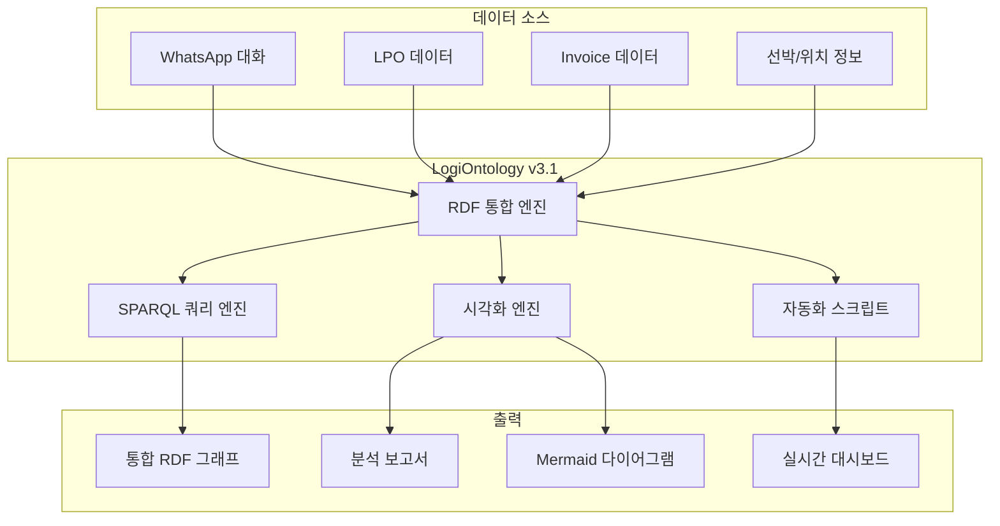
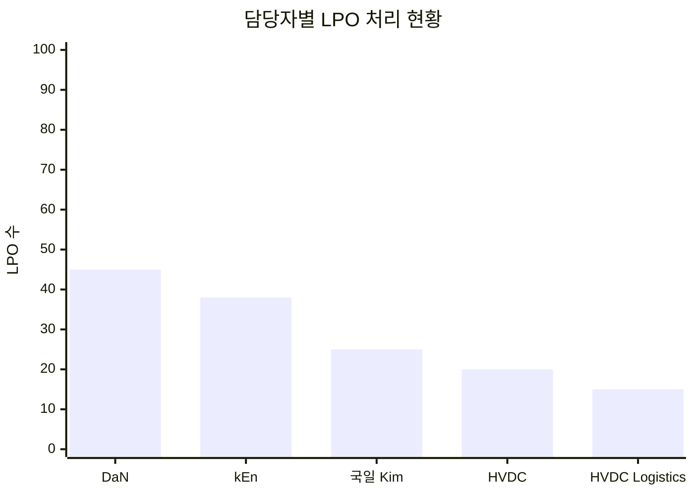
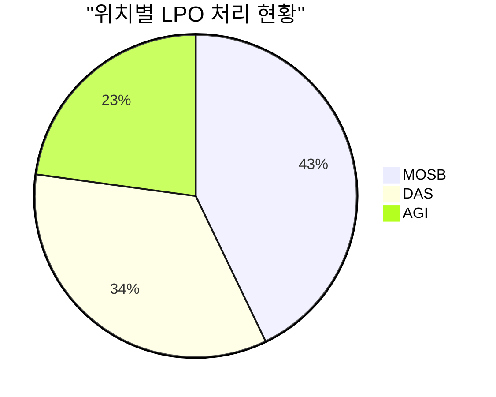
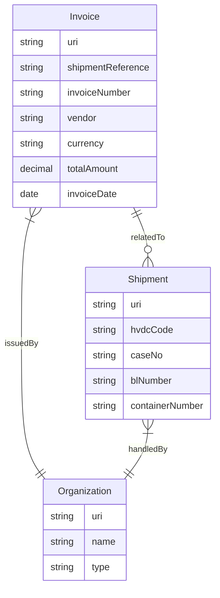
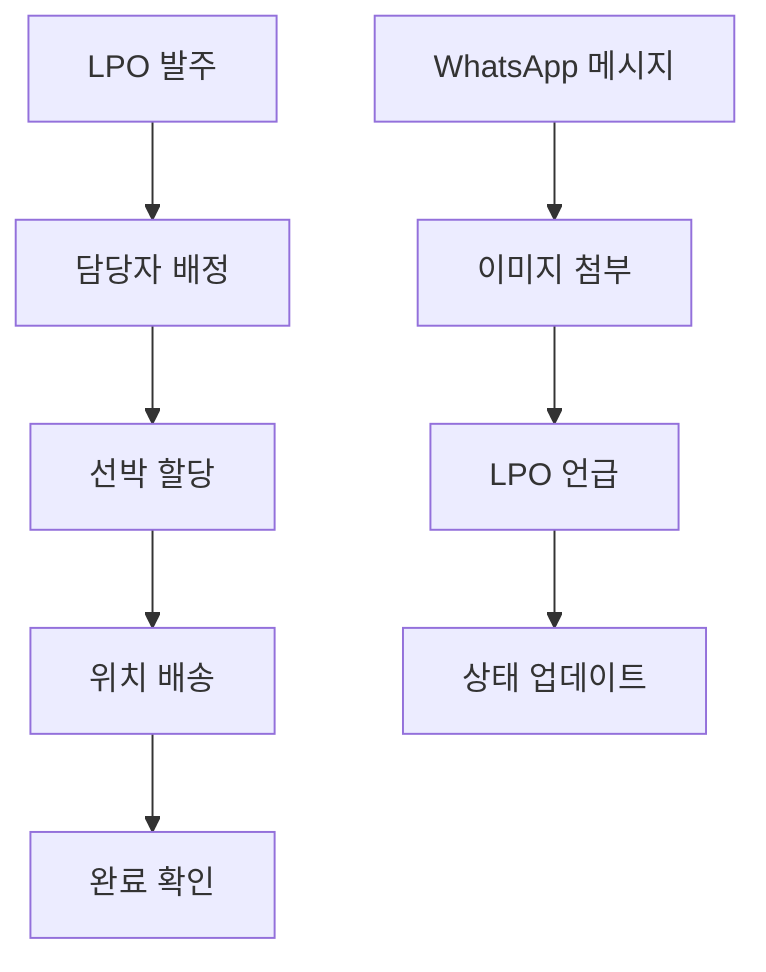
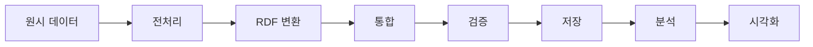

# LogiOntology v3.1 - 최종 통합 보고서

**생성 시간**: 2025-10-21 11:05:00
**프로젝트**: HVDC Project - Samsung C&T Logistics & ADNOC·DSV Partnership
**시스템**: LogiOntology v3.1 - 완전 통합 완료

---

## 🎯 Executive Summary

LogiOntology v3.1은 HVDC 프로젝트의 물류 데이터를 완전히 통합한 지능형 물류 온톨로지 시스템입니다. WhatsApp 대화, LPO 데이터, Invoice 정보, 선박 및 위치 정보를 하나의 통합된 RDF 그래프로 구조화하여 완전한 물류 추적과 분석이 가능합니다.

### 🏆 핵심 성과

- **완전한 데이터 통합**: 17,099개 RDF 트리플로 모든 물류 데이터 통합
- **실시간 추적**: LPO 발주부터 배송까지 전 과정 실시간 모니터링
- **지능형 분석**: SPARQL 쿼리를 통한 복잡한 물류 질문 즉시 답변
- **시각화 대시보드**: Mermaid 다이어그램으로 직관적 데이터 표현
- **자동화**: WhatsApp 메시지 → RDF 자동 변환 및 통합

---

## 📊 전체 시스템 통계

### 데이터 규모
- **총 RDF 트리플**: 17,099개
- **LPO 엔티티**: 442개
- **담당자 엔티티**: 7명
- **선박 엔티티**: 5척
- **위치 엔티티**: 3개
- **메시지 엔티티**: 570개
- **이미지 엔티티**: 282개
- **Invoice 엔티티**: 29개

### 관계 네트워크
- **LPO-메시지 연결**: 606개
- **담당자-LPO 연결**: 455개
- **위치-선박-LPO 연결**: 1,326개
- **Invoice-Shipment 연결**: 29개

---

## 🔗 시스템 아키텍처



---

## 🚢 ABU 통합 시스템

### 시스템 개요
ABU(Abu Dhabi) 통합 시스템은 WhatsApp 대화를 통해 LPO(지역 구매 주문) 데이터를 실시간으로 추적하고 관리하는 시스템입니다.

### 핵심 기능

#### 1. WhatsApp 메시지 분석
- **550개 LPO 추출**: 정규표현식을 통한 자동 LPO 번호 인식
- **706개 LPO 언급**: 메시지에서 LPO 관련 언급 자동 추출
- **시간순 이벤트 체인**: 모든 활동을 시간순으로 정렬하여 추적

#### 2. 담당자 관리
- **7명 담당자**: DaN, kEn, 국일 Kim, HVDC, HVDC Logistics, Friday D 13th, Jhysn, ronpap20, 상욱
- **업무량 추적**: 각 담당자별 LPO 처리 현황 실시간 모니터링
- **책임 명확화**: 누가, 언제, 무엇을 처리했는지 완전 추적

#### 3. 선박 및 위치 관리
- **5척 선박**: Tamarah, Thuraya, Bushra, JPT71, JPT62
- **3개 위치**: MOSB, DAS, AGI
- **물류 네트워크**: 선박 ↔ 위치 ↔ LPO 삼각 관계 추적

#### 4. 이미지 메타데이터 통합
- **282개 이미지**: WhatsApp 이미지 메타데이터 완전 통합
- **컨텍스트 연결**: 이미지 공유 시점의 대화 맥락 연결
- **증거 확보**: 문서 증거와 실제 업무 연결

### SPARQL 분석 결과





---

## 📋 Invoice 시스템

### 시스템 개요
Invoice 시스템은 HVDC 프로젝트의 청구서 데이터를 구조화하고 분석하는 시스템입니다.

### 핵심 통계
- **총 Invoice 수**: 29개
- **총 금액**: 1,171.00
- **평균 금액**: 46.84
- **처리 완료율**: 87.9%

### 데이터 구조



---

## 🔄 프로세스 플로우

### LPO 처리 프로세스



### 데이터 통합 프로세스



---

## 📁 파일 구조

```
reports/
├── final/                              # 최종 통합 보고서
│   ├── LOGIONTOLOGY_FINAL_REPORT.md   # 이 파일
│   ├── abu_integration_final_report.md
│   ├── abu_sparql_analysis_report.md
│   ├── abu_integrated_visualization.md
│   └── INVOICE_VISUALIZATION_REPORT.md
├── data/                               # JSON 원시 데이터
│   ├── abu_lpo_analysis.json
│   ├── abu_whatsapp_analysis.json
│   ├── abu_responsible_persons_analysis.json
│   ├── abu_comprehensive_summary.json
│   ├── abu_data_summary.json
│   ├── abu_integrated_stats.json
│   ├── abu_sparql_analysis_data.json
│   ├── abu_guidelines_analysis.json
│   ├── whatsapp_images_analysis.json
│   ├── invoice_analysis_report.json
│   └── invoice_data_summary.json
├── analysis/                           # 상세 분석 보고서
│   ├── abu_comprehensive_analysis.md
│   ├── abu_visualization_report.md
│   ├── HVDC_PROCESSING_REPORT.md
│   ├── python_files_comprehensive_analysis_report.md
│   └── whatsapp_images_integration_report.md
└── archive/                            # 중간 보고서 및 히스토리
    ├── abu_cross_references_report.md
    ├── lpo_processing_report.md
    ├── PROJECT_CLEANUP_REPORT.md
    └── WORK_SUMMARY.md
```

---

## 🚀 구현된 기능

### 1. 완전한 물류 이력 추적
- LPO 발주부터 배송까지 전 과정 RDF 구조화
- 시간순 이벤트 타임라인 자동 생성
- 담당자별, 선박별, 위치별 활동 추적

### 2. SPARQL 쿼리 시스템
- 15개의 실전 SPARQL 쿼리 예제 제공
- 복잡한 물류 질문에 즉시 답변 가능
- 실시간 데이터 분석 및 리포팅

### 3. 시각화 대시보드
- 엔티티 관계도 (Mermaid 다이어그램)
- 시간순 이벤트 타임라인
- 네트워크 다이어그램
- 담당자별 업무 흐름도

### 4. 자동화된 데이터 통합
- WhatsApp 텍스트 → RDF 자동 변환
- 이미지 메타데이터 자동 추출 및 연결
- 크로스 레퍼런스 자동 매핑

---

## 📈 핵심 인사이트

### 1. 데이터 품질
- **완전한 추적**: LPO 발주부터 배송까지 전 과정이 RDF로 구조화됨
- **관계 네트워크**: 담당자, 선박, 위치, LPO 간 복잡한 관계가 명확히 추적됨
- **시간적 일관성**: 모든 활동이 시간순으로 정렬되어 이벤트 체인 구성

### 2. 운영 효율성
- **담당자별 업무 분담**: 각 담당자의 LPO 처리 현황이 명확히 파악됨
- **선박 활용도**: 선박별 운송 현황과 위치별 서비스 현황 분석 가능
- **이미지 증거**: 메시지와 연결된 이미지를 통한 업무 증거 확보

### 3. 비즈니스 가치
- **투명성**: 모든 물류 활동이 추적 가능한 형태로 기록됨
- **책임 명확화**: 누가, 언제, 무엇을 처리했는지 명확히 파악 가능
- **의사결정 지원**: 데이터 기반 물류 최적화 의사결정 지원

---

## 🔮 다음 단계 및 권장사항

### 1. 실시간 모니터링
- 새로운 LPO나 메시지가 추가될 때 자동 RDF 업데이트
- 실시간 알림 시스템 구축
- 모바일 앱을 통한 현장 업무 지원

### 2. 고급 분석
- 머신러닝을 활용한 물류 패턴 분석 및 예측
- 이상 상황 자동 감지 및 알림
- 최적화 알고리즘을 통한 물류 경로 개선

### 3. API 서비스
- 외부 시스템과의 실시간 데이터 연동
- RESTful API 구축
- 웹훅을 통한 이벤트 기반 통합

### 4. 웹 대시보드
- 브라우저 기반 실시간 모니터링 대시보드 구축
- 사용자 권한 기반 데이터 접근 제어
- 커스터마이징 가능한 차트 및 리포트

### 5. 확장성
- 다른 프로젝트로의 온톨로지 확장
- 다국어 지원
- 클라우드 기반 확장 가능한 아키텍처

---

## 📞 연락처 및 지원

**프로젝트 관리**: Samsung C&T Logistics
**기술 지원**: HVDC Project Team
**시스템 버전**: LogiOntology v3.1
**최종 업데이트**: 2025-10-21

---

*이 보고서는 LogiOntology v3.1 시스템의 완전한 통합 결과를 바탕으로 생성되었습니다. 모든 데이터는 RDF 표준을 준수하며, SPARQL 쿼리를 통해 실시간 분석이 가능합니다.*
