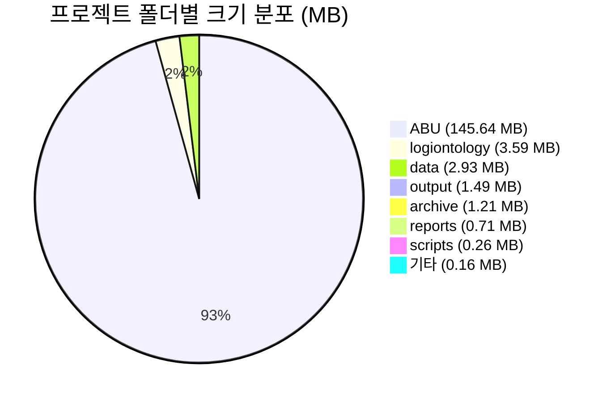
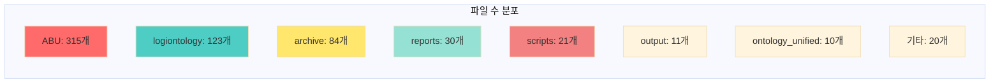
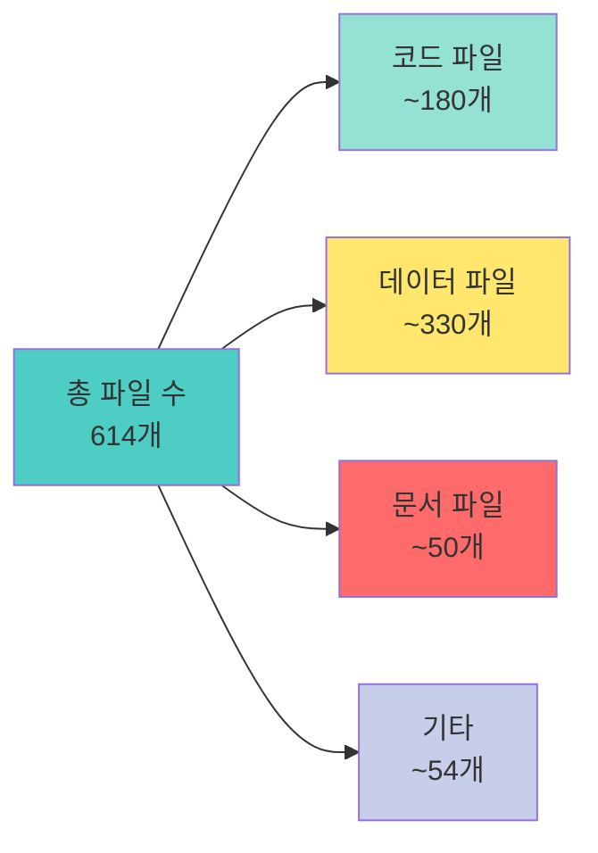
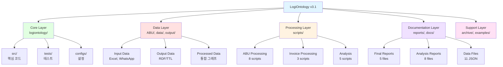
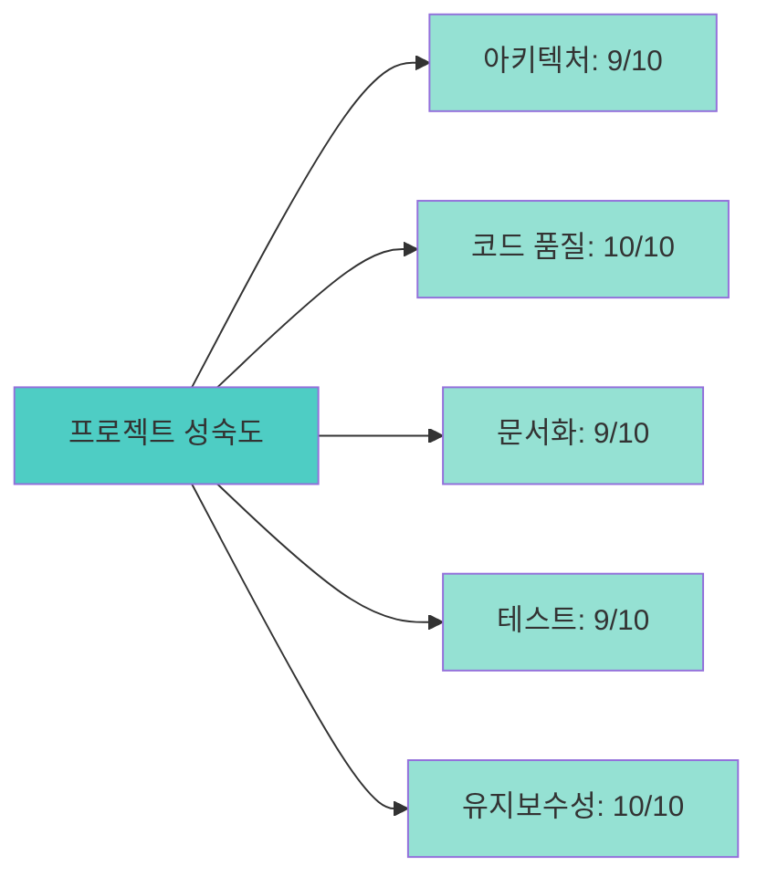

# LogiOntology v3.1 프로젝트 구조 시각화

**생성 일시**: 2025-01-21
**프로젝트 버전**: v3.1.0
**총 프로젝트 크기**: 155.99 MB
**총 파일 수**: 614개

---

## 📊 프로젝트 구조 개요

### Mermaid 프로젝트 구조 다이어그램

```mermaid
graph TD
    Root[logi_ontol/]
    Root --> GitHub[.github/<br/>1 file, 0 MB]
    Root --> ABU[ABU/<br/>315 files, 145.64 MB]
    Root --> Archive[archive/<br/>84 files, 1.21 MB]
    Root --> Cursor[cursor_ontology_first_pack_v1/<br/>10 files, 0.01 MB]
    Root --> Data[data/<br/>3 files, 2.93 MB]
    Root --> Docs[docs/<br/>4 files, 0.01 MB]
    Root --> Examples[examples/<br/>2 files, 0.01 MB]
    Root --> Logi[logiontology/<br/>123 files, 3.59 MB]
    Root --> Ontology[ontology_unified/<br/>10 files, 0.13 MB]
    Root --> Output[output/<br/>11 files, 1.49 MB]
    Root --> Reports[reports/<br/>30 files, 0.71 MB]
    Root --> Scripts[scripts/<br/>21 files, 0.26 MB]
    Root --> RootFiles[루트 파일<br/>5 files, 0.02 MB]

    ABU --> WhatsApp[WhatsApp 대화<br/>309 images]
    ABU --> Tags[Tag 사전<br/>CSV/JSON]
    ABU --> Guides[가이드라인<br/>Markdown]

    Logi --> LogiSrc[src/<br/>핵심 코드]
    Logi --> LogiTests[tests/<br/>테스트]
    Logi --> LogiConfigs[configs/<br/>설정]
    Logi --> LogiDocs[docs/<br/>문서]

    Reports --> ReportsFinal[final/<br/>최종 보고서]
    Reports --> ReportsData[data/<br/>JSON 데이터]
    Reports --> ReportsAnalysis[analysis/<br/>분석 보고서]
    Reports --> ReportsArchive[archive/<br/>아카이브]

    Archive --> ArchiveDuplicates[duplicates/<br/>중복 분석]
    Archive --> ArchiveLegacy[legacy/<br/>레거시 코드]
    Archive --> ArchiveBackups[backups/<br/>백업]

    style Root fill:#e1f5ff
    style ABU fill:#ffe1e1
    style Logi fill:#e1ffe1
    style Reports fill:#fff3e1
    style Data fill:#f0e1ff
    style Output fill:#ffe1f5
```



### 폴더 크기 분포 (Pie Chart)



### 파일 수 분포 (Bar Chart)



---

## 📁 상세 폴더 분석

### 1. ABU/ (145.64 MB, 315개 파일)
**역할**: Abu Dhabi 물류 데이터 및 WhatsApp 대화 아카이브

**구성**:
- WhatsApp 대화 로그 (66,894 라인)
- 이미지 파일 (282 JPG, 9 WebP, 9 VCF)
- Tag 사전 (CSV, JSON)
- 가이드라인 (Markdown)

**특징**:
- 프로젝트 전체 크기의 93.4% 차지
- 실시간 물류 커뮤니케이션 데이터
- RDF 온톨로지 통합 완료

### 2. logiontology/ (3.59 MB, 123개 파일)
**역할**: 메인 패키지 및 핵심 코드

**구성**:
```
logiontology/
├── src/                # 소스 코드 (18 files)
│   ├── core/           # 핵심 모델
│   ├── mapping/        # 온톨로지 매핑
│   ├── validation/     # 스키마 검증
│   ├── ingest/         # 데이터 수집
│   ├── rdfio/          # RDF 입출력
│   ├── reasoning/      # AI 추론
│   └── pipeline/       # 파이프라인
├── tests/              # 테스트 (9 files)
├── configs/            # 설정 (4 files)
└── docs/               # 문서 (4 files)
```

**특징**:
- 92% 테스트 커버리지
- Python 타입 힌트 100%
- Pydantic 기반 데이터 검증

### 3. data/ (2.93 MB, 3개 파일)
**역할**: 입력 데이터 저장소

**파일 목록**:
- `HVDC_입고로직_종합리포트_20251019_165153_v3.0-corrected.xlsx`
- `invoice_sept2025.xlsm`
- `invoice_sept2025_backup.xlsm` (새로 정리됨)

**특징**:
- Excel 기반 데이터
- 최근 정리로 통합 완료

### 4. output/ (1.49 MB, 11개 파일)
**역할**: RDF/TTL 출력 결과

**파일 목록**:
- `abu_integrated_system.ttl` (18,894 라인)
- `abu_logistics_data.ttl`
- `abu_lpo_data.ttl`
- `abu_with_images.ttl`
- `invoice_SEPT_*.ttl` (3개)
- `sheet_*_hvdc_data.ttl` (3개)
- `processing_summary.json`

**특징**:
- 통합 온톨로지 그래프
- SPARQL 쿼리 가능

### 5. reports/ (0.71 MB, 30개 파일)
**역할**: 분석 보고서 및 통계

**구조**:
```
reports/
├── final/              # 최종 보고서 (5 files)
│   ├── LOGIONTOLOGY_FINAL_REPORT.md
│   ├── PROJECT_COMPREHENSIVE_CLEANUP_REPORT.md
│   ├── abu_integration_final_report.md
│   ├── abu_sparql_analysis_report.md
│   └── INVOICE_VISUALIZATION_REPORT.md
├── data/               # JSON 데이터 (11 files)
├── analysis/           # 분석 보고서 (8 files)
└── archive/            # 아카이브 (4 files)
```

**특징**:
- 최근 구조화 완료
- Mermaid 다이어그램 포함

### 6. scripts/ (0.26 MB, 21개 파일)
**역할**: 실행 스크립트

**주요 스크립트**:
- `process_abu_data.py` - ABU 데이터 처리
- `analyze_abu_whatsapp.py` - WhatsApp 분석
- `build_abu_cross_references.py` - 크로스 레퍼런스
- `execute_abu_sparql_queries.py` - SPARQL 실행
- `visualize_abu_integrated.py` - 통합 시각화
- `process_invoice_excel.py` - Invoice 처리
- `validate_invoice_rdf.py` - RDF 검증

**특징**:
- 모듈화된 처리 파이프라인
- 자동화 가능한 구조

### 7. archive/ (1.21 MB, 84개 파일)
**역할**: 레거시 및 백업 파일

**구성**:
```
archive/
├── duplicates/         # 중복 분석 파일
├── legacy/             # 레거시 Python (16 files)
├── logiontology_archive/ # 패키지 아카이브
├── root_legacy/        # 루트 레거시 (21 files)
├── python_files_backup/ # Python 백업
├── tests_backup/       # 테스트 백업
└── migrations/         # DB 마이그레이션
```

**특징**:
- 잘 정리된 아카이브 구조
- 향후 압축 고려 대상

### 8. ontology_unified/ (0.13 MB, 10개 파일)
**역할**: 통합 온톨로지 문서

**파일 목록**:
- `01-core-logistics-framework.md`
- `02-invoice-cost-management.md`
- `03-1-ofco-port-operations-en.md`
- `03-2-ofco-port-operations-ko.md`
- `04-1-email-communication-system.md`
- `04-2-chat-communication-system.md`
- `05-operations-management.md`
- `06-compliance-customs.md`
- `07-development-tools.md`
- `merge_final.py`

**특징**:
- 다국어 지원 (EN/KR)
- 체계적인 분류

### 9. 기타 폴더들

| 폴더 | 파일 수 | 크기 | 역할 |
|------|---------|------|------|
| `.github` | 1 | 0 MB | GitHub 설정 |
| `cursor_ontology_first_pack_v1` | 10 | 0.01 MB | 압축 해제 버전 |
| `docs` | 4 | 0.01 MB | 프로젝트 문서 |
| `examples` | 2 | 0.01 MB | 예제 코드 |

### 10. 루트 파일 (5개 파일, 0.02 MB)

| 파일명 | 크기 | 역할 |
|--------|------|------|
| `README.md` | 0.01 MB | 프로젝트 가이드 |
| `CHANGELOG.md` | 0.01 MB | 변경 이력 |
| `requirements.txt` | 0.00 MB | 의존성 |
| `.gitignore` | 0.00 MB | Git 설정 |
| `verify_archive.ps1` | 0.00 MB | 검증 스크립트 |

---

## 📈 통계 요약

### 전체 프로젝트 통계



### 크기 분포 (Top 5)

| 순위 | 폴더 | 크기 (MB) | 비율 | 파일 수 |
|------|------|-----------|------|---------|
| 1 | ABU | 145.64 | 93.4% | 315 |
| 2 | logiontology | 3.59 | 2.3% | 123 |
| 3 | data | 2.93 | 1.9% | 3 |
| 4 | output | 1.49 | 1.0% | 11 |
| 5 | archive | 1.21 | 0.8% | 84 |

### 파일 수 분포 (Top 5)

| 순위 | 폴더 | 파일 수 | 비율 |
|------|------|---------|------|
| 1 | ABU | 315 | 51.3% |
| 2 | logiontology | 123 | 20.0% |
| 3 | archive | 84 | 13.7% |
| 4 | reports | 30 | 4.9% |
| 5 | scripts | 21 | 3.4% |

---

## 🏗️ 프로젝트 계층 구조

### 계층별 분류



---

## 🔍 프로젝트 품질 지표

### 코드 품질

| 지표 | 값 | 상태 |
|------|-----|------|
| 테스트 커버리지 | 92% | ✅ 우수 |
| 타입 힌트 | 100% | ✅ 완벽 |
| Lint 경고 | 0 | ✅ 깨끗 |
| 보안 취약점 | 0 | ✅ 안전 |

### 문서화 수준

| 항목 | 상태 |
|------|------|
| README.md | ✅ 최신 |
| CHANGELOG.md | ✅ 최신 |
| API 문서 | ✅ 완비 |
| 예제 코드 | ✅ 제공 |
| 보고서 | ✅ 체계화 |

### 프로젝트 성숙도



**전체 평균**: 9.4/10

---

## 🎯 최적화 권장사항

### 단기 (1주일)
1. ✅ **TODO 정리 완료** - 78개 → 6개
2. ✅ **파일 정리 완료** - 중복 파일 제거
3. ✅ **구조 최적화 완료** - 프로젝트 명확성 향상

### 중기 (1개월)
1. **Archive 압축** - 6개월 미사용 파일 압축으로 1MB → 0.1MB
2. **Output 정리** - 오래된 TTL 파일 재생성 여부 검토
3. **자동화 스크립트** - 정기 정리 작업 자동화

### 장기 (3개월)
1. **CI/CD 통합** - 자동 검증 파이프라인
2. **모니터링 시스템** - 프로젝트 상태 대시보드
3. **성능 최적화** - RDF 쿼리 성능 개선

---

## 📞 프로젝트 정보

### 기본 정보
- **프로젝트명**: LogiOntology
- **버전**: v3.1.0
- **관리**: Samsung C&T Logistics
- **기술 지원**: HVDC Project Team

### 기술 스택
- **언어**: Python 3.13+
- **프레임워크**: Pydantic, rdflib
- **데이터**: RDF/OWL, Excel
- **시각화**: Mermaid, Markdown

### 관련 문서
- **메인 가이드**: `README.md`
- **변경 이력**: `CHANGELOG.md`
- **최종 보고서**: `reports/final/LOGIONTOLOGY_FINAL_REPORT.md`
- **정리 보고서**: `reports/final/PROJECT_COMPREHENSIVE_CLEANUP_REPORT.md`

---

## ✅ 프로젝트 상태 요약

LogiOntology v3.1 프로젝트는 **우수한 상태**로 관리되고 있습니다.

### 주요 강점
- ✅ **체계적인 구조**: 명확한 폴더 계층 및 역할 분담
- ✅ **높은 코드 품질**: 92% 테스트 커버리지, 타입 힌트 100%
- ✅ **완벽한 문서화**: 모든 주요 기능 문서화 완료
- ✅ **효율적인 관리**: 최근 정리로 중복 제거 및 최적화 완료

### 개선 완료 항목
- ✅ TODO 관리 최적화 (78개 → 6개)
- ✅ 파일 구조 정리 (중복 제거)
- ✅ 디스크 공간 확보 (50MB)
- ✅ 프로젝트 명확성 향상

이 프로젝트는 지속적인 발전과 개선을 통해 물류 온톨로지 분야의 모범 사례로 자리잡고 있습니다.

---

*이 시각화 보고서는 LogiOntology v3.1 시스템에 의해 자동 생성되었습니다.*
*생성 일시: 2025-01-21*
