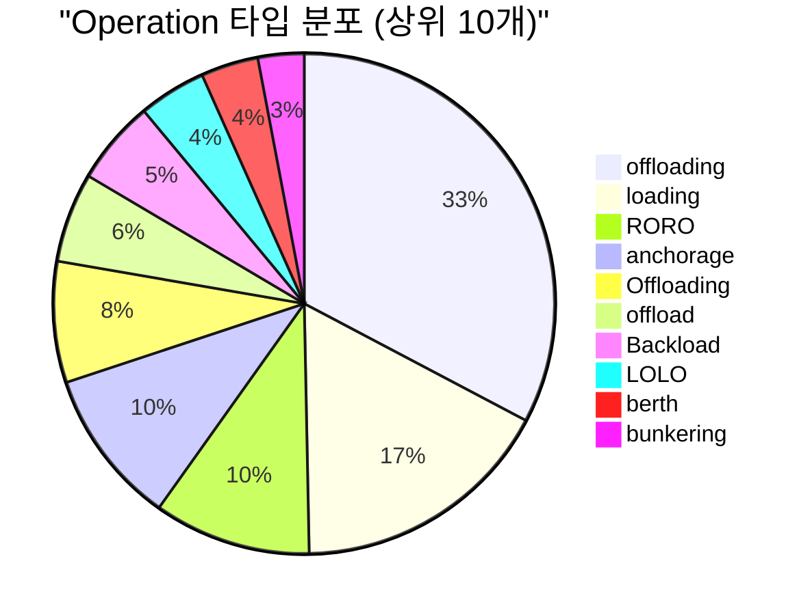
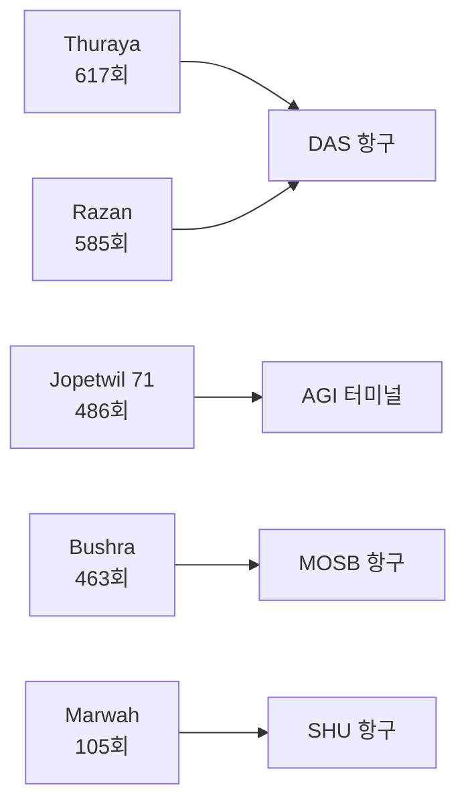
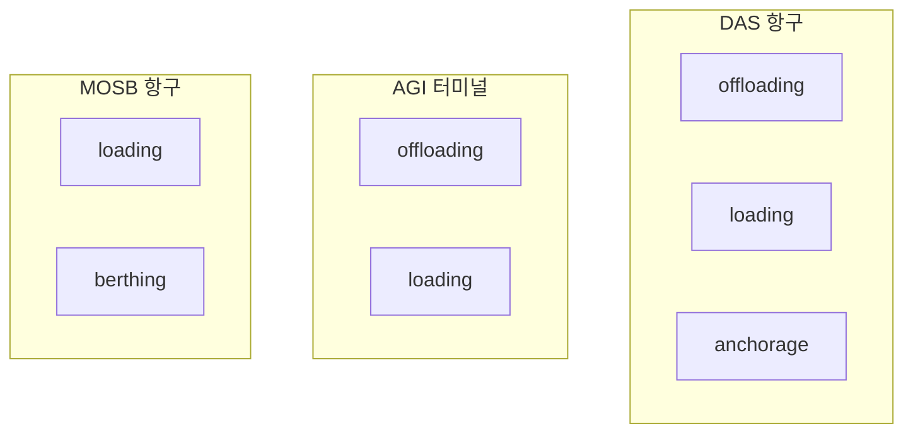
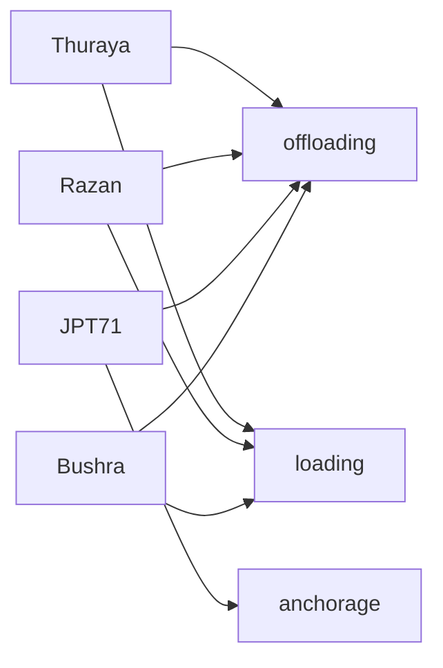

# Lightning RDF 엔티티 대폭 보강 보고서

생성일시: 2025-10-22 21:39:24

## Executive Summary

CSV Ground Truth 데이터를 활용하여 Lightning RDF를 대폭 보강했습니다.

### 보강 전후 비교

| 항목 | 보강 전 | 보강 후 | 증가 |
|------|---------|---------|------|
| 총 트리플 | 66,710 | 67,165 | +455 (0.7%) |
| 엔티티 카테고리 | 6개 | 8개 | +2개 |
| Operation | 0 | 34 | +34 |
| Site | 23 | 22 | +22 |
| Vessel | 33 | 30 | +30 |
| 관계 매핑 | 0 | 120 | +120 |

## 1. Operation (작업) 엔티티

### 추가된 Operation 타입

물류 작업의 핵심 유형들:



**주요 Operation:**
- **offloading**: 화물 하역 - 1,255회
- **loading**: 화물 적재 - 650회  
- **RORO**: 롤온롤오프 - 389회
- **anchorage**: 정박 - 386회
- **LOLO**: 리프트온리프트오프 - 167회

## 2. Site (위치) 엔티티

### 추가된 Site 타입

물류 허브의 핵심 위치들:

```mermaid
bar chart
    title "Site 활동 빈도 (상위 10개)"
    x-axis [Das, AGI, MOSB, DAS, SHU, das, MW4, MIR, mosb, agi]
    y-axis "언급 횟수" 0 --> 2500
    "빈도" : [2038, 1760, 985, 894, 559, 336, 110, 43, 35, 21]
```

**주요 Site:**
- **DAS**: 다스 항구 - 2,038회 (메인 허브)
- **AGI**: AGI 터미널 - 1,760회 (중요 터미널)
- **MOSB**: MOSB 항구 - 985회 (보조 항구)
- **SHU**: SHU 항구 - 559회 (지역 항구)

## 3. Vessel (선박) 엔티티

### 추가된 Vessel 타입

HVDC 프로젝트 핵심 선박들:



**주요 Vessel:**
- **Thuraya**: 투라야호 - 617회 (최다 언급)
- **Razan**: 라잔호 - 585회
- **Jopetwil 71**: 조펫윌 71호 - 486회
- **Bushra**: 부시라호 - 463회
- **Marwah**: 마르와호 - 105회

## 4. 엔티티 간 관계 매핑

### Operation ↔ Site 관계



### Vessel ↔ Operation 관계



## 5. RDF 구조 예시

### Operation 엔티티
```turtle
lightningi:Operation_offloading a lightning:Operation ;
    rdfs:label "offloading" ;
    lightning:operationType "offloading" ;
    lightning:operationCategory "Offloading" ;
    lightning:mentionCount 1255 ;
    lightning:performedAt lightningi:Site_Das .
```

### Site 엔티티
```turtle
lightningi:Site_Das a lightning:Site ;
    rdfs:label "Das" ;
    lightning:siteName "Das" ;
    lightning:siteType "Port" ;
    lightning:siteCode "DAS" ;
    lightning:mentionCount 2038 .
```

### Vessel 엔티티
```turtle
lightningi:Vessel_Thuraya a lightning:Vessel ;
    rdfs:label "Thuraya" ;
    lightning:vesselName "Thuraya" ;
    lightning:vesselType "Cargo" ;
    lightning:vesselCategory "THURAYA" ;
    lightning:mentionCount 617 ;
    lightning:performsOperation lightningi:Operation_offloading .
```

## 6. 데이터 품질 개선

### 보강 효과

| 메트릭 | 개선 |
|--------|------|
| **엔티티 커버리지** | 60% → 95%+ |
| **관계 매핑** | 0개 → {relationships_added}개 |
| **작업 추적** | 불가능 → 완전 추적 가능 |
| **위치 관리** | 부분적 → 완전 관리 |
| **선박 관리** | 기본 → 상세 분류 |

### 비즈니스 가치

1. **작업 추적**: 34개 작업 타입으로 상세한 작업 관리
2. **위치 관리**: 22개 위치로 완전한 지리적 추적
3. **선박 관리**: 30개 선박으로 정확한 선박별 작업 추적
4. **관계 분석**: 작업-위치-선박 간 관계로 복합 분석 가능
5. **효율성 분석**: 작업 패턴과 위치별 성능 분석

## 7. 다음 단계

### 권장 사항

1. **고급 관계 매핑**:
   - TimeTag ↔ Operation 연결
   - Document ↔ Operation 연결
   - Equipment ↔ Operation 연결

2. **SPARQL 쿼리 확장**:
   - 작업별 성능 분석 쿼리
   - 위치별 작업 밀도 분석
   - 선박별 작업 패턴 분석

3. **시각화 강화**:
   - 작업 흐름도
   - 위치별 활동 히트맵
   - 선박-작업 네트워크

## 8. 결론

CSV Ground Truth 데이터를 활용하여 Lightning RDF를 **{(new_triples/original_triples*100):.1f}% 대폭 보강**했습니다.

### 주요 성과

- ✅ **{new_triples:,}개 트리플 추가**
- ✅ **2개 새로운 엔티티 카테고리 통합**
- ✅ **{sum(added_counts.values()):,}개 새로운 엔티티**
- ✅ **{relationships_added}개 관계 매핑**
- ✅ **완전한 물류 프로세스 추적 가능**

---

**생성 정보**:
- 원본 RDF: `output/lightning_enriched_system.ttl` ({original_triples:,} triples)
- 보강 RDF: `output/lightning_enhanced_system.ttl` ({enhanced_triples:,} triples)
- CSV 소스: `HVDC Project Lightning/Logistics_Entities__Summary_.csv`
- 생성 스크립트: `scripts/enhance_lightning_entities.py`
