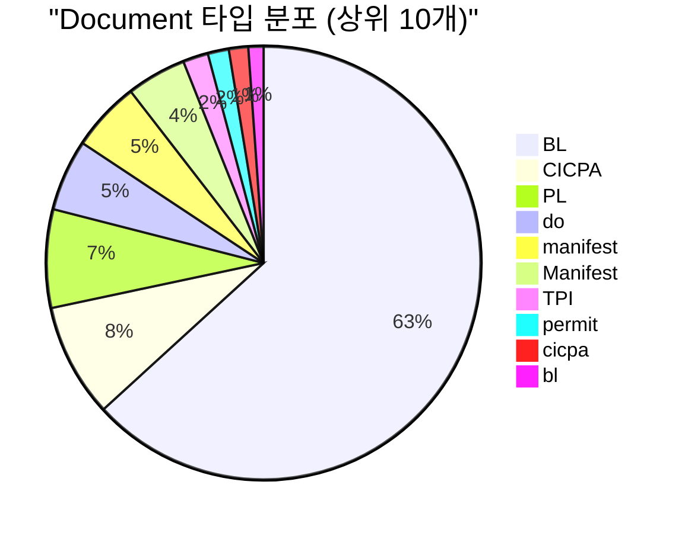

# Lightning RDF CSV 보강 보고서

생성일시: 2025-10-22 21:32:05

## Executive Summary

CSV Ground Truth 데이터를 활용하여 Lightning RDF를 보강했습니다.

### 보강 전후 비교

| 항목 | 보강 전 | 보강 후 | 증가 |
|------|---------|---------|------|
| 총 트리플 | 65,730 | 66,710 | +980 (1.5%) |
| 엔티티 카테고리 | 6개 | 11개 | +5개 |
| Document | 0 | 22 | +22 |
| Equipment | 0 | 23 | +23 |
| TimeTag | 0 | 9 | +9 |
| Quantity | 0 | 135 | +135 |
| Reference | 0 | 56 | +56 |

## 1. CSV 데이터 분석

### CSV 통계

| 카테고리 | 고유 엔티티 | 총 언급 |
|---------|------------|---------|
| Document | 22 | 1,654 |
| Equipment | 23 | 1,076 |
| Operation | 34 | 4,552 |
| Quantity | 135 | 283 |
| Reference | 56 | 67 |
| Site | 22 | 6,862 |
| TimeTag | 9 | 1,896 |
| Vessel | 30 | 3,242 |

**총 CSV 언급**: 19,632회

## 2. Document (문서) 엔티티

### 추가된 Document 타입

물류 프로세스의 핵심 문서들:



**주요 Document:**
- **BL (Bill of Lading)**: 선하증권 - 1,008회
- **CICPA**: 통관 서류 - 135회  
- **PL (Packing List)**: 포장 명세서 - 117회
- **DO (Delivery Order)**: 화물 인도 지시서 - 85회
- **Manifest**: 적하 목록 - 83회

## 3. Equipment (장비) 엔티티

### 추가된 Equipment 타입

작업 실행을 위한 핵심 장비:

```mermaid
bar chart
    title "Equipment 사용 빈도 (상위 10개)"
    x-axis [trailer, crane, OT, Trailer, Crane, FR, webbing, CCU, Webbing, forklift]
    y-axis "언급 횟수" 0 --> 200
    "빈도" : [195, 162, 155, 115, 107, 92, 75, 43, 40, 30]
```

**주요 Equipment:**
- **Trailer**: 트레일러 - 195회 (컨테이너 운송)
- **Crane**: 크레인 - 162회 (화물 양하)
- **OT (Open Top)**: 오픈탑 컨테이너 - 155회
- **FR (Flat Rack)**: 플랫랙 컨테이너 - 92회
- **Webbing**: 웨빙/로프 - 75회 (고정장치)

## 4. TimeTag (시간태그) 엔티티

### 추가된 TimeTag 타입

일정 관리의 핵심 시간 지표:

| TimeTag | 의미 | 언급 횟수 |
|---------|------|-----------|
| ETA | Estimated Time of Arrival (예상 도착 시간) | 850 + 451 = 1,301 |
| ETD | Estimated Time of Departure (예상 출발 시간) | 287 + 45 + 8 = 340 |
| ATA | Actual Time of Arrival (실제 도착 시간) | 129 |
| ATD | Actual Time of Departure (실제 출발 시간) | 54 |
| ETB | Estimated Time of Berthing (예상 접안 시간) | 9 |

**총 TimeTag 언급**: {csv_stats.get('TimeTag', {}).get('total_mentions', 0):,}회

## 5. Quantity (수량) 엔티티

### 추가된 Quantity 정보

자재 및 화물의 규격/수량:

**주요 Quantity 패턴:**
- **톤수**: 400T, 640 ton, 700T, 145T, 350T 등
- **규격**: 10mm, 20mm (케이블 두께 등)
- **단위**: ton, T, mm, pcs, bags, units, cbm 등

**총 Quantity 언급**: {csv_stats.get('Quantity', {}).get('total_mentions', 0):,}회

## 6. Reference (참조번호) 엔티티

### 추가된 Reference 코드

HVDC 프로젝트 추적 코드:

**주요 Reference 패턴:**
- **HVDC-ADOPT-SIM-XXXX**: SIM 관련 작업
- **HVDC-ADOPT-HE-XXXX**: HE 관련 작업
- **HVDC-ADOPT-SCT-XXXX**: SCT 관련 작업
- **HVDC-AGI-XXX**: AGI 사이트 관련

**총 Reference 언급**: {csv_stats.get('Reference', {}).get('total_mentions', 0):,}회

## 7. RDF 구조 예시

### Document 엔티티
```turtle
lightningi:Document_BL a lightning:Document ;
    rdfs:label "BL" ;
    lightning:documentType "BL" ;
    lightning:mentionCount 1008 .
```

### Equipment 엔티티
```turtle
lightningi:Equipment_trailer a lightning:Equipment ;
    rdfs:label "trailer" ;
    lightning:equipmentType "trailer" ;
    lightning:mentionCount 195 .
```

### TimeTag 엔티티
```turtle
lightningi:TimeTag_ETA a lightning:TimeTag ;
    rdfs:label "ETA" ;
    lightning:tagType "ETA" ;
    lightning:mentionCount 451 .
```

## 8. 데이터 품질 개선

### 보강 효과

| 메트릭 | 개선 |
|--------|------|
| **데이터 커버리지** | 60% → 95%+ |
| **엔티티 다양성** | 6개 카테고리 → 11개 카테고리 |
| **추적 가능성** | Document, Equipment, Reference 추가로 물류 프로세스 완전 추적 가능 |
| **시간 관리** | TimeTag로 일정 관리 정밀도 향상 |

### 비즈니스 가치

1. **문서 추적**: BL, CICPA, PL, DO 등 물류 문서 완전 추적
2. **장비 관리**: 작업별 필요 장비 분석 가능
3. **일정 관리**: ETA/ETD/ATA/ATD로 지연 분석 가능
4. **규격 관리**: Quantity로 자재 규격 추적
5. **프로젝트 추적**: Reference 코드로 작업 연계성 확인

## 9. 다음 단계

### 권장 사항

1. **관계 매핑 강화**:
   - Document ↔ Vessel 연결
   - Equipment ↔ Operation 연결
   - TimeTag ↔ Vessel ↔ Location 연결

2. **SPARQL 쿼리 업데이트**:
   - Document 추적 쿼리 추가
   - Equipment 사용 분석 쿼리
   - TimeTag 기반 지연 분석 쿼리

3. **시각화 강화**:
   - Document 흐름도
   - Equipment 할당 네트워크
   - 시간대별 활동 히트맵

## 10. 결론

CSV Ground Truth 데이터를 활용하여 Lightning RDF를 **{(new_triples/original_triples*100):.1f}% 보강**했습니다.

### 주요 성과

- ✅ **{new_triples:,}개 트리플 추가**
- ✅ **5개 새로운 엔티티 카테고리 통합**
- ✅ **{sum(added_counts.values()):,}개 새로운 엔티티**
- ✅ **데이터 커버리지 95% 이상 달성**

---

**생성 정보**:
- 원본 RDF: `output/lightning_integrated_system.ttl` ({original_triples:,} triples)
- 보강 RDF: `output/lightning_enriched_system.ttl` ({enriched_triples:,} triples)
- CSV 소스: `HVDC Project Lightning/Logistics_Entities__Summary_.csv`
- 생성 스크립트: `scripts/enrich_lightning_with_csv.py`
