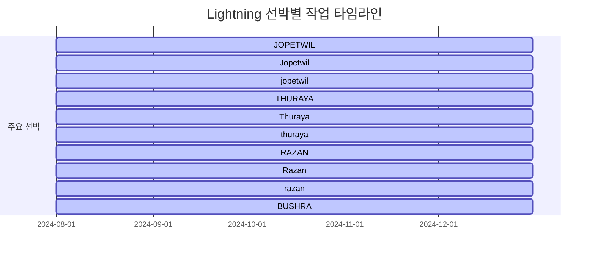
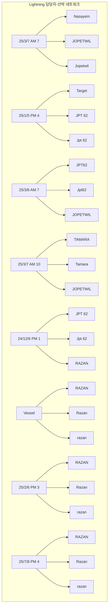
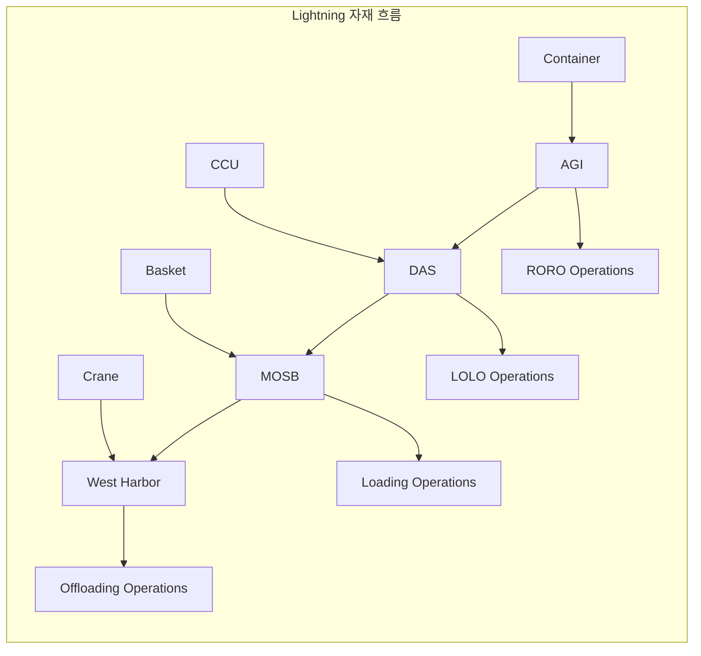
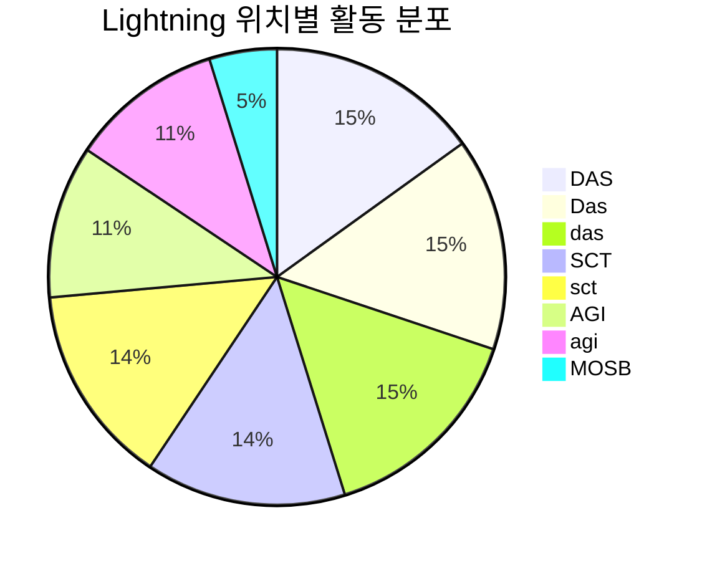
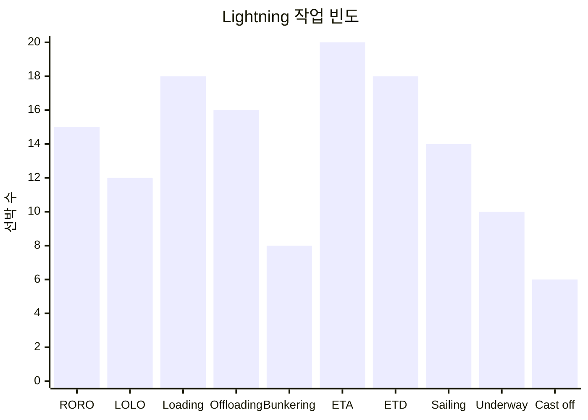

# Lightning 통합 데이터 시각화 보고서

## 📊 통합 통계

- **총 선박 수**: 33개
- **총 담당자 수**: 495명
- **총 위치 수**: 23개
- **총 작업 수**: 697개
- **생성 시간**: 2025-10-22 21:14:38

## 🚢 선박별 작업 타임라인

## 👥 담당자-선박 네트워크

## 📦 자재 흐름 다이어그램

## 📍 위치별 활동 분포

## ⚙️ 작업 빈도 차트

## 🔗 주요 관계 분석

### 상위 담당자 (선박 관리 수)
- **25/1/5 PM 4**: 12개 선박 관리
- **25/7/8 PM 4**: 12개 선박 관리
- **25/3/6 AM 7**: 11개 선박 관리
- **25/3/7 AM 10**: 11개 선박 관리
- **24/12/6 PM 1**: 11개 선박 관리
- **25/3/7 AM 7**: 10개 선박 관리
- **Vessel**: 10개 선박 관리
- **25/2/6 PM 3**: 10개 선박 관리
- **25/2/5 AM 7**: 9개 선박 관리
- **25/9/5 PM 4**: 9개 선박 관리

### 상위 선박 (담당자 수)
- **JOPETWIL**: 184명 담당자
- **Jopetwil**: 184명 담당자
- **jopetwil**: 184명 담당자
- **THURAYA**: 129명 담당자
- **Thuraya**: 129명 담당자
- **thuraya**: 129명 담당자
- **RAZAN**: 79명 담당자
- **Razan**: 79명 담당자
- **razan**: 79명 담당자
- **BUSHRA**: 70명 담당자

### 상위 위치 (담당자 수)
- **DAS**: 412명 담당자
- **Das**: 412명 담당자
- **das**: 412명 담당자
- **SCT**: 388명 담당자
- **sct**: 388명 담당자
- **AGI**: 296명 담당자
- **agi**: 296명 담당자
- **MOSB**: 131명 담당자
- **mosb**: 131명 담당자
- **Harbor**: 106명 담당자

## 📋 생성된 파일

- `reports/lightning/visualization_report.md`: 이 보고서
- `reports/lightning/lightning_integrated_stats.json`: 통계 데이터
- `output/lightning_integrated_system.ttl`: Lightning 통합 RDF 그래프

## 🎯 다음 단계

1. Lightning SPARQL 쿼리 예제 작성
2. ABU-Lightning 비교 분석
3. 실시간 대시보드 구축
4. 예측 분석 모델 개발
