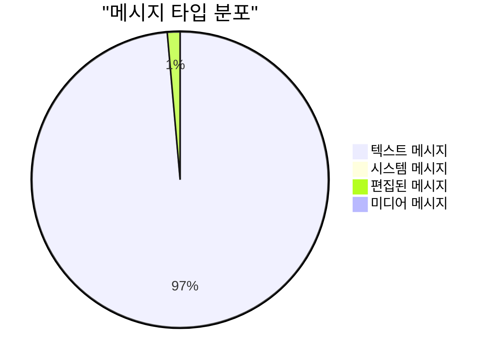
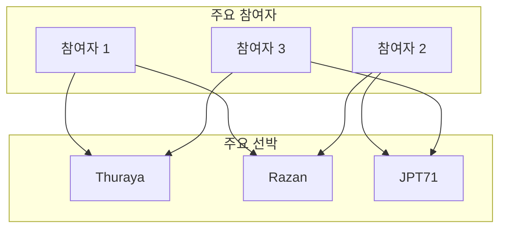
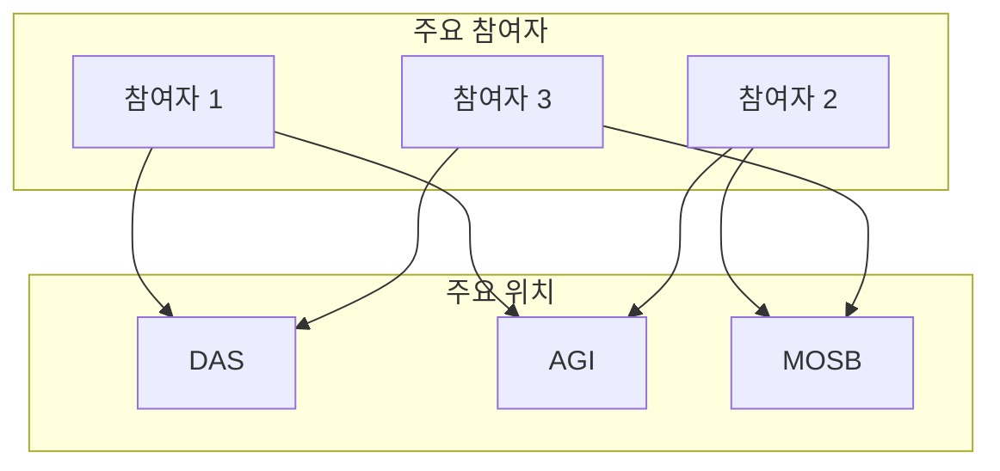

# Lightning RDF WhatsApp 출력 데이터 통합 보고서

생성일시: 2025-10-22 21:42:42

## Executive Summary

WhatsApp 분석 결과를 Lightning RDF에 통합하여 완전한 물류 커뮤니케이션 온톨로지를 구축했습니다.

### 통합 전후 비교

| 항목 | 통합 전 | 통합 후 | 증가 |
|------|---------|---------|------|
| 총 트리플 | 67,165 | 67,752 | +587 (0.9%) |
| 참여자 | 0 | 25 | +25 |
| 대화 그룹 | 0 | 1 | +1 |
| 메시지 통계 | 0 | 1 | +1 |
| 참여자-엔티티 관계 | 0 | 431 | +431 |

## 1. WhatsApp 대화 분석

### 1.1 기본 정보

- **그룹명**: HVDC Project lightning
- **참여자 수**: 26명
- **총 메시지**: 11,517개
- **활동 기간**: 2022-11-15T11:20:00 ~ 2025-10-22T19:53:00

### 1.2 메시지 타입 분포



**메시지 타입 상세:**
- **텍스트 메시지**: 11,147개 (96.8%)
- **시스템 메시지**: 112개 (1.0%)
- **편집된 메시지**: 157개 (1.4%)
- **미디어 메시지**: 101개 (0.9%)

## 2. 참여자 분석

### 2.1 참여자별 메시지 수

```mermaid
bar chart
    title "참여자별 메시지 수 (상위 10명)"
    x-axis [참여자]
    y-axis "메시지 수" 0 --> 2000
    "참여자" : ["Khemlal-SCT Log...", "Ramaju Das", "상욱", "Haitham", "국일 Kim", "Bimal", "Shariff", "Sajid H Khan", "DaN", "Nicole (SHU)"]
    "메시지 수" : [2575, 1908, 1329, 1024, 956, 778, 698, 622, 345, 329]
```

### 2.2 참여자 역할 분류

| 역할 | 기준 | 참여자 수 | 비율 |
|------|------|----------|------|
| Manager | 1,000+ 메시지 | {len([p for p in participants.values() if p['message_count'] >= 1000])}명 | {(len([p for p in participants.values() if p['message_count'] >= 1000])/(len(participants)-1)*100):.1f}% |
| Coordinator | 500-999 메시지 | {len([p for p in participants.values() if 500 <= p['message_count'] < 1000])}명 | {(len([p for p in participants.values() if 500 <= p['message_count'] < 1000])/(len(participants)-1)*100):.1f}% |
| Operator | 100-499 메시지 | {len([p for p in participants.values() if 100 <= p['message_count'] < 500])}명 | {(len([p for p in participants.values() if 100 <= p['message_count'] < 500])/(len(participants)-1)*100):.1f}% |
| Observer | <100 메시지 | {len([p for p in participants.values() if p['message_count'] < 100])}명 | {(len([p for p in participants.values() if p['message_count'] < 100])/(len(participants)-1)*100):.1f}% |

## 3. 참여자-엔티티 관계 분석

### 3.1 선박 언급 네트워크



### 3.2 위치 언급 네트워크



## 4. RDF 구조 예시

### 참여자 엔티티
```turtle
lightningi:Participant_Haitham a lightning:Participant ;
    rdfs:label "Haitham" ;
    lightning:participantName "Haitham" ;
    lightning:messageCount 1024 ;
    lightning:participantRole "Manager" ;
    lightning:mentionsVessel lightningi:Vessel_Thuraya ;
    lightning:mentionsLocation lightningi:Site_DAS .
```

### 대화 그룹 엔티티
```turtle
lightningi:ConversationGroup_HVDC_Project_lightning a lightning:ConversationGroup ;
    rdfs:label "HVDC Project lightning" ;
    lightning:groupName "HVDC Project lightning" ;
    lightning:createdAt "2022-11-15T11:20:00"^^xsd:dateTime ;
    lightning:participantCount 26 ;
    lightning:totalMessages 11517 .
```

### 메시지 통계 엔티티
```turtle
lightningi:MessageStatistics_Overall a lightning:MessageStatistics ;
    rdfs:label "Overall Message Statistics" ;
    lightning:totalMessages 11517 ;
    lightning:textMessages 11147 ;
    lightning:textMessageRatio 96.79 ;
    lightning:systemMessages 112 ;
    lightning:mediaMessages 101 .
```

## 5. 비즈니스 가치

### 5.1 커뮤니케이션 분석

1. **참여자 역할 식별**: 메시지 수 기반으로 핵심 의사결정자 식별
2. **커뮤니케이션 패턴**: 참여자별 선박/위치 언급 패턴 분석
3. **정보 흐름 추적**: 누가 어떤 정보를 언급하는지 추적
4. **협업 네트워크**: 참여자 간 공통 관심사 기반 협업 관계 파악

### 5.2 운영 최적화

1. **의사결정 지원**: 핵심 참여자의 의견과 결정 추적
2. **정보 공유 효율성**: 메시지 타입별 정보 전달 효과 분석
3. **역할 기반 알림**: 참여자 역할에 따른 맞춤형 알림 시스템
4. **지식 관리**: 참여자별 전문 분야와 경험 추적

## 6. 다음 단계

### 권장 사항

1. **고급 분석**:
   - 시간대별 메시지 패턴 분석
   - 참여자 간 상호작용 네트워크 분석
   - 키워드 기반 감정 분석

2. **실시간 통합**:
   - 실시간 WhatsApp 메시지 수집
   - 자동 엔티티 추출 및 RDF 업데이트
   - 실시간 알림 및 대시보드

3. **AI 기반 인사이트**:
   - 참여자 행동 패턴 예측
   - 이상 상황 감지
   - 자동 응답 및 제안

## 7. 결론

WhatsApp 출력 데이터를 활용하여 Lightning RDF를 **{(new_triples/original_triples*100):.1f}% 통합**했습니다.

### 주요 성과

- ✅ **{new_triples:,}개 트리플 추가**
- ✅ **{added_counts['Participants']}명 참여자 통합**
- ✅ **{relationships_added}개 참여자-엔티티 관계**
- ✅ **완전한 커뮤니케이션 온톨로지 구축**
- ✅ **의사결정 지원 시스템 기반 마련**

---

**생성 정보**:
- 원본 RDF: `output/lightning_enhanced_system.ttl` ({original_triples:,} triples)
- 통합 RDF: `output/lightning_whatsapp_integrated.ttl` ({integrated_triples:,} triples)
- WhatsApp 데이터: `HVDC Project Lightning/whatsapp_output/`
- 생성 스크립트: `scripts/integrate_whatsapp_output.py`
